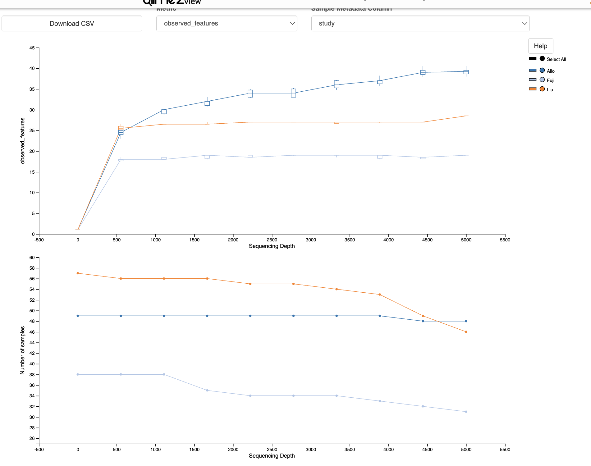
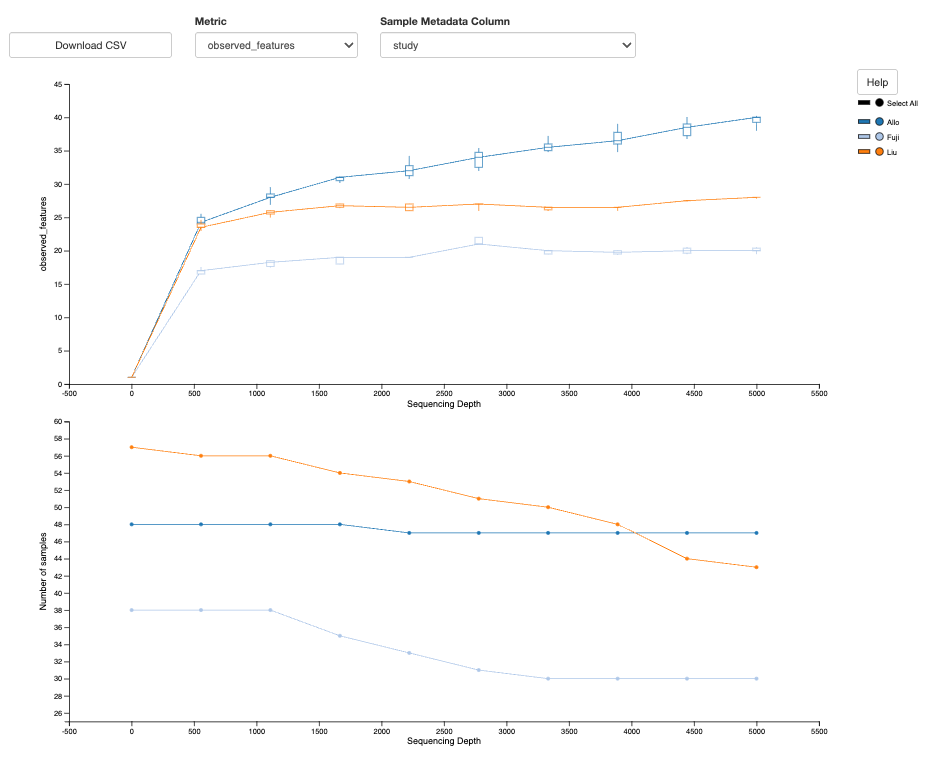

# Overview

We are working off of the uncorreced_ps object created in ODSiData/AnalyticCohort.

```{r}
library(tidyverse)
#BiocManager::install("sva")
library(sva)
library(biomformat)
library(vegan)
library(phyloseq)
library(ggExtra)
```

```{r}
load("~/Documents/ODSi/ODSiData/AnalyticCohort/uncorrected_ps.Rdata")

source("/Users/sophiehuebler/Documents/ODSi/ODSiData/Functions/tree_coloring.R")

uncorrected_ps
```

# Functions

```{r}
permanova_label_generate <- function(perm_res,
                                     ord_res,
                                     x_position = "l",
                                     y_position = "l",
                                     x_perc = .95,
                                     y_perc = .95){
  
  # 1. Extract the F and p-value from the adonis2 results
permanova_f <- perm_res$F[1]
permanova_p <- perm_res$`Pr(>F)`[1]

# Create the formatted text label for the box
# and format p-values less than 0.001 as "p < 0.001"
# For this example, let's just make it look like the plot you showed.
# We'll need some logic, as p=0.001 might be rounded from 0.0007,
# while p=0.0001 might be rounded from 0.00006.
# We'll use a rounded number to 3 decimal places as a starting point.
rounded_f <- round(permanova_f, 2)
rounded_p <- round(permanova_p, 3)

# Then we create the text label, adding logic to show < 0.001 if needed.
if (permanova_p < 0.001) {
  p_text <- "< 0.001"
} else {
  p_text <- paste0("=", rounded_p)
}

box_label <- paste0("PERMANOVA:\nF=", rounded_f, ", p", p_text)

# We need to decide where to place the box. We will place it based on the
# coordinates in the plot, which means we have to find out what the maximum
# x and y coordinates are. We'll find them from the ordination object.
# Find the range of PCoA 1 and PCoA 2
ord_df <- as.data.frame(ord_res$vectors[, 1:2])

if(x_position == "l"){
  coord_x <- min(ord_df$Axis.1)
}else if(x_position == "u"){
    coord_x <- max(ord_df$Axis.1)
  }

if(y_position == "l"){
    coord_y <- min(ord_df$Axis.2)
  }else if(y_position == "u"){
    coord_y <- max(ord_df$Axis.2)
  }


# Set the corner position of the label relative to the plot.
# We'll use 90% of the max range for each axis.
# Adjust these values based on your specific plot data.
box_x <- coord_x * as.numeric(x_perc)
box_y <- coord_y * as.numeric(y_perc)


return(list("box_label" = box_label,
            "box_x" = box_x,
            "box_y" = box_y))
  
}
```

```{r}
beta_pipe <- function(phylo_obj,
                      rare_depth = NULL,
                      ord_method,
                      title_str,
                      norm_method = "rarefy",
                      box_label_positions = c("l", "l"),
                      box_label_percs = c(.95,.95),
                      overide_positions = NULL){
  
  # 1) Normalize
  
  if (norm_method == "rarefy") {
    if (is.null(rare_depth)) stop("Must provide rare_depth when norm_method is 'rarefy'")
    
    norm_phylo <- phyloseq::rarefy_even_depth(phylo_obj,
                                              sample.size = rare_depth,
                                              replace = FALSE)
  } else if (norm_method == "logCPM") {
    # Calculate log2 Counts Per Million with a pseudocount of 1 to handle zeros
    norm_phylo <- phyloseq::transform_sample_counts(phylo_obj, function(x) {
      log2(((x / sum(x)) * 1e6) + 1)
    })
  } else {
    stop("norm_method must be either 'rarefy' or 'logCPM'")
  }
  

  norm_phylo <- prune_taxa(taxa_sums(norm_phylo)>0,
                           norm_phylo)
  norm_phylo <- prune_samples(sample_sums(norm_phylo)>0, 
                              norm_phylo)
  
  # 2) Ordination
  

  if(ord_method %in% c("bray")){
    distance_obj <- phyloseq::distance(norm_phylo, method = ord_method)
  }
  if(ord_method %in% c("unifrac")){
   distance_obj <-  phyloseq::distance(norm_phylo, method = ord_method,
                       weighted = FALSE)
  }
    
    ord_obj <- ordinate(norm_phylo,
                        method = "PCoA", 
                        distance = distance_obj)
    
    perm_res <- adonis2(
      distance_obj ~ study,
      data = data.frame(sample_data(norm_phylo)),
      permutations = 999)
    
    box <- permanova_label_generate(perm_res, ord_obj, 
                                    box_label_positions[1], box_label_positions[2],
                                    as.numeric(box_label_percs[1]), as.numeric(box_label_percs[2]))
    
     if(!is.null(overide_positions)){
   box$box_x <- overide_positions[1]
   box$box_y <- overide_positions[2]
 }
    
    #print(box)
    
  # 3) Plot
    
    base_plot <- plot_ordination(norm_phylo,
                             ord_obj,
                             color = "study") +
      geom_point(size = 2.5, alpha = 0.8) +          # Make points clear but slightly transparent
      stat_ellipse(type = "t", level = 0.95, linetype = 2) +
      theme_bw() +                                   # Clean background theme
      theme(legend.position = "bottom")+              # Move legend to bottom so it doesn't crowd the margins
      scale_color_manual(name = "Cohort",
                     labels = c("Allo" = "Allozithro",
                                "Fuji" = "Fujimoto",
                                "Liu" = "Liu"),
                     values = c("gold", "#56B4E9", "#76EE00"))+
      geom_label(x = box$box_x, y = box$box_y, label = box$box_label,
             fill = "white", color = "black", fontface = "bold", size = 4) +
      ggtitle(title_str)+
      xlim(-.6, .6)+
      ylim(-.6, .6)

  # Add the marginal distributions using ggExtra
final_plot <- ggMarginal(base_plot, 
                         type = "density",       # Change to "boxplot" or "histogram" if preferred
                         groupColour = TRUE, 
                         groupFill = TRUE, 
                         alpha = 0.4)            # Transparency for overlapping distributions


final_plot

  
}
```

# Uncorrected

## Export to qiime

```{r}
# 1. Extract the OTU table (convert to matrix)
otu_mat <- as(otu_table(uncorrected_ps), "matrix")

# 2. Create OTU biom
biom_otu <- make_biom(data = t(otu_mat))
write_biom(biom_otu, 
           "/Users/sophiehuebler/Documents/ODSi/ODSiData/AnalyticCohort/Uncorrected/feature-table.biom")


# 3. Extract Taxonomy table
tax_mat <- as(tax_table(uncorrected_ps), "matrix")
tax_strings <- apply(tax_mat, 1, function(x) paste(x, collapse = "; "))
qiime_tax <- data.frame(
  `Feature ID` = rownames(tax_mat),
  Taxon = tax_strings,
  check.names = FALSE
)
write.table(qiime_tax, "/Users/sophiehuebler/Documents/ODSi/ODSiData/AnalyticCohort/Uncorrected/taxonomy.tsv", sep = "\t", row.names = FALSE, quote = FALSE)


rm(otu_mat, tax_mat, biom_otu, tax_strings, qiime_tax)

# 4. Export Metadata (Standard TSV)
#metadata <- as(sample_data(ps), "data.frame")
# Add the #SampleID header required by QIIME 2
#metadata <- cbind(SampleID = rownames(metadata), metadata)

uncorrected_meta <- sample_data(uncorrected_ps)%>%data.frame()
names(uncorrected_meta)<- c("sampleid","study",
                                "individual","sex","age",
                                "disease","agvhd","death", "relapse")


write.table(uncorrected_meta, "/Users/sophiehuebler/Documents/ODSi/ODSiData/AnalyticCohort/Uncorrected/meta.tsv", sep="\t", row.names=FALSE, quote=FALSE)

# 5. Export Tree 
if (!is.null(phy_tree(combatseq_ps, errorIfNULL = FALSE))) {
  ape::write.tree(phy_tree(uncorrected_ps), 
                  "/Users/sophiehuebler/Documents/ODSi/ODSiData/AnalyticCohort/Uncorrected/tree.nwk")
}

rm(uncorrected_meta)
```

## Beta diversity

### Rarefaction

```{r}
summary(rowSums(as(otu_table(uncorrected_ps), "matrix")))
```

```         
rarefy_pipe.sh 5000
```



```{r}
set.seed(9134)
```

### Bray

```{r}
uncorrected_rare900_beta_bray <- beta_pipe(uncorrected_ps,
          900,
          "bray",
"Beta Diversity (Bray-Curtis)
Uncorrected
Rarefied to 900",
"rarefy",
box_label_positions = c("l", "l"),
box_label_percs = c(.99, .89))

uncorrected_rare900_beta_bray 
```

```{r}
uncorrected_logCPM_beta_bray <- beta_pipe(uncorrected_ps,
          NULL,
          "bray",
"Beta Diversity (Bray-Curtis)
Uncorrected
Log Parts Per Million",
"logCPM",
box_label_positions = c("l", "l"),
box_label_percs = c(.99, .89))

uncorrected_logCPM_beta_bray 
```

### Unifrac

```{r}
uncorrected_rare900_beta_unifrac <- beta_pipe(uncorrected_ps,
          900,
          "unifrac",
"Beta Diversity (Unweighted Unifrac)
Uncorrected
Rarefied to 900",
box_label_positions = c("l", "l"),
box_label_percs = c(1.0, -.9),
overide_positions = c(-.5, -.5))

uncorrected_rare900_beta_unifrac
```

Export at 700 x 500

# Combat-seq

Developed by \[<https://pmc.ncbi.nlm.nih.gov/articles/PMC7518324/>\]

Uses a negative binomial regression model for batch correction. Allows designation of biological variables such that clinicly explainable heterogeneity is not removed.

```{r}
## ComBat_seq requires taxa are rows, samples are cols
count_matrix <- as(otu_table(uncorrected_ps), "matrix")
if (!taxa_are_rows(uncorrected_ps)) {
  count_matrix <- t(count_matrix)
}

## Extract batch (study) and bio variable (agvhd)
count_meta <- data.frame(sample_data(uncorrected_ps))
count_meta <- count_meta[colnames(count_matrix), , drop = FALSE]

batch_var <- droplevels(factor(count_meta$study))

## Treat agvhd as categorical (any gvhd)
bio_var <- droplevels(factor(count_meta$agvhd))
```

```{r}


##  Sanity checks
stopifnot(ncol(count_matrix) == nrow(count_meta))
stopifnot(identical(colnames(count_matrix), rownames(count_meta)))
stopifnot(all(count_matrix >= 0))
stopifnot(all(count_matrix == round(count_matrix)))   # raw counts

## Original sample library sizes
summary(colSums(count_matrix))
which(colSums(count_matrix) == 0)

library_sizes <- colSums(count_matrix)
hist(log(library_sizes))
```

```{r}

# Filter for samples that have taxa which only appears in a single batch

## 1) Identify taxa that are non-zero in at least one sample of at least two batches
shared_taxa <-  rowSums(sapply(levels(batch_var), function(b) {
  rowSums(count_matrix[, batch_var == b, drop = FALSE]) > 0
  })) >= 2

## 2) Filter count matrix for only those taxa shared between at least 2 studies
shared_count_matrix <- count_matrix[shared_taxa, , drop = FALSE]

## 3) Identify samples that do not have any any shared taxa in library
bad_samples <- colnames(shared_count_matrix)[colSums(shared_count_matrix) == 0]
print(bad_samples)

## 4) Identify samples that should be kept
sample_keep <- colSums(shared_count_matrix) > 0

## 5) Filter count matrix, batch var, and bio var
count_matrix_keep <- count_matrix[, sample_keep]
count_meta_keep <- count_meta[sample_keep,]
batch_var_keep <- batch_var[sample_keep]
bio_var_keep <- bio_var[sample_keep]


```

```{r}

adjusted_counts <- sva::ComBat_seq(
  counts = count_matrix_keep,
  batch  = batch_var_keep,
  group  = bio_var_keep
)
```

```{r}

##  Sanity checks
stopifnot(ncol(adjusted_counts) == nrow(count_meta_keep))
stopifnot(identical(colnames(adjusted_counts), rownames(count_meta_keep)))
stopifnot(all(adjusted_counts >= 0))
stopifnot(all(adjusted_counts == round(adjusted_counts)))   # raw counts

## Original sample library sizes
summary(colSums(adjusted_counts))
which(colSums(adjusted_counts) == 0)

adjusted_library_sizes <- colSums(adjusted_counts)
hist(log(adjusted_library_sizes))
```

## ps_combat

```{r}
combatseq_ps <- prune_samples(!(sample_data(uncorrected_ps)$sample.id %in% bad_samples), uncorrected_ps)
otu_table(combatseq_ps) <- otu_table(adjusted_counts, taxa_are_rows = TRUE)
```

```{r}
print("Matching otu rownames and tree tip labels:")
all(rownames(combatseq_ps@otu_table) %in% combatseq_ps@phy_tree$tip.label)

print(sprintf("OTU features: %d ; tree tips: %d", ntaxa(combatseq_ps@otu_table), length(combatseq_ps@phy_tree$tip.label)))
print(sprintf("Intersection: %d", sum(rownames(combatseq_ps@otu_table) %in% combatseq_ps@phy_tree$tip.label)))


print(sprintf("OTU sample: %d ; meta samples: %d", ncol(combatseq_ps@otu_table), nrow(combatseq_ps@sam_data)))
print(sprintf("Intersection: %d", sum(colnames(combatseq_ps@otu_table) %in% rownames(combatseq_ps@sam_data))))
```

## Export to qiime

```{r}

# 1. Extract the OTU table (convert to matrix)
otu_mat <- as(otu_table(combatseq_ps), "matrix")

# 2. Create OTU biom
biom_otu <- make_biom(data = otu_mat)
write_biom(biom_otu, 
           "/Users/sophiehuebler/Documents/ODSi/ODSiData/AnalyticCohort/CombatSeq/combat-feature-table.biom")


# 3. Extract Taxonomy table
tax_mat <- as(tax_table(combatseq_ps), "matrix")
tax_strings <- apply(tax_mat, 1, function(x) paste(x, collapse = "; "))
qiime_tax <- data.frame(
  `Feature ID` = rownames(tax_mat),
  Taxon = tax_strings,
  check.names = FALSE
)
write.table(qiime_tax, "/Users/sophiehuebler/Documents/ODSi/ODSiData/AnalyticCohort/CombatSeq/combat-taxonomy.tsv", sep = "\t", row.names = FALSE, quote = FALSE)


rm(otu_mat, tax_mat, biom_otu, tax_strings, qiime_tax)

# 4. Export Metadata (Standard TSV)
#metadata <- as(sample_data(ps), "data.frame")
# Add the #SampleID header required by QIIME 2
#metadata <- cbind(SampleID = rownames(metadata), metadata)

combat_adjusted_meta <- sample_data(combatseq_ps)%>%data.frame()
names(combat_adjusted_meta)<- c("sampleid","study",
                                "individual","sex","age",
                                "disease","agvhd","death", "relapse")


write.table(combat_adjusted_meta, "/Users/sophiehuebler/Documents/ODSi/ODSiData/AnalyticCohort/CombatSeq/combat-meta.tsv", sep="\t", row.names=FALSE, quote=FALSE)

# 5. Export Tree 
if (!is.null(phy_tree(combatseq_ps, errorIfNULL = FALSE))) {
  ape::write.tree(phy_tree(combatseq_ps), 
                  "/Users/sophiehuebler/Documents/ODSi/ODSiData/AnalyticCohort/CombatSeq/combat-tree.nwk")
}
```

## Beta diversity

### Rarefaction

```         
rarefy_pipe.sh 5000
```

{width="681"}

### Bray

```{r}
combatseq_rare900_beta_bray <- beta_pipe(combatseq_ps,
          900,
          "bray",
"Beta Diversity (Bray-Curtis)
ComBat-seq corrected
Rarefied to 900",
box_label_positions = c("l", "l"),
box_label_percs = c(.99, .89))

combatseq_rare900_beta_bray 
```

### Unifrac

```{r}
combatseq_rare900_beta_unifrac <- beta_pipe(combatseq_ps,
          900,
          "unifrac",
"Beta Diversity (Unweighted Unifrac)
ComBat-seq corrected
Rarefied to 900",
box_label_positions = c("l", "l"),
box_label_percs = c(1, .89),
overide_positions = c(-.5, -.5))

combatseq_rare900_beta_unifrac 
```

# Combat-seq (no bio)

```{r}
## ComBat_seq requires taxa are rows, samples are cols
count_matrix <- as(otu_table(uncorrected_ps), "matrix")
if (!taxa_are_rows(uncorrected_ps)) {
  count_matrix <- t(count_matrix)
}

## Extract batch (study) and bio variable (agvhd)
count_meta <- data.frame(sample_data(uncorrected_ps))
count_meta <- count_meta[colnames(count_matrix), , drop = FALSE]

batch_var <- droplevels(factor(count_meta$study))


```

```{r}


##  Sanity checks
stopifnot(ncol(count_matrix) == nrow(count_meta))
stopifnot(identical(colnames(count_matrix), rownames(count_meta)))
stopifnot(all(count_matrix >= 0))
stopifnot(all(count_matrix == round(count_matrix)))   # raw counts

## Original sample library sizes
summary(colSums(count_matrix))
which(colSums(count_matrix) == 0)

library_sizes <- colSums(count_matrix)
hist(log(library_sizes))
```

```{r}

# Filter for samples that have taxa which only appears in a single batch

## 1) Identify taxa that are non-zero in at least one sample of at least two batches
shared_taxa <-  rowSums(sapply(levels(batch_var), function(b) {
  rowSums(count_matrix[, batch_var == b, drop = FALSE]) > 0
  })) >= 2

## 2) Filter count matrix for only those taxa shared between at least 2 studies
shared_count_matrix <- count_matrix[shared_taxa, , drop = FALSE]

## 3) Identify samples that do not have any any shared taxa in library
bad_samples <- colnames(shared_count_matrix)[colSums(shared_count_matrix) == 0]
print(bad_samples)

## 4) Identify samples that should be kept
sample_keep <- colSums(shared_count_matrix) > 0

## 5) Filter count matrix, batch var, and bio var
count_matrix_keep <- count_matrix[, sample_keep]
count_meta_keep <- count_meta[sample_keep,]
batch_var_keep <- batch_var[sample_keep]


```

```{r}

adjusted_counts2 <- sva::ComBat_seq(
  counts = count_matrix_keep,
  batch  = batch_var_keep,
  group  = NULL
)
```

```{r}

##  Sanity checks
stopifnot(ncol(adjusted_counts2) == nrow(count_meta_keep))
stopifnot(identical(colnames(adjusted_counts2), rownames(count_meta_keep)))
stopifnot(all(adjusted_counts2 >= 0))
stopifnot(all(adjusted_counts2 == round(adjusted_counts2)))   # raw counts

## Original sample library sizes
summary(colSums(adjusted_counts2))
which(colSums(adjusted_counts2) == 0)

adjusted_library_sizes2 <- colSums(adjusted_counts2)
hist(log(adjusted_library_sizes2))
```

## ps_combat

```{r}
combatseq2_ps <- prune_samples(!(sample_data(uncorrected_ps)$sample.id %in% bad_samples), uncorrected_ps)
otu_table(combatseq2_ps) <- otu_table(adjusted_counts2, taxa_are_rows = TRUE)
```

```{r}
print("Matching otu rownames and tree tip labels:")
all(rownames(combatseq2_ps@otu_table) %in% combatseq2_ps@phy_tree$tip.label)

print(sprintf("OTU features: %d ; tree tips: %d", ntaxa(combatseq2_ps@otu_table), length(combatseq2_ps@phy_tree$tip.label)))
print(sprintf("Intersection: %d", sum(rownames(combatseq2_ps@otu_table) %in% combatseq2_ps@phy_tree$tip.label)))


print(sprintf("OTU sample: %d ; meta samples: %d", ncol(combatseq2_ps@otu_table), nrow(combatseq2_ps@sam_data)))
print(sprintf("Intersection: %d", sum(colnames(combatseq2_ps@otu_table) %in% rownames(combatseq2_ps@sam_data))))
```

## Export to qiime

```{r}

# 1. Extract the OTU table (convert to matrix)
otu_mat <- as(otu_table(combatseq2_ps), "matrix")

# 2. Create OTU biom
biom_otu <- make_biom(data = otu_mat)
write_biom(biom_otu, 
           "/Users/sophiehuebler/Documents/ODSi/ODSiData/AnalyticCohort/CombatSeq2/combat2-feature-table.biom")


# 3. Extract Taxonomy table
tax_mat <- as(tax_table(combatseq2_ps), "matrix")
tax_strings <- apply(tax_mat, 1, function(x) paste(x, collapse = "; "))
qiime_tax <- data.frame(
  `Feature ID` = rownames(tax_mat),
  Taxon = tax_strings,
  check.names = FALSE
)
write.table(qiime_tax, "/Users/sophiehuebler/Documents/ODSi/ODSiData/AnalyticCohort/CombatSeq2/combat2-taxonomy.tsv", sep = "\t", row.names = FALSE, quote = FALSE)


rm(otu_mat, tax_mat, biom_otu, tax_strings, qiime_tax)

# 4. Export Metadata (Standard TSV)
#metadata <- as(sample_data(ps), "data.frame")
# Add the #SampleID header required by QIIME 2
#metadata <- cbind(SampleID = rownames(metadata), metadata)

combat2_adjusted_meta <- sample_data(combatseq2_ps)%>%data.frame()
names(combat2_adjusted_meta)<- c("sampleid","study",
                                "individual","sex","age",
                                "disease","agvhd","death", "relapse")


write.table(combat2_adjusted_meta, "/Users/sophiehuebler/Documents/ODSi/ODSiData/AnalyticCohort/CombatSeq2/combat2-meta.tsv", sep="\t", row.names=FALSE, quote=FALSE)

# 5. Export Tree 
if (!is.null(phy_tree(combatseq2_ps, errorIfNULL = FALSE))) {
  ape::write.tree(phy_tree(combatseq2_ps), 
                  "/Users/sophiehuebler/Documents/ODSi/ODSiData/AnalyticCohort/CombatSeq2/combat2-tree.nwk")
}
```

## Beta

### Bray

```{r}
combatseq2_rare900_beta_bray <- beta_pipe(combatseq2_ps,
          900,
          "bray",
"Beta Diversity (Bray-Curtis)
ComBat-seq corrected
Rarefied to 900",
box_label_positions = c("l", "l"),
box_label_percs = c(.99, .89))


```

```{r}
combatseq_rare900_beta_bray 
combatseq2_rare900_beta_bray 
```

### Unifrac

```{r}
combatseq2_rare900_beta_unifrac <- beta_pipe(combatseq2_ps,
          900,
          "unifrac",
"Beta Diversity (Unweighted Unifrac)
ComBat-seq corrected
Rarefied to 900",
box_label_positions = c("l", "l"),
box_label_percs = c(1, .89),
overide_positions = c(-.5, -.5))


```

```{r}
combatseq_rare900_beta_unifrac 
combatseq2_rare900_beta_unifrac 
```
