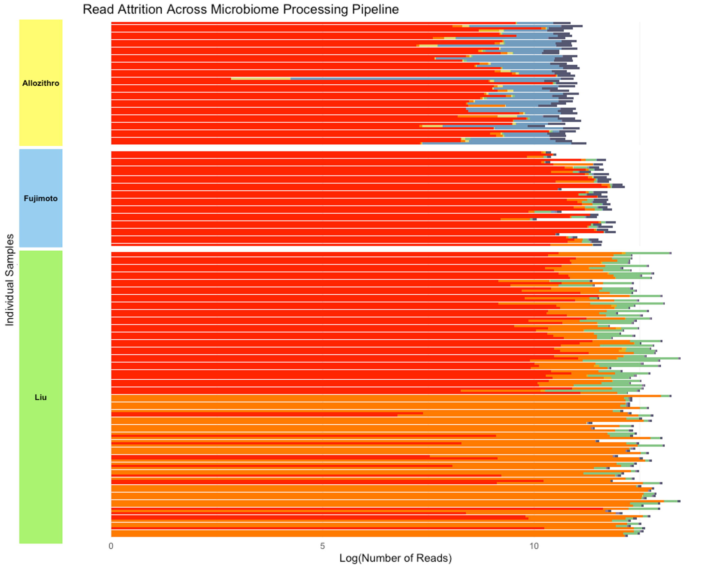

# Overview

Here we create the analytic cohort. We start from the phyloseq object created in ODSi/ODSiData/Merging/Merging.qmd.

We first apply the inclusion/excusion criteria:


We then collapse the Liu data to have 1 sample/person/timepoint by adding together libraries. Note, not all person-timepoints had both reads pass the preprocessing stage.



```{r}
library(tidyverse)
```

```{r}
load("~/Documents/ODSi/ODSiData/Merging/merged_ps.Rdata")
```

# Filtering for baseline

```{r}
baseline_index <- sample_data(ps)$baseline 
patient_index <- sample_data(ps)$patient
adult_index <- sample_data(ps)$age >= 18

final_index <- as.logical(pmin(baseline_index, patient_index, adult_index))
ps_filtered_01 <- prune_samples(final_index, ps)
ps_filtered_01 <- prune_taxa(taxa_sums(ps_filtered_01)>0, ps_filtered_01)
```

## Collapse Liu

```{r}

filtered_meta <- sample_data(ps_filtered_01)%>%
  data.frame()%>%
  dplyr::group_by(individual)%>%
  mutate(sample.id2 = paste(unique(sample.id), collapse = "_"))%>%
  dplyr::select(-sample.id)%>%
  dplyr::select(sample.id = sample.id2,
                study,
                individual,
                sex,
                age,
                disease,
                agvhd,
                death, 
                relapse)%>%
  distinct()
 

ps_filtered_02 <- merge_samples(ps_filtered_01, group = "individual")
```

```{r}
filtered_otu <- otu_table(ps_filtered_02)
rownames(filtered_otu)<- filtered_meta$sample.id
filtered_meta <- sample_data(filtered_meta)
rownames(filtered_meta)<- filtered_meta$sample.id

ps_filtered <- phyloseq(filtered_otu, tax_table(ps_filtered_02), filtered_meta, phy_tree(ps_filtered_02), refseq(ps_filtered_01))

ps_filtered <- prune_taxa(taxa_sums(ps_filtered)>0, ps_filtered)
ps_filtered <- prune_samples(sample_sums(ps_filtered)>0, ps_filtered)
```

```{r}
print("Matching otu rownames and tree tip labels:")
all(colnames(ps_filtered@otu_table) %in% ps_filtered@phy_tree$tip.label)

print(sprintf("OTU features: %d ; tree tips: %d", ntaxa(ps_filtered@otu_table), length(ps_filtered@phy_tree$tip.label)))
print(sprintf("Intersection: %d", sum(colnames(ps_filtered@otu_table) %in% ps_filtered@phy_tree$tip.label)))


print(sprintf("OTU sample: %d ; meta samples: %d", nrow(ps_filtered@otu_table), nrow(ps_filtered@sam_data)))
print(sprintf("Intersection: %d", sum(rownames(ps_filtered@otu_table) %in% rownames(ps_filtered@sam_data))))
```

```{r}
print(ps_filtered)
```

```{r}


all_asv_merge_filtered <- asv_mapping_func(ps_filtered,
                             save = TRUE,
           save_file_name = "Allo_Liu_Fuji_Filtered_ASVs.txt",
           id_col_name = "sample.id",
           cohort_col_name = "study",
           save_path = "/Users/sophiehuebler/Documents/ODSi/ODSiData/MergedTree/TreeColors")
table(all_asv_merge_filtered$Cohort)

```

```{r}
ggtree(phy_tree(ps_genus), layout = "circular", branch.length = "none") %<+% genus_tax2 +
  #geom_tippoint(size = 1.6, alpha = 0.9, aes(color = Color)) +
  
  geom_tippoint( size = 1.6, alpha = 0.9, aes(color = Color))+
  geom_tiplab(aes(label = Genus, color = Color),
              offset = 1, size = 2)+
  #scale_color_manual(values = cohort_colors) +
  scale_color_identity(guide = "legend",
                       name = "Cohort",
                       breaks = names(colors_cohort),
                       labels = unname(colors_cohort))+
  ggtitle("Genus Level")

ggtree(phy_tree(ps), layout = "circular", branch.length = "none") %<+% all_asv_merge_filtered +
  geom_tippoint(size = 5, alpha = 0.9, aes(color = Color)) +
  #scale_color_manual(values = cohort_colors) +
  scale_color_identity(guide = "legend",
                       name = "Cohort",
                       breaks = names(colors_cohort),
                       labels = unname(colors_cohort))+
  ggtitle("ASV Level")

```

```{r}
ps_genus_filtered <- suppressMessages(tax_glom(ps_filtered, taxrank = "Genus"))
ps_genus_filtered <- prune_samples(sample_sums(ps_genus_filtered)>0, ps_genus_filtered)
ps_genus_filtered

all_genus_merge_filtered <- asv_mapping_func(ps_genus_filtered,
                                    save = TRUE,
                                    save_file_name = "Allo_Liu_Fuji_genus_filtered.txt",
                                    id_col_name = "sample.id",
                                    cohort_col_name = "study",
                                    save_path = "/Users/sophiehuebler/Documents/ODSi/ODSiData/MergedTree/TreeColors")
table(all_genus_merge_filtered$Cohort)
genus_tax_filtered <- tax_table(ps_genus_filtered)%>%
  as.data.frame()%>%
  rownames_to_column("ASV_ID")

genus_tax2_filtered <- all_genus_merge_filtered %>%
  left_join(genus_tax_filtered %>%
              select(ASV_ID, Genus),
            by = "ASV_ID")
ggtree(phy_tree(ps_genus_filtered), layout = "circular", branch.length = "none") %<+% genus_tax2_filtered +
  geom_tippoint( size = 1.6, alpha = 0.9, aes(color = Color))+
  geom_tiplab(aes(label = Genus, color = Color),
              offset = 1, size = 2)+
  #scale_color_manual(values = cohort_colors) +
  scale_color_identity(guide = "legend",
                       name = "Cohort",
                       breaks = names(colors_cohort),
                       labels = unname(colors_cohort))+
  ggtitle("Genus Level")
```
