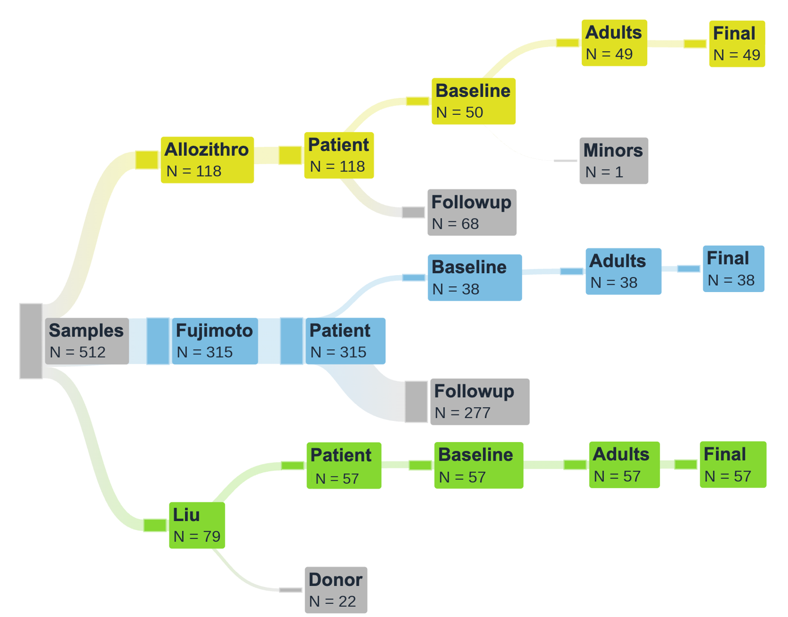
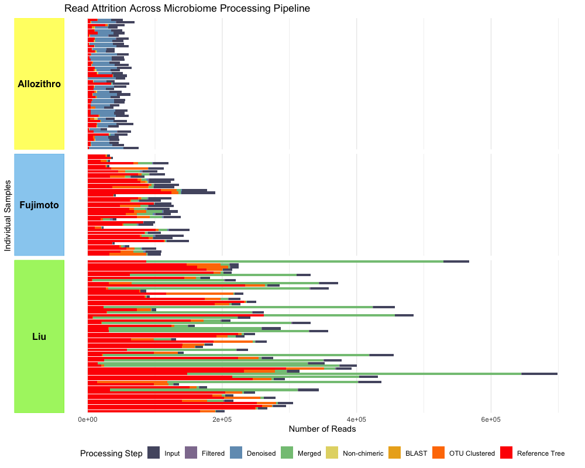

# Overview

Here we create the analytic cohort. We start from the phyloseq object created in ODSi/ODSiData/Merging/Merging.qmd.

We first apply the inclusion/exclusion criteria:

{width="641"}

{width="620"}

```{r}
#| label: libraries
#| output: false
library(tidyverse)
library(phyloseq)
```

```{r}
#| label: load
#| output: false


#ps = all_samples_ps
load("~/Documents/ODSi/ODSiData/Merging/merged_ps.Rdata")
source("/Users/sophiehuebler/Documents/ODSi/ODSiData/Functions/tree_coloring.R")
```

# Filtering for baseline

Starting with our all_samples_ps phyloseq object:

```{r}
#| label: filter
#| output: false

baseline_index <- sample_data(ps)$baseline 
patient_index <- sample_data(ps)$patient
adult_index <- sample_data(ps)$age >= 18

final_index <- as.logical(pmin(baseline_index, patient_index, adult_index))
ps_filtered_01 <- prune_samples(final_index, ps)
ps_filtered <- prune_taxa(taxa_sums(ps_filtered_01)>0, ps_filtered_01)
```

```{r}
#| label: check ps

print("Matching otu rownames and tree tip labels:")
all(rownames(ps_filtered@otu_table) %in% ps_filtered@phy_tree$tip.label)

print(sprintf("OTU features: %d ; tree tips: %d", ntaxa(ps_filtered@otu_table), length(ps_filtered@phy_tree$tip.label)))
print(sprintf("Intersection: %d", sum(rownames(ps_filtered@otu_table) %in% ps_filtered@phy_tree$tip.label)))


print(sprintf("OTU sample: %d ; meta samples: %d", ncol(ps_filtered@otu_table), nrow(ps_filtered@sam_data)))
print(sprintf("Intersection: %d", sum(colnames(ps_filtered@otu_table) %in% rownames(ps_filtered@sam_data))))
```

```{r}
#| label: print ps

print(ps_filtered)
```

# Export

Saving our analytic_samples_ps object:

```{r}

uncorrected_ps <- ps_filtered
#save(uncorrected_ps, file = "~/Documents/ODSi/ODSiData/AnalyticCohort/uncorrected_ps.Rdata")
analytic_samples_ps <- uncorrected_ps
#save(analytic_samples_ps, file = "~/Documents/ODSi/ODSiData/analytic_samples_ps.Rdata")
```

# Visualize

```{r}
vizualize_collapse(analytic_samples_ps, "ASV")
```

```{r}
vizualize_collapse(analytic_samples_ps, "Species")
```

```{r}
vizualize_collapse(analytic_samples_ps, "Genus")
```
