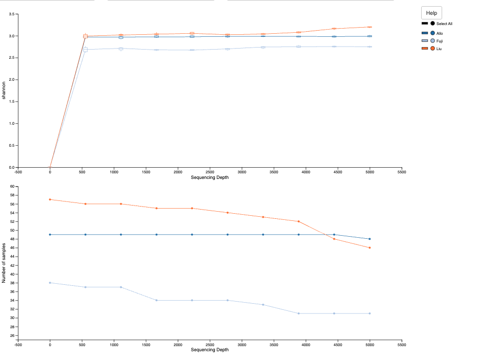

# Overview

We are working off of the uncorreced_ps object created in ODSiData/AnalyticCohort.

```{r}
library(tidyverse)
#BiocManager::install("sva")
library(sva)
library(biomformat)
library(vegan)
library(phyloseq)
library(ggExtra)
```

```{r}
load("~/Documents/ODSi/ODSiData/AnalyticCohort/uncorrected_ps.Rdata")

source("/Users/sophiehuebler/Documents/ODSi/ODSiData/Functions/tree_coloring.R")

uncorrected_ps
```

# Functions

```{r}
permanova_label_generate <- function(perm_res,
                                     ord_res,
                                     x_position = "l",
                                     y_position = "l",
                                     x_perc = .95,
                                     y_perc = .95){
  
  # 1. Extract the F and p-value from the adonis2 results
permanova_f <- perm_res$F[1]
permanova_p <- perm_res$`Pr(>F)`[1]

# Create the formatted text label for the box
# and format p-values less than 0.001 as "p < 0.001"
# For this example, let's just make it look like the plot you showed.
# We'll need some logic, as p=0.001 might be rounded from 0.0007,
# while p=0.0001 might be rounded from 0.00006.
# We'll use a rounded number to 3 decimal places as a starting point.
rounded_f <- round(permanova_f, 2)
rounded_p <- round(permanova_p, 3)

# Then we create the text label, adding logic to show < 0.001 if needed.
if (permanova_p < 0.001) {
  p_text <- "< 0.001"
} else {
  p_text <- paste0("=", rounded_p)
}

box_label <- paste0("PERMANOVA:\nF=", rounded_f, ", p", p_text)

# We need to decide where to place the box. We will place it based on the
# coordinates in the plot, which means we have to find out what the maximum
# x and y coordinates are. We'll find them from the ordination object.
# Find the range of PCoA 1 and PCoA 2
ord_df <- as.data.frame(ord_res$vectors[, 1:2])

if(x_position == "l"){
  coord_x <- min(ord_df$Axis.1)
}else if(x_position == "u"){
    coord_x <- max(ord_df$Axis.1)
  }

if(y_position == "l"){
    coord_y <- min(ord_df$Axis.2)
  }else if(y_position == "u"){
    coord_y <- max(ord_df$Axis.2)
  }


# Set the corner position of the label relative to the plot.
# We'll use 90% of the max range for each axis.
# Adjust these values based on your specific plot data.
box_x <- coord_x * as.numeric(x_perc)
box_y <- coord_y * as.numeric(y_perc)


return(list("box_label" = box_label,
            "box_x" = box_x,
            "box_y" = box_y))
  
}
```

```{r}
beta_pipe <- function(phylo_obj,
                      rare_depth = NULL,
                      ord_method,
                      title_str,
                      norm_method = "rarefy",
                      box_label_positions = c("l", "l"),
                      box_label_percs = c(.95,.95),
                      overide_positions = NULL){
  
  # 1) Normalize
  
  if (norm_method == "rarefy") {
    if (is.null(rare_depth)) stop("Must provide rare_depth when norm_method is 'rarefy'")
    
    norm_phylo <- phyloseq::rarefy_even_depth(phylo_obj,
                                              sample.size = rare_depth,
                                              replace = FALSE)
    
     norm_phylo <- prune_taxa(taxa_sums(norm_phylo)>0,
                             norm_phylo)
    norm_phylo <- prune_samples(sample_sums(norm_phylo)>0,
                                norm_phylo)
  } else if (norm_method == "logCPM") {
    # Calculate log2 Counts Per Million with a pseudocount of 1 to handle zeros
    norm_phylo <- phyloseq::transform_sample_counts(phylo_obj, function(x) {
      log2(((x / sum(x)) * 1e6) + 1)
    })
      
    norm_phylo <- prune_taxa(taxa_sums(norm_phylo)>0,
                             norm_phylo)
    norm_phylo <- prune_samples(sample_sums(norm_phylo)>0,
                                norm_phylo)
    
  } else if(norm_method == "identity"){
    norm_phylo <- phylo_obj
    print("No normalization used, make sure that supplied phylo_obj has normalized relative abundance data")
    if(ord_method != "euclidean"){
    norm_phylo <- prune_taxa(taxa_sums(norm_phylo)>0,
                             norm_phylo)
    norm_phylo <- prune_samples(sample_sums(norm_phylo)>0,
                                norm_phylo)
    }
    
  }else if(norm_method == "clr"){
    # Centered log-ratio (CLR) transform with a naive pseudocount of 1.
    # Extract counts as a samples (rows) x taxa (cols) matrix so we can
    # apply the CLR one sample at a time, then rebuild a phyloseq object
    # that keeps the original sample_data() and tax_table() attached.
    otu <- as(otu_table(phylo_obj), "matrix")
    if (taxa_are_rows(phylo_obj)) {
      otu <- t(otu)   # ensure samples are rows, taxa are columns
    }

    imputed <- otu + 1                                   # naive zero imputation
    clr_mat <- t(apply(imputed, 1,
                       function(r) as.numeric(compositions::clr(r))))
    rownames(clr_mat) <- rownames(imputed)
    colnames(clr_mat) <- colnames(imputed)

    clr_otu <- otu_table(clr_mat, taxa_are_rows = FALSE)
    norm_phylo <- phyloseq(clr_otu,
                           sample_data(phylo_obj),
                           tax_table(phylo_obj))
  } else{
    stop("norm_method must be either 'rarefy' or 'logCPM' or 'identity' or 'clr")
  }
  
  # 2) Ordination
  

  if(norm_method == "clr"){
    # CLR data lives in Aitchison (Euclidean) space, so ordination is PCA with
    # Euclidean distance. PCoA on a Euclidean distance matrix is equivalent to
    # PCA and keeps the downstream ord object structure ($vectors / Axis.1 /
    # Axis.2) intact for permanova_label_generate() and plot_ordination().
    if(!missing(ord_method) && !is.null(ord_method) && ord_method != "euclidean"){
      warning("norm_method = 'clr' requires PCA with Euclidean distance; the ",
              "supplied ord_method = '", ord_method, "' is incompatible and is ",
              "being ignored. Using Euclidean distance instead.")
    }
    distance_obj <- phyloseq::distance(norm_phylo, method = "euclidean")
  } else {
    if(ord_method %in% c("bray")){
      distance_obj <- phyloseq::distance(norm_phylo, method = ord_method)
    }
    if(ord_method %in% c("unifrac")){
     distance_obj <-  phyloseq::distance(norm_phylo, method = ord_method,
                         weighted = FALSE)
    }
    if(ord_method %in% c("euclidean")){
     distance_obj <- phyloseq::distance(norm_phylo, method = "euclidean")
    }
  }

    ord_obj <- ordinate(norm_phylo,
                        method = "PCoA",
                        distance = distance_obj)
    
    perm_res <- adonis2(
      distance_obj ~ study,
      data = data.frame(sample_data(norm_phylo)),
      permutations = 999)
    
    box <- permanova_label_generate(perm_res, ord_obj, 
                                    box_label_positions[1], box_label_positions[2],
                                    as.numeric(box_label_percs[1]), as.numeric(box_label_percs[2]))
    
     if(!is.null(overide_positions)){
   box$box_x <- overide_positions[1]
   box$box_y <- overide_positions[2]
 }
    
    #print(box)
    
  # 3) Plot
    
    base_plot <- plot_ordination(norm_phylo,
                             ord_obj,
                             color = "study") +
      geom_point(size = 2.5, alpha = 0.8) +          # Make points clear but slightly transparent
      stat_ellipse(type = "t", level = 0.95, linetype = 2) +
      theme_bw() +                                   # Clean background theme
      theme(legend.position = "bottom")+              # Move legend to bottom so it doesn't crowd the margins
      scale_color_manual(name = "Cohort",
                     labels = c("Allo" = "Allozithro",
                                "Fuji" = "Fujimoto",
                                "Liu" = "Liu"),
                     values = c("gold", "#56B4E9", "#76EE00"))+
      geom_label(x = box$box_x, y = box$box_y, label = box$box_label,
             fill = "white", color = "black", fontface = "bold", size = 4) +
      ggtitle(title_str)

  # Fixed axis limits suit the relative-abundance PCoA scale; CLR/PCA lives on a
  # much larger scale, so let ggplot auto-scale the axes in that case.
  if(norm_method != "clr" & !(norm_method == "identity" & ord_method == "euclidean")){
    base_plot <- base_plot +
      xlim(-.6, .6)+
      ylim(-.6, .6)
  }

  # Add the marginal distributions using ggExtra
final_plot <- ggMarginal(base_plot, 
                         type = "density",       # Change to "boxplot" or "histogram" if preferred
                         groupColour = TRUE, 
                         groupFill = TRUE, 
                         alpha = 0.4)            # Transparency for overlapping distributions


final_plot

  
}
```

# Prevalence threshold

```{r}
singleton_ps <- filter_taxa(uncorrected_ps, function(x) sum(x > 0) ==1, prune = TRUE)
singleton_ps
```

Out of the 1731 taxa we start with, 683 occur in only a single sample.

We will drop taxa that appear in fewer than x% of samples

```{r}

filter_by_prevalence <- function(x, phylo_obj=uncorrected_ps){
prevalence_threshold <- x * nsamples(phylo_obj) 

# Filter the taxa
filtered_ps <- filter_taxa(phylo_obj, function(x) sum(x > 0) >= prevalence_threshold, prune = TRUE)
filtered_ps <- prune_samples(sample_sums(filtered_ps) > 0, filtered_ps)

filtered_ps

}

filter_by_prevalence(.1)
filter_by_prevalence(.05)
```

We'll filter for taxa found in at least 5% of samples (8 out of 144).

```{r}
filtered_ps <- filter_by_prevalence(.05)
```

# Uncorrected

## Export to qiime

```{r}
# 1. Extract the OTU table (convert to matrix)
otu_mat <- as(otu_table(filtered_ps), "matrix")

# 2. Create OTU biom
biom_otu <- make_biom(data = t(otu_mat))
write_biom(biom_otu, 
           "/Users/sophiehuebler/Documents/ODSi/ODSiData/AnalyticCohort/Filtered/feature-table.biom")


# 3. Extract Taxonomy table
tax_mat <- as(tax_table(filtered_ps), "matrix")
tax_strings <- apply(tax_mat, 1, function(x) paste(x, collapse = "; "))
qiime_tax <- data.frame(
  `Feature ID` = rownames(tax_mat),
  Taxon = tax_strings,
  check.names = FALSE
)
write.table(qiime_tax, "/Users/sophiehuebler/Documents/ODSi/ODSiData/AnalyticCohort/Filtered/taxonomy.tsv", sep = "\t", row.names = FALSE, quote = FALSE)


rm(otu_mat, tax_mat, biom_otu, tax_strings, qiime_tax)

# 4. Export Metadata (Standard TSV)
#metadata <- as(sample_data(ps), "data.frame")
# Add the #SampleID header required by QIIME 2
#metadata <- cbind(SampleID = rownames(metadata), metadata)

uncorrected_meta <- sample_data(filtered_ps)%>%data.frame()
names(uncorrected_meta)<- c("sampleid","study",
                                "individual","sex","age",
                                "disease","agvhd","death", "relapse")


write.table(uncorrected_meta, "/Users/sophiehuebler/Documents/ODSi/ODSiData/AnalyticCohort/Filtered/meta.tsv", sep="\t", row.names=FALSE, quote=FALSE)

# 5. Export Tree 
if (!is.null(phy_tree(filtered_ps, errorIfNULL = FALSE))) {
  ape::write.tree(phy_tree(filtered_ps), 
                  "/Users/sophiehuebler/Documents/ODSi/ODSiData/AnalyticCohort/Filtered/tree.nwk")
}

rm(uncorrected_meta)
```

## Beta diversity

### Rarefaction

```{r}
summary(rowSums(as(otu_table(uncorrected_ps), "matrix")))
summary(rowSums(as(otu_table(filtered_ps), "matrix")))
```

```         
rarefy_pipe.sh 5000
```



```{r}
set.seed(9134)
```

### Bray

```{r}
uncorrected_rare900_beta_bray <- beta_pipe(filtered_ps,
          900,
          "bray",
"Beta Diversity (Bray-Curtis)
Uncorrected
Rarefied to 900",
"rarefy",
box_label_positions = c("l", "l"),
box_label_percs = c(.99, .89))

uncorrected_rare900_beta_bray 
```

```{r}
uncorrected_logCPM_beta_bray <- beta_pipe(filtered_ps,
          NULL,
          "bray",
"Beta Diversity (Bray-Curtis)
Uncorrected
Log Parts Per Million",
"logCPM",
box_label_positions = c("l", "l"),
box_label_percs = c(.99, .89))

uncorrected_logCPM_beta_bray 
```

### Unifrac

```{r}
uncorrected_rare900_beta_unifrac <- beta_pipe(filtered_ps,
          900,
          "unifrac",
"Beta Diversity (Unweighted Unifrac)
Uncorrected
Rarefied to 900",
box_label_positions = c("l", "l"),
box_label_percs = c(1.0, -.9),
overide_positions = c(-.5, -.5))

uncorrected_rare900_beta_unifrac
```

Export at 700 x 500

```{r}
uncorrected_logCPM_beta_unifrac <- beta_pipe(filtered_ps,
          NULL,
          "unifrac",
"Beta Diversity (Unweighted Unifrac)
Uncorrected
Log Parts Per Million",
"logCPM",                                          
box_label_positions = c("l", "l"),
box_label_percs = c(1.0, -.9),
overide_positions = c(-.5, -.5))

uncorrected_logCPM_beta_unifrac
```

# Debias M

## 1) Confirm debias M is installed and environment is launched

```         
conda activate debiasm
```

## 2) Export data from R to python usable

```{r}
## Taxa rows × sample cols (same orientation required by ComBat-seq)
count_matrix <- as(otu_table(filtered_ps), "matrix")
if (!taxa_are_rows(filtered_ps)) {
  count_matrix <- t(count_matrix)
}

count_meta <- data.frame(sample_data(filtered_ps))
count_meta <- count_meta[colnames(count_matrix), , drop = FALSE]

batch_var <- droplevels(factor(count_meta$study))

## 1) Identify taxa non-zero in at least one sample of at least two studies
shared_taxa <- rowSums(sapply(levels(batch_var), function(b) {
  rowSums(count_matrix[, batch_var == b, drop = FALSE]) > 0
})) >= 2

## 2) Filter to shared taxa
shared_count_matrix <- count_matrix[shared_taxa, , drop = FALSE]

## 3) Drop samples with zero total counts after filtering
sample_keep <- colSums(shared_count_matrix) > 0
shared_count_matrix <- shared_count_matrix[, sample_keep, drop = FALSE]

## 4) Transpose to samples × taxa and write counts CSV
counts_df <- as.data.frame(t(shared_count_matrix))
counts_df <- cbind(sampleid = rownames(counts_df), counts_df)

write.csv(counts_df,
          "/Users/sophiehuebler/Documents/ODSi/ODSiData/AnalyticCohort/DebiasM/debiasm-counts.csv",
          row.names = FALSE)

## 5) Build metadata aligned to filtered sample order and write meta CSV
debiasm_meta <- count_meta[sample_keep, , drop = FALSE]
names(debiasm_meta) <- c("sampleid", "study", "individual", "sex", "age",
                          "disease", "agvhd", "death", "relapse")
debiasm_meta <- debiasm_meta[, c("sampleid", "study", "agvhd")]

write.csv(debiasm_meta,
          "/Users/sophiehuebler/Documents/ODSi/ODSiData/AnalyticCohort/DebiasM/debiasm-meta.csv",
          row.names = FALSE)
```

## 3) Run Debias-M python script

```         
conda activate debiasm
python /Users/sophiehuebler/Documents/ODSi/ODSiData/AnalyticCohort/DebiasM/run_debiasm.py
```

## 4) Import back into R

```{r}
corrected_df <- read.csv(
  "/Users/sophiehuebler/Documents/ODSi/ODSiData/AnalyticCohort/DebiasM/debiasm-corrected.csv",
  row.names = 1,
  check.names = FALSE
)

# corrected_df is samples × taxa; prune uncorrected_ps to the retained
# samples and taxa before swapping the otu_table
retained_samples <- rownames(corrected_df)
retained_taxa    <- colnames(corrected_df)

debiasm_ps <- prune_samples(sample_names(uncorrected_ps) %in% retained_samples,
                             uncorrected_ps)
debiasm_ps <- prune_taxa(taxa_names(debiasm_ps) %in% retained_taxa,
                          debiasm_ps)

# Align corrected matrix to the object's current sample and taxa order,
# then transpose to taxa × samples for otu_table assignment
corrected_mat <- as.matrix(corrected_df[sample_names(debiasm_ps),
                                         taxa_names(debiasm_ps)])
stopifnot(identical(colnames(corrected_mat), taxa_names(debiasm_ps)))
stopifnot(identical(rownames(corrected_mat), sample_names(debiasm_ps)))

otu_table(debiasm_ps) <- otu_table(t(corrected_mat), taxa_are_rows = TRUE)
```

```{r}
print("Matching otu rownames and tree tip labels:")
all(rownames(debiasm_ps@otu_table) %in% debiasm_ps@phy_tree$tip.label)

print(sprintf("OTU features: %d ; tree tips: %d", ntaxa(debiasm_ps@otu_table), length(debiasm_ps@phy_tree$tip.label)))
print(sprintf("Intersection: %d", sum(rownames(debiasm_ps@otu_table) %in% debiasm_ps@phy_tree$tip.label)))

print(sprintf("OTU sample: %d ; meta samples: %d", ncol(debiasm_ps@otu_table), nrow(debiasm_ps@sam_data)))
print(sprintf("Intersection: %d", sum(colnames(debiasm_ps@otu_table) %in% rownames(debiasm_ps@sam_data))))
```

```{r}
print(debiasm_ps)
```

## 5) Beta diversity

> These relative-abundance panels are most comparable to the logCPM uncorrected/ComBat panels, not the rarefied-to-900 ones.

```{r}
set.seed(9134)
```

### Bray

```{r}
debiasm_beta_bray <- beta_pipe(debiasm_ps,
          NULL,
          "bray",
"Beta Diversity (Bray-Curtis)
DEBIAS-M corrected
Relative Abundance",
"identity",
box_label_positions = c("l", "l"),
box_label_percs = c(.99, .89))

debiasm_beta_bray
```

### Unifrac

```{r}
debiasm_beta_unifrac <- beta_pipe(debiasm_ps,
          NULL,
          "unifrac",
"Beta Diversity (Unweighted Unifrac)
DEBIAS-M corrected
Relative Abundance",
"identity",
box_label_positions = c("l", "l"),
box_label_percs = c(1, .89),
overide_positions = c(-.5, -.5))

debiasm_beta_unifrac
```

# Log space

```{r}
uncorrected_clr_beta <- beta_pipe(filtered_ps,
          NULL,
          "euclidean",
"Beta Diversity (PCA)
Uncorrected
CLR Transformed",
"clr",
box_label_positions = c("l", "l"),
box_label_percs = c(.99, .89))

uncorrected_clr_beta
```

## Debias log-additive

### 1) CLR transform

```{r}
otu <- as(otu_table(filtered_ps), "matrix")
    if (taxa_are_rows(filtered_ps)) {
      otu <- t(otu)   # ensure samples are rows, taxa are columns
    }

    imputed <- otu + 1                                   # naive zero imputation
    clr_mat <- t(apply(imputed, 1,
                       function(r) as.numeric(compositions::clr(r))))
    rownames(clr_mat) <- rownames(imputed)
    colnames(clr_mat) <- colnames(imputed)

    clr_otu <- otu_table(clr_mat, taxa_are_rows = FALSE)
    clr_ps <- phyloseq(clr_otu,
                           sample_data(filtered_ps),
                           tax_table(filtered_ps))
    
    rm(otu, imputed)
```

### 2) Export data from R to python

```{r}
## Taxa rows × sample cols (same orientation required by ComBat-seq)
count_matrix <- as(otu_table(clr_ps), "matrix")
if (!taxa_are_rows(clr_ps)) {
  count_matrix <- t(count_matrix)
}

count_meta <- data.frame(sample_data(clr_ps))
count_meta <- count_meta[colnames(count_matrix), , drop = FALSE]

batch_var <- droplevels(factor(count_meta$study))

## 1) Identify taxa non-zero in at least one sample of at least two studies
# shared_taxa <- rowSums(sapply(levels(batch_var), function(b) {
#   abs(rowSums(count_matrix[, batch_var == b, drop = FALSE])) > 0
# })) >= 2

shared_taxa <- rep(TRUE, nrow(count_matrix))
names(shared_taxa) <- rownames(count_matrix)

## 2) Filter to shared taxa
shared_count_matrix <- count_matrix[shared_taxa, , drop = FALSE]

## 3) Do NOT drop samples with zero total counts after filtering, the colSums will all be about 0
## 3) Drop samples with zero total counts after filtering
sample_keep <- rep(TRUE, ncol(count_matrix))
names(sample_keep)<- colnames(count_matrix)


## 4) Transpose to samples × taxa and write counts CSV
counts_df <- as.data.frame(t(shared_count_matrix))
counts_df <- cbind(sampleid = rownames(counts_df), counts_df)

write.csv(counts_df,
          "/Users/sophiehuebler/Documents/ODSi/ODSiData/AnalyticCohort/DebiasM/logdebiasm-counts.csv",
          row.names = FALSE)

## 5) Build metadata aligned to filtered sample order and write meta CSV
debiasm_meta <- count_meta[sample_keep, , drop = FALSE]
names(debiasm_meta) <- c("sampleid", "study", "individual", "sex", "age",
                          "disease", "agvhd", "death", "relapse")
debiasm_meta <- debiasm_meta[, c("sampleid", "study", "agvhd")]

write.csv(debiasm_meta,
          "/Users/sophiehuebler/Documents/ODSi/ODSiData/AnalyticCohort/DebiasM/logdebiasm-meta.csv",
          row.names = FALSE)
```

### 3) Run logDebias-M python script

### 4) Import back into R

```{r}
logcorrected_df <- read.csv(
  "/Users/sophiehuebler/Documents/ODSi/ODSiData/AnalyticCohort/DebiasM/logdebiasm-corrected.csv",
  row.names = 1,
  check.names = FALSE
)

# corrected_df is samples × taxa; prune uncorrected_ps to the retained
# samples and taxa before swapping the otu_table
retained_samples <- rownames(logcorrected_df)
retained_taxa    <- colnames(logcorrected_df)

logdebiasm_ps <- prune_samples(sample_names(filtered_ps) %in% retained_samples,
                             filtered_ps)
logdebiasm_ps <- prune_taxa(taxa_names(filtered_ps) %in% retained_taxa,
                          filtered_ps)

# Align corrected matrix to the object's current sample and taxa order,
# then transpose to taxa × samples for otu_table assignment
logcorrected_mat <- as.matrix(logcorrected_df[sample_names(logdebiasm_ps),
                                         taxa_names(logdebiasm_ps)])
stopifnot(identical(colnames(logcorrected_mat), taxa_names(logdebiasm_ps)))
stopifnot(identical(rownames(logcorrected_mat), sample_names(logdebiasm_ps)))

#Multiply by the number of taxa
otu_table(logdebiasm_ps) <- 342*otu_table(t(logcorrected_mat), taxa_are_rows = TRUE)
```

### 5) Beta diversity

```{r}
logdebiasm_beta_clr <- beta_pipe(logdebiasm_ps,
          NULL,
          "euclidean",
"Beta Diversity (PCA)
DEBIAS-M corrected
CLR Transformed",
"identity",
box_label_positions = c("l", "l"),
box_label_percs = c(.99, .89))

logdebiasm_beta_clr
```