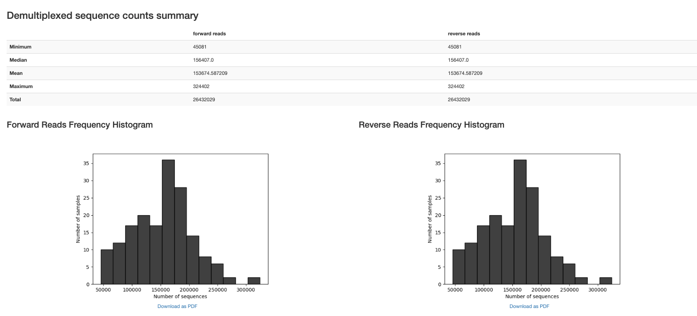
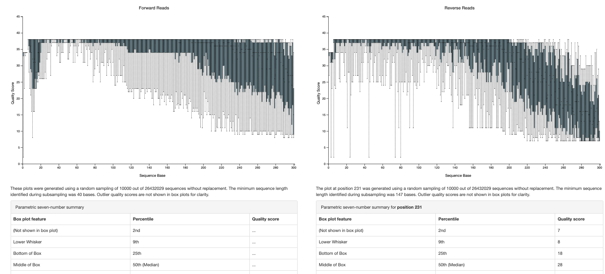
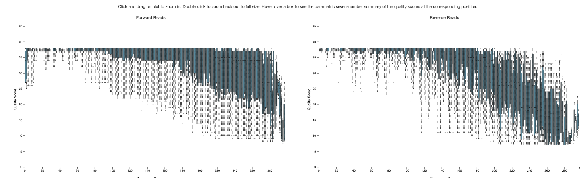
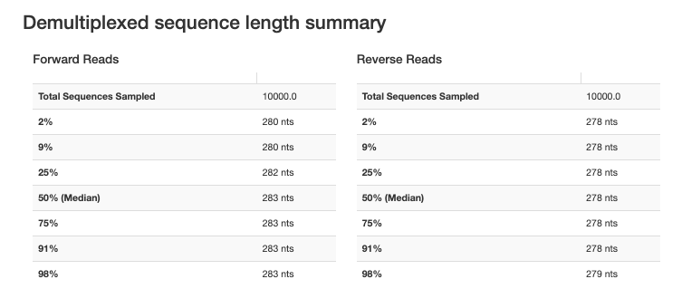
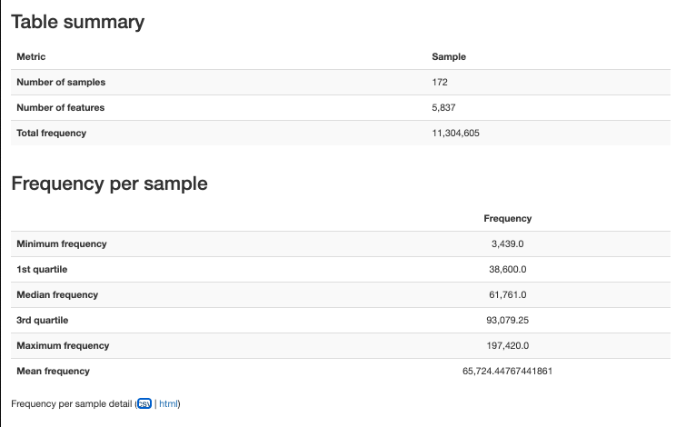

# Artacho

-   xx adult patients

-   xx samples

-   V3-V4 region

# Reference

-   Full citation: Artacho, A., González-Torres, C., Gómez-Cebrián, N., Moles-Poveda, P., Pons, J., Jiménez, N., Casanova, M.J., Montoro, J., Balaguer, A., Villalba, M., Chorão, P., Puchades-Carrasco, L., Sanz, J., Ubeda, C., 2024. Multimodal analysis identifies microbiome changes linked to stem cell transplantation-associated diseases. Microbiome 12, 229. https://doi.org/10.1186/s40168-024-01948-0

-   Bioproject: PRJNA1088414

# Relevant methods

-   The V3-V4 region of the 16s [rRNA gene](https://www.sciencedirect.com/topics/immunology-and-microbiology/rna-gene) was amplified (Kapa HiFi HotStart Ready Mix), indexed with Nextera® XT Index Kit (96 indexes, 384 samples) and sequenced as described in the manual for “16S [Metagenomic](https://www.sciencedirect.com/topics/biochemistry-genetics-and-molecular-biology/metagenomics) Sequencing Library Preparation” of the MiSeq platform (Illumina) using Miseq Reagent Kit V3.

    [16S rRNA](https://www.sciencedirect.com/topics/pharmacology-toxicology-and-pharmaceutical-science/rna-16s) sequences were denoised and processed with DADA2 v1.8 ([Callahan et al., 2016](https://www.sciencedirect.com/science/article/pii/S2211124722003096?via%3Dihub#bib8)). Prior to denoising, as recommended in the DADA2 pipeline tutorial, the 3′ ends of the forward and reverse pair-end sequences (35 and 75 nucleotides, respectively), which contained lower quality nucleotides, were removed from each sequence. The first nucleotides (17 in the forward read and 21 in the reverse read) were also trimmed to remove the v3-v4 primers. Sequences containing undetermined nucleotides (N) were discarded. After denoising, the forward and reverse pair-end sequences were merged together, with a minimum overlapping region of 15 bases and a maximum of 1 mismatch. DADA2 and the command removeBimeraDenovo were subsequently applied to remove chimeras. Taxonomy was assigned for each [amplicon](https://www.sciencedirect.com/topics/neuroscience/amplicon) sequence variant (ASV) using the Silva 138 database ([eQuast et al., 2013](https://www.sciencedirect.com/science/article/pii/S2211124722003096?via%3Dihub#bib76)) as reference and the naive Bayesian classifier implemented in DADA2.

# Software versions

# Data access

-   meta_samples downloaded from bioproject (July 29, 2026)

-   meta_clinical downloaded from manuscript website (July 29, 2026)

# Fetch and import

Import took about 3 hours. Imported as paired sequences.



{width="792"}

## Trimming primers

Primers given in the manuscript

-   341F (fwd): CCTACGGGNGGCWGCAG (17 nt)

-    805R (rev): GACTACHVGGGTATCTAATCC (21 nt)

Only kept sequences where the primers were found





# Dada2

-   Didn't trim the front because cutadapt found exact primers

-   Truncated at 265 forward and 225 reverse (taken directly from manuscript, confirmed reasonable).

    



# BLAST

```{r}
library(RCurl)
library(rBLAST)
library(Biostrings)
library(tidyverse)
```

```{r}
# 1. DATABASE PATHS -----------------------------------------------------------
conda_blast_path <- "/Users/sophiehuebler/miniconda3-x86_64/envs/qiime2-env/bin"
Sys.setenv(PATH = paste(conda_blast_path, Sys.getenv("PATH"), sep = ":"))

db_dir <- "~/blast_databases"
human_db_path <- file.path(db_dir, "GCF_000001405.39_top_level")
s16_db_path   <- file.path(db_dir, "16S_ribosomal_RNA")

# 2. LOAD SEQUENCES --------------------------------------------------------
fasta_input <- "~/Documents/ODSi/ODSiData/Artacho2024/QiimeData/dna-sequences.fasta"
seqs <- readDNAStringSet(fasta_input)
cat("Starting with", length(seqs), "total sequences.\n")

# 3. STEP 1: HUMAN DECONTAMINATION -----------------------------------------
cat("\n--- Step 1: Human Decontamination ---\n")
bl_human <- blast(db = human_db_path)

# High confidence human matches
human_args <- paste('-perc_identity 95', '-qcov_hsp_perc 90', '-num_threads 4')

blast_human <- predict(bl_human, seqs, type = 'megablast', BLAST_args = human_args)

human_ids <- unique(blast_human$qseqid)
non_human_seqs <- seqs[!(names(seqs) %in% human_ids)]

cat("Detected", length(human_ids), "human sequences.\n")
cat("Proceeding with", length(non_human_seqs), "microbial candidate sequences.\n")

# 4. STEP 2: 16S RRNA CLASSIFICATION ---------------------------------------
cat("\n--- Step 2: 16S rRNA Classification ---\n")
bl_16s <- blast(db = s16_db_path)

# Microbiome standard: identity > 75% (Source)
s16_args <- paste('-perc_identity 75', 
                  '-word_size 15', 
                  '-qcov_hsp_perc 90', 
                  '-max_target_seqs 10', 
                  '-num_threads 4')

blast_16s <- predict(bl_16s, non_human_seqs, type = 'megablast', BLAST_args = s16_args)
bact_ids <- unique(blast_16s$qseqid)
bact_seqs <- seqs[names(seqs) %in% bact_ids]

# 5. FILTER TO BEST HIT ----------------------------------------------------
cat("Filtering results to best hit per sequence...\n")

top_hits <- blast_16s %>%
  group_by(qseqid) %>%
  arrange(desc(pident), evalue) %>%
  dplyr::slice(1) %>%
  ungroup()

# 7. CALCULATE SUMMARY STATISTICS -----------------------------------------
cat("\n--- Final Summary Statistics ---\n")

total_count      <- length(seqs)
non_human_count  <- length(non_human_seqs)
classified_count <- length(unique(top_hits$qseqid))

# Calculate percentages
pct_human      <- ((total_count - non_human_count) / total_count) * 100
pct_classified <- (classified_count / non_human_count) * 100
pct_total_loss <- ((total_count - classified_count) / total_count) * 100

# Create a clean summary table
summary_stats <- data.frame(
  Metric = c("Total Raw ASVs", 
             "Human Contaminants Removed", 
             "Microbial Candidates Remaining", 
             "Successfully Classified (16S)",
             "Unclassified"),
  Count = c(total_count, 
            total_count - non_human_count, 
            non_human_count, 
            classified_count, 
            non_human_count - classified_count),
  Percentage = c(100, pct_human, (100 - pct_human), pct_classified, (100 - pct_classified))
)

print(summary_stats)

cat("\nFinal classification rate among non-human reads:", round(pct_classified, 2), "%\n")

# 6. EXPORT RESULTS --------------------------------------------------------
write_tsv(top_hits, "~/Documents/ODSi/ODSiData/Artacho2024/FilteredData/16s_blast_results.tsv")
writeXStringSet(bact_seqs, "~/Documents/ODSi/ODSiData/Artacho2024/FilteredData/blast_seqs.fasta")

cat("\nAnalysis Complete. Results saved to '16s_blast_results.tsv'.\n")
```
