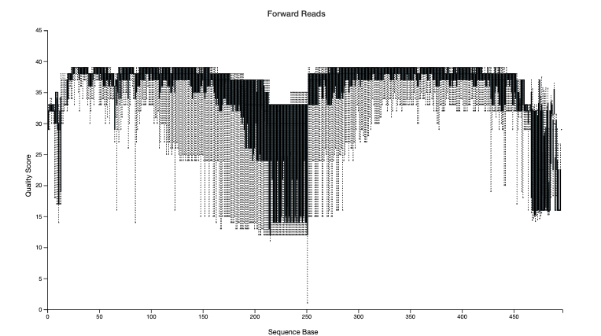
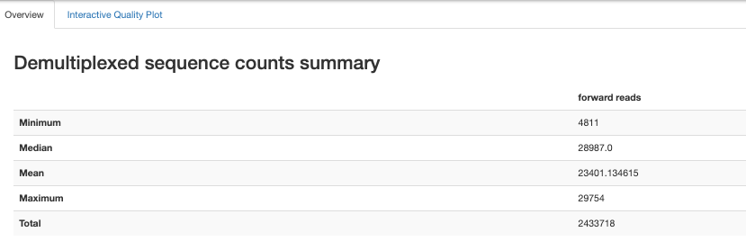
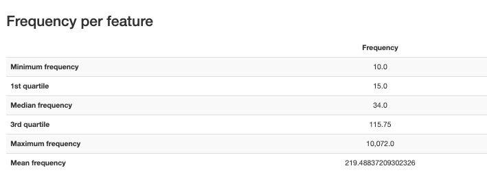
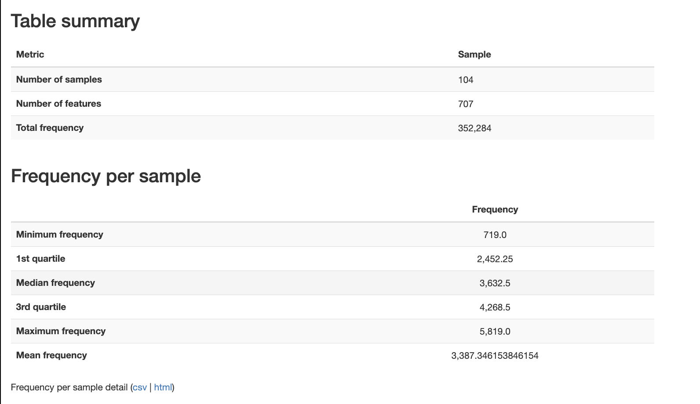

# DAmico

-   20 pediatric patients

-   104 samples

-   V3-V4 region

# Reference

-   D’Amico, F., Biagi, E., Rampelli, S., Fiori, J., Zama, D., Soverini, M., Barone, M., Leardini, D., Muratore, E., Prete, A., Gotti, R., Pession, A., Masetti, R., Brigidi, P., Turroni, S., Candela, M., 2019. Enteral Nutrition in Pediatric Patients Undergoing Hematopoietic SCT Promotes the Recovery of Gut Microbiome Homeostasis. Nutrients 11, 2958. https://doi.org/10.3390/nu11122958

-   PRJNA592853

# Relevant Methods

-   Total microbial DNA was extracted from 250 mg of stool sample using the repeated bead-beatingplus column method, as previously described with few modifications \[25\]. Briefly, all the sampleswere suspended in 1 mL of lysis buffer (500 mM NaCl, 50 mM Tris-HCl, pH 8, 50 mM EDTA, and4% sodium dodecyl sulfate) and bead-beaten three times in a FastPrep instrument (MP Biomedicals,Irvine, CA, USA) at 5.5 movements/s for 1 min, in the presence of four 3 mm glass beads and 0.5 g of0.1 mm zirconia beads (BioSpec Products, Bartlesville, OK, USA). After an incubation step at 95 ◦Cfor 15 min, samples were centrifuged at 13,000 rpm for 5 min. Two hundred and sixty microliters of10 M ammonium acetate was added to the supernatant, followed by a 5 min incubation in ice anda 10 min centrifugation at 13,000 rpm. Each sample was incubated with one volume of isopropanol,followed by an incubation in ice for 30 min. Precipitated nucleic acids were washed with 70% ethanol,re-suspended in 100 μL of TE (10 mM Tris-HCl, 1 mM EDTA pH 8.0) buffer, and treated with 2 μL of10 mg/mL DNase-free RNase at 37 ◦C for 15 min. DNA purification was performed using the DNeasyBlood and Tissue Kit (QIAGEN, Hilden, Germany) following the manufacturer’s instructions. DNAconcentration and quality were evaluated using NanoDrop ND-1000 spectrophotometer (NanoDropTechnologies, Wilmington, DE, USA).

-   The 16S rRNA gene sequencing and SCFA determination were performed in a total of 104 and 99 samples, respectively, for twenty pediatric patients sampled before, during and after HSCT. Patientswere divided into two groups of ten subjects depending on the type of feeding procedure received rightafter the transplant, EN or PN. Clinical and transplant characteristics are summarized in SupplementaryTable S2. Samples were grouped as “pre” (i.e., samples taken before HSCT), “HSCT” (i.e., the firstsamples taken after HSCT for all subjects, ranging from 8 to 30 days post-transplant), and “post”(i.e., all other samples taken after HSCT). In order to better visualize the trajectory of GM recovery,post-HSCT samples were further divided into three groups: “post40” (i.e., all samples taken from 31to 40 days post-HSCT), “post60” (i.e., samples taken from 41 to 60 days post-HSCT) and “post120”(i.e., samples taken from 61 to 120 days after the transplant) (Figure 1).

-   The V3–V4 hypervariable region of the 16S rRNA gene was amplified by using the 341Fand 785R primers with linked Illumina adapter overhang sequences, as previously described inKlindworth et al. \[26\]. Fragment amplification was performed by using KAPA HiFi HotStart ReadyMix(Roche, Basel, CH, USA), setting the thermal cycle as follows: 3 min at 95 ◦C, 25 cycles of 30 s at95 ◦C, 30 s at 55 ◦C, and 30 s at 72 ◦C, and a final 5 min step at 72 ◦C. Library preparation followeda first purification with a magnetic bead-based clean-up system (Agencourt AMPure XP, BeckmanCoulter, Brea, CA, USA) and a limited-cycle PCR was performed to obtain the indexed library usingNextera technology, followed by a second AMPure XP magnetic beads clean-up step. Final librarieswere prepared by pooling all samples to an equimolar concentration of 4nM; the denaturation anddilution to 5 pmol was carried out before performing the sequencing on an Illumina MiSeq platformwith a 2 × 250 bp paired-end protocol according to manufacturer’s instructions (Illumina, San Diego,CA, USA). Raw sequence reads were deposited in the National Center for Biotechnology InformationSequence Read Archive (https://www.ncbi.nlm.nih.gov/bioproject/PRJNA592853).

-   Looks like the paired end reads were put together before being deposited (with the reverse compliment being used). They need to be read as a single run.

# Software Versions

# Data Access

-   meta_samples downloaded from bioproject (July 29, 2026)

-   meta_clinical downloaded from manuscript website (July 29, 2026)

# Fetching and importing data

Fetched data using chpc pipeline. Imported as forward reads only.



# Trimming

Each sequence starts with forward primer and end with the reverse complement of the reverse primer

-   FWD_PRIMER="CCTACGGGNGGCWGCAG" \# 341F (5' front, 17 nt)

-   REV_PRIMER_RC="GGATTAGATACCCBDGTAGTC"

](images/clipboard-2120976982.png)


# Denoising

Had to use deblur instead of DADA2. AI explanation:

DADA2 single (denoise-single) — parametric, learns from your data. It fits an error model by regressing observed substitution frequencies against Phred quality scores from your reads, then uses that fitted model in its divisive partitioning to decide whether a rare sequence is a true variant or an error off a more abundant one. The critical dependency: it assumes the quality-score→error-rate relationship is the genuine Illumina one. Pre-joined reads break this because the merger overwrites the overlap region with recalculated posterior qualities (it combines the two base calls and inflates/deflates Q accordingly). DADA2 then trains its error model on scores that no longer map to real error rates, so the whole denoising step is fit on corrupted signal.

Deblur — static, ignores the empirical quality distribution. Deblur doesn't learn anything from your data. It applies a fixed, positional upper-bound Illumina error profile: for a read trimmed to length L, it has a precomputed expected number of error-derived reads each sequence should spawn, and subtracts those from less-abundant neighbors within a Hamming/indel neighborhood. Because that profile is baked in rather than trained on quality scores, the recalibrated qualities in the merged overlap are irrelevant to it — it never looks at them for model fitting. That's the specific property that makes it safe on pre-joined reads.

So the comparison in one line: both collapse single sequences to ASVs, but DADA2-single's error model is data-trained on quality scores (which merging corrupts), while deblur's is a static positional model that never consults them — so only deblur survives externally joined reads.

](images/clipboard-3671172327.png)

Deblur trims everything to the exact same length

# BLAST

```{r}
library(RCurl)
library(rBLAST)
library(Biostrings)
library(tidyverse)
```

```{r}
# 1. DATABASE PATHS -----------------------------------------------------------
conda_blast_path <- "/Users/sophiehuebler/miniconda3-x86_64/envs/qiime2-env/bin"
Sys.setenv(PATH = paste(conda_blast_path, Sys.getenv("PATH"), sep = ":"))

db_dir <- "~/blast_databases"
human_db_path <- file.path(db_dir, "GCF_000001405.39_top_level")
s16_db_path   <- file.path(db_dir, "16S_ribosomal_RNA")

# 2. LOAD SEQUENCES --------------------------------------------------------
fasta_input <- "~/Documents/ODSi/ODSiData/DAmico2019/QiimeData/dna-sequences.fasta"
seqs <- readDNAStringSet(fasta_input)
cat("Starting with", length(seqs), "total sequences.\n")

# 3. STEP 1: HUMAN DECONTAMINATION -----------------------------------------
cat("\n--- Step 1: Human Decontamination ---\n")
bl_human <- blast(db = human_db_path)

# High confidence human matches
human_args <- paste('-perc_identity 95', '-qcov_hsp_perc 90', '-num_threads 4')

blast_human <- predict(bl_human, seqs, type = 'megablast', BLAST_args = human_args)

human_ids <- unique(blast_human$qseqid)
non_human_seqs <- seqs[!(names(seqs) %in% human_ids)]

cat("Detected", length(human_ids), "human sequences.\n")
cat("Proceeding with", length(non_human_seqs), "microbial candidate sequences.\n")

# 4. STEP 2: 16S RRNA CLASSIFICATION ---------------------------------------
cat("\n--- Step 2: 16S rRNA Classification ---\n")
bl_16s <- blast(db = s16_db_path)

# Microbiome standard: identity > 75% (Source)
s16_args <- paste('-perc_identity 75', 
                  '-word_size 15', 
                  '-qcov_hsp_perc 90', 
                  '-max_target_seqs 10', 
                  '-num_threads 4')

blast_16s <- predict(bl_16s, non_human_seqs, type = 'megablast', BLAST_args = s16_args)
bact_ids <- unique(blast_16s$qseqid)
bact_seqs <- seqs[names(seqs) %in% bact_ids]

# 5. FILTER TO BEST HIT ----------------------------------------------------
cat("Filtering results to best hit per sequence...\n")

top_hits <- blast_16s %>%
  group_by(qseqid) %>%
  arrange(desc(pident), evalue) %>%
  dplyr::slice(1) %>%
  ungroup()

# 7. CALCULATE SUMMARY STATISTICS -----------------------------------------
cat("\n--- Final Summary Statistics ---\n")

total_count      <- length(seqs)
non_human_count  <- length(non_human_seqs)
classified_count <- length(unique(top_hits$qseqid))

# Calculate percentages
pct_human      <- ((total_count - non_human_count) / total_count) * 100
pct_classified <- (classified_count / non_human_count) * 100
pct_total_loss <- ((total_count - classified_count) / total_count) * 100

# Create a clean summary table
summary_stats <- data.frame(
  Metric = c("Total Raw ASVs", 
             "Human Contaminants Removed", 
             "Microbial Candidates Remaining", 
             "Successfully Classified (16S)",
             "Unclassified"),
  Count = c(total_count, 
            total_count - non_human_count, 
            non_human_count, 
            classified_count, 
            non_human_count - classified_count),
  Percentage = c(100, pct_human, (100 - pct_human), pct_classified, (100 - pct_classified))
)

print(summary_stats)

cat("\nFinal classification rate among non-human reads:", round(pct_classified, 2), "%\n")

# 6. EXPORT RESULTS --------------------------------------------------------
write_tsv(top_hits, "~/Documents/ODSi/ODSiData/DAmico2019/FilteredData/16s_blast_results.tsv")
writeXStringSet(bact_seqs, "~/Documents/ODSi/ODSiData/DAmico2019/FilteredData/blast_seqs.fasta")

cat("\nAnalysis Complete. Results saved to '16s_blast_results.tsv'.\n")
```

# Metadata

```{r}
library(tidyverse)
library(readxl)
```

```{r}
damico_meta_qiime <- read_tsv("/Users/sophiehuebler/Documents/ODSi/ODSiData/DAmico2019/Metadata/damico_meta_qiime.tsv")
```

# Qc and Mapped


