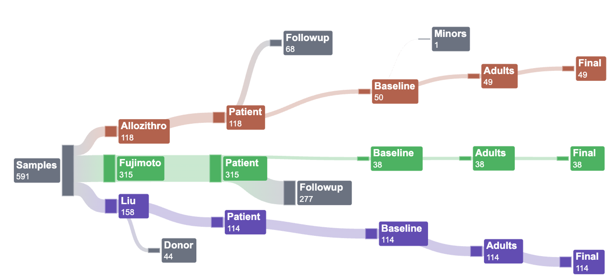

```{r}
#| include: false

library(tidyverse)
library(qiime2R)
library(ggh4x)
```

# Overview

All samples from a single study were processed with the DADA2 pipeline, then BLAST, then matched to greengenes representative sequences skeleton with between 95-97% clustering threshold, and then matched to the greengenes phylogenetic tree reference database.

The bar charts shown in this document show the uniform pre-processing pipeline for a subset of the data (specifically, the data which matched the inclusion/exclusion criteria).

## Notes

-   One sample was corrupted from the fujimoto dataset: SRR28984726. Unable to import this into qiime. It is one of the 591 samples shown in the inclusion/exclusion diagram (although it gets filtered out in the baseline vs followup stage). It is not currently (03.24.2026) included in the merged_metadata.tsv so it had to be manually added to the dataframe.

-   Liu was forward reads only. So the 'merged' column is directly imputed from the denoised column.

-   Liu has 2 samples/person/timepoint. The samples get merged later on.

-   More filtering happens once the ASV tables are merged, but that is not displayed here in any of the figures. Those next steps are:

    -   Samples put into a single ASV table

    -   ASV table filtered for sequences that appear in at least 2 samples. Then ASV table filtered for samples with non-empty libraries.

    -   Import to R

    -   Filter for 'included' samples only (see inclusion/exclusion criteria + non-zero library size)

    -   Merge the reads from Liu study by adding together the libraries from samples corresponding to the same observation

    -   Run batch correction between studies using combat-seq (this step filters out samples for which all observed sequences are found only within one single study. This occurs in only 1 sample)

## Inclusion/Exclusion

Here is an overview of the inclusion/exclusion steps.

{width="1007"}

```{r}
#| include: false


merged_meta <- read_tsv("~/Documents/ODSi/ODSiData/Merging/merged_metadata.tsv")

included_samples<- merged_meta %>%
  filter(patient == 1)%>%
  filter(baseline == 1)%>%
  filter(age > 18)
```

## Setting up dataframe

```{r}
#| include: false

barplot_01 <- data.frame("sample.id" = c(merged_meta$`sample-id`, "SRR28984726"),
                         "study" = c(merged_meta$study, "Fuji")) %>%
  mutate(included = ifelse(sample.id %in% included_samples$`sample-id`, 1, 0))


```

```{r}
table(barplot_01$study, barplot_01$included) %>%
  kableExtra::kable()%>%
  kableExtra::kable_classic_2()%>%
  kableExtra::add_header_above(c("", "Filtered Out","Included"),
                               monospace = T,
                               align= "r")
  
```

# Filtering from DADA 2

```{r}
#| include: false
dada2_allo <- read_tsv("~/Documents/ODSi/ODSiData/FilteringSteps/Allo_dada2.tsv", 
                       col_names = T)%>%
  filter(`sample-id` != "#q2:types") %>%
  type.convert(as.is = TRUE)

dada2_fuji <- read_tsv("~/Documents/ODSi/ODSiData/FilteringSteps/Fuji_dada2.tsv", 
                       col_names = T)%>%
  filter(`sample-id` != "#q2:types") %>%
  type.convert(as.is = TRUE)

dada2_liu <- read_tsv("~/Documents/ODSi/ODSiData/FilteringSteps/Liu_dada2.tsv", 
                       col_names = T)%>%
  filter(`sample-id` != "#q2:types") %>%
  type.convert(as.is = TRUE)

```

```{r}
#| include: false

dada2_liu$merged <- dada2_liu$denoised

dada2 <- bind_rows(
  dada2_allo %>%
    select(`sample-id`, input, filtered, denoised, merged, `non-chimeric`),
  dada2_fuji %>%
    select(`sample-id`, input, filtered, denoised, merged, `non-chimeric`),
  dada2_liu %>%
    select(`sample-id`, input, filtered, denoised, merged, `non-chimeric`)
)


barplot_02 <- barplot_01 %>%
  left_join(dada2 %>%
              select(`sample-id`, input, filtered, denoised, merged, `non-chimeric`),
            by = c("sample.id" = "sample-id"))
```

# Filtering from BLAST

```{r}
#| include: false
blast_allo <- qiime2R::read_qza("~/Documents/ODSi/ODSiData/Allozithro2017/FilteredData/clean-table.qza")
blast_allo <- blast_allo$data
blast_allo <- data.frame(sample.id = colnames(blast_allo),
                         BLAST = colSums(blast_allo))

blast_fuji <- qiime2R::read_qza("~/Documents/ODSi/ODSiData/Fujimoto2024/FilteredData/clean-table.qza")
blast_fuji <- blast_fuji$data
blast_fuji <- data.frame(sample.id = colnames(blast_fuji),
                         BLAST = colSums(blast_fuji))

blast_liu <- qiime2R::read_qza("~/Documents/ODSi/ODSiData/Liu2017/FilteredData/clean-table.qza")
blast_liu <- blast_liu$data
blast_liu <- data.frame(sample.id = colnames(blast_liu),
                         BLAST = colSums(blast_liu))
```

```{r}
#| include: false
blast <- bind_rows(
  blast_allo, 
  blast_fuji,
  blast_liu
)

barplot_03 <- barplot_02 %>%
  left_join(blast,
            by = "sample.id")
```

# Filtering from Greengenes2

## Clustering

```{r}
#| include: false
cluster_allo <- qiime2R::read_qza("~/Documents/ODSi/ODSiData/Allozithro2017/ClusteredData/clustered-table.qza")
cluster_allo <- cluster_allo$data
cluster_allo <- data.frame(sample.id = colnames(cluster_allo),
                         Clustered = colSums(cluster_allo))

cluster_fuji <- qiime2R::read_qza("~/Documents/ODSi/ODSiData/Fujimoto2024/ClusteredData/clustered-table.qza")
cluster_fuji <- cluster_fuji$data
cluster_fuji <- data.frame(sample.id = colnames(cluster_fuji),
                         Clustered = colSums(cluster_fuji))

cluster_liu <- qiime2R::read_qza("~/Documents/ODSi/ODSiData/Liu2017/ClusteredData/clustered-table.qza")
cluster_liu <- cluster_liu$data
cluster_liu <- data.frame(sample.id = colnames(cluster_liu),
                         Clustered = colSums(cluster_liu))
```

```{r}
#| include: false
cluster <- bind_rows(
  cluster_allo, 
  cluster_fuji,
  cluster_liu
)

barplot_04 <- barplot_03 %>%
  left_join(cluster,
            by = "sample.id")
```

## Greengenes Reference

```{r}
#| include: false
tree_allo <- qiime2R::read_qza("~/Documents/ODSi/ODSiData/Allozithro2017/PhylogeneticTree/tree-table.qza")
tree_allo <- tree_allo$data
tree_allo <- data.frame(sample.id = colnames(tree_allo),
                         GreengenesTree = colSums(tree_allo))

tree_fuji <- qiime2R::read_qza("~/Documents/ODSi/ODSiData/Fujimoto2024/PhylogeneticTree/tree-table.qza")
tree_fuji <- tree_fuji$data
tree_fuji <- data.frame(sample.id = colnames(tree_fuji),
                         GreengenesTree = colSums(tree_fuji))

tree_liu <- qiime2R::read_qza("~/Documents/ODSi/ODSiData/Liu2017/PhylogeneticTree/tree-table.qza")
tree_liu <- tree_liu$data
tree_liu <- data.frame(sample.id = colnames(tree_liu),
                         GreengenesTree = colSums(tree_liu))
```

```{r}
#| include: false
tree <- bind_rows(
  tree_allo, 
  tree_fuji,
  tree_liu
)

barplot_05 <- barplot_04 %>%
  left_join(tree,
            by = "sample.id")
```

# Barplots

```{r}

#| include: false

# 1. Filter the data to included == 1 and select the relevant columns
# (Assuming your dataframe is currently named 'df')
df_filtered <- barplot_05 %>%
  filter(included == 1) %>%
  select(sample.id, study, Input = input, Filtered = filtered, 
         Denoised = denoised, Merged = merged, 
         `Non-chimeric` = `non-chimeric`, 
         BLAST, `OTU Clustered` = Clustered, `Reference Tree`=GreengenesTree)

# 2. Reshape the data from wide to long format for ggplot
df_long <- df_filtered %>%
  pivot_longer(
    cols = -c(sample.id, study),
    names_to = "Pipeline_Step",
    values_to = "Reads"
  )

# 3. Order the factor levels so they draw in the correct sequence (largest in back, smallest in front)
# If you ever find your smaller bars are hidden behind the big ones, simply reverse this vector with rev()
step_order <- c("Input", "Filtered", "Denoised", "Merged", 
                "Non-chimeric", "BLAST", "OTU Clustered", "Reference Tree")

df_long$Pipeline_Step <- factor(df_long$Pipeline_Step, levels = step_order)

# 4. Generate the custom color palette (Dusty Blue -> Neutral -> Bright Red)
# colorRampPalette creates a smooth gradient across 8 distinct colors
my_colors <- colorRampPalette(c("#7B9ACC", "#E5D8BD", "#FF0000"))(8)
my_colors2 <- c("#4B0082", "#9400D3", "#1E90FF", "#32CD32", 
               "#FFFF00", "#FFDB58", "#FF8C00", "#FF0000")

my_colors3 <- c("#555770", "#8F7C9E", "#729CBE", "#84C484", 
               "#E3D774", "#EBAE1E", "#FF7B00", "#FF0000")

df_long$logReads <- pmax(log(df_long$Reads), 0)

df_long$study <- factor(df_long$study,
                        levels = c("Allo", "Fuji", "Liu"),
                        labels = c("Allozithro",
                                   "Fujimoto",
                                   "Liu"))


```

```{r}
read_attrition_option1 <- ggplot(df_long, aes(x = sample.id, y = Reads, fill = Pipeline_Step)) +
  # Use position = "identity" to layer the bars over each other instead of stacking them
  geom_bar(stat = "identity", position = "identity") +
  
  # Apply our custom dusty blue to bright red palette
  scale_fill_manual(values = my_colors3) +
  
  # Group the x-axis cleanly by 'study' using facets
  facet_grid(~ study, scales = "free_x", space = "free_x") +
  
  # Clean up labels and theming
  labs(
    title = "Read Attrition Across Microbiome Processing Pipeline",
    x = "Individual Samples",
    y = "Number of Reads",
    fill = "Processing Step"
  ) +
  theme_minimal() +
  theme(
    # Make sample names less visible per your request (small size, angled)
    axis.text.x = element_text(angle = 90, vjust = 0.5, hjust = 1, size = 0),
    # Make the 'study' group indicators bold and clear at the top
    strip.text.x = element_text(size = 12, face = "bold", color = "black"),
    strip.background = element_rect(fill = "gray95", color = NA),
    panel.grid.major.x = element_blank() # Removes vertical grid lines for a cleaner look
  )

read_attrition_option1
```

```{r}
# 5. Build the horizontal plot
read_attrition_option2 <- ggplot(df_long, aes(y = sample.id, x = Reads, fill = Pipeline_Step)) +
  # Use position = "identity" to layer the bars
  geom_bar(stat = "identity", position = "identity") +
  
  # Apply our custom dusty blue to bright red palette
  scale_fill_manual(values = my_colors3) +
  
  # Group the y-axis cleanly by 'study' using facets (study ~ . stacks them vertically)
  facet_grid(study ~ ., scales = "free_y", space = "free_y") +
  
  # Clean up labels and theming (Note x and y labels are swapped)
  labs(
    title = "Read Attrition Across Microbiome Processing Pipeline",
    y = "Individual Samples",
    x = "Number of Reads",
    fill = "Processing Step"
  ) +
  theme_minimal() +
  theme(
    # Sample names are easier to read horizontally, just keep them small
    axis.text.y = element_text(size = 0),
    
    # Make the 'study' group indicators bold (vertical facets put strips on the right)
    strip.text.y = element_text(size = 12, face = "bold", color = "black", angle = 0),
    strip.background = element_rect(fill = "gray95", color = NA),
    
    # Remove horizontal grid lines for a cleaner look
    panel.grid.major.y = element_blank(),
    legend.position = "bottom"
  )+
  guides(fill = guide_legend(nrow = 1, byrow = TRUE))

read_attrition_option2
```

```{r}
read_attrition_option3 <- ggplot(df_long, aes(y = sample.id, x = Reads, fill = Pipeline_Step)) +
  # Use position = "identity" to layer the bars
  geom_bar(stat = "identity", position = "identity") +
  
  # Apply our custom dusty blue to bright red palette
  scale_fill_manual(values = my_colors3) +
  
  # switch = "y" moves the facet strips from the right to the left
  facet_grid(study ~ ., scales = "free_y", space = "free_y", switch = "y") +
  
  # Clean up labels
  labs(
    title = "Read Attrition Across Microbiome Processing Pipeline",
    y = "", # Changed from Sample ID since we hid the sample names
    x = "Number of Reads",
    fill = "Processing Step"
  ) +
  theme_minimal() +
  theme(
    # Remove individual sample names and ticks entirely
    axis.text.y = element_blank(),
    axis.ticks.y = element_blank(),
    
    # Position the left-side strips perfectly
    strip.placement = "outside", # Puts the strip outside the main plot area
    # Note we use strip.text.y.left now because we switched sides
    strip.text.y.left = element_text(size = 12, face = "bold", color = "black", angle = 0),
    strip.background = element_rect(fill = "gray95", color = NA),
    
    # Remove horizontal grid lines
    panel.grid.major.y = element_blank() 
  )

read_attrition_option3
```

```{r}
ggplot(df_long%>%
         #arrange(Reads)%>%
         mutate(Pipeline_Step <- factor(df_long$Pipeline_Step,
                                           levels = rev(step_order))),
       aes(y = sample.id, x = logReads, fill = Pipeline_Step)) +
  # Use position = "identity" to layer the bars
  geom_bar(stat = "identity", position = "identity") +
  
  # Apply our custom dusty blue to bright red palette
  scale_fill_manual(values = my_colors3) +
  
  # switch = "y" moves the facet strips from the right to the left
  facet_grid(study ~ ., scales = "free_y", space = "free_y", switch = "y") +
  
  # Clean up labels
  labs(
    title = "Read Attrition Across Microbiome Processing Pipeline",
    y = "", # Changed from Sample ID since we hid the sample names
    x = "Log(Number of Reads)",
    fill = "Processing Step"
  ) +
  theme_minimal() +
  theme(
    # Remove individual sample names and ticks entirely
    axis.text.y = element_blank(),
    axis.ticks.y = element_blank(),
    
    # Position the left-side strips perfectly
    strip.placement = "outside", # Puts the strip outside the main plot area
    # Note we use strip.text.y.left now because we switched sides
    strip.text.y.left = element_text(size = 12, face = "bold", color = "black", angle = 0),
    strip.background = element_rect(fill = "gray95", color = NA),
    
    # Remove horizontal grid lines
    panel.grid.major.y = element_blank(),
    legend.position = "bottom"
  )+
  guides(fill = guide_legend(nrow = 1, byrow = TRUE))
```

```{r}
 


base_study_colors <- c("#FFFF00",
  "#56B4E9",
  "#76EE00")#c("#AD5E4C", "#4CAF50", "#5E35B1")


# Apply alpha() here. Change '0.5' to adjust transparency.
# 0 = invisible, 1 = opaque.
transparent_study_colors <- alpha(base_study_colors, 0.65)
```

```{r}
# ggplot(df_long, aes(y = sample.id, x = Reads, fill = Pipeline_Step)) +
#   # Use position = "identity" to layer the bars
#   geom_bar(stat = "identity", position = "identity") +
#   
#   # Apply our custom dusty blue to bright red palette
#   scale_fill_manual(values = my_colors3) +
#   
#   # Group the y-axis cleanly by 'study' using facets (study ~ . stacks them vertically)
#   facet_grid(study ~ ., scales = "free_y", space = "free_y") +
#   
#   # Clean up labels and theming (Note x and y labels are swapped)
#   labs(
#     title = "Read Attrition Across Microbiome Processing Pipeline",
#     y = "Individual Samples",
#     x = "Number of Reads",
#     fill = "Processing Step"
#   ) +
#   theme_minimal() +
#   theme(
#     # Sample names are easier to read horizontally, just keep them small
#     axis.text.y = element_text(size = 0),
#     
#     # Make the 'study' group indicators bold (vertical facets put strips on the right)
#     strip.text.y = element_text(size = 12, face = "bold", color = "black", angle = 0),
#     strip.background = element_rect(fill = "gray95", color = NA),
#     
#     # Remove horizontal grid lines for a cleaner look
#     panel.grid.major.y = element_blank(),
#     legend.position = "bottom"
#   )+
#   guides(fill = guide_legend(nrow = 1, byrow = TRUE))

```

```{r}
read_attrition_option4 <- ggplot(df_long, aes(y = sample.id, x = Reads, fill = Pipeline_Step)) +
  geom_bar(stat = "identity", position = "identity") +
  scale_fill_manual(values = my_colors3) +
  
  # Swap facet_grid for facet_grid2 from the ggh4x package
  facet_grid2(
    study ~ ., 
    scales = "free_y", 
    space = "free_y", 
    switch = "y",
    # strip_themed allows us to pass a list of different rectangle fills
    strip = strip_themed(
      background_y = elem_list_rect(fill = transparent_study_colors, color = base_study_colors)
    )
  ) +
  
  labs(
    title = "Read Attrition Across Microbiome Processing Pipeline",
    y = "Individual Samples", 
    x = "Number of Reads", 
    fill = "Processing Step"
  ) +
  theme_minimal() +
  theme(
    axis.text.y = element_blank(),
    axis.ticks.y = element_blank(),
    #strip.placement = "outside", 
    
    # I changed the text color here to "white" so it stands out against the dark backgrounds
    strip.text.y.left = element_text(size = 12, face = "bold", color = "black", angle = 0),
    panel.grid.major.y = element_blank(),
    legend.position = "bottom" 
  ) +
  
  # Keeps your 3-row, left-to-right legend formatting
  guides(fill = guide_legend(nrow = 1, byrow = TRUE))

read_attrition_option4
```

# Table 1

```{r}
library(table1)

dat_sum <- included_samples %>% 
  mutate(study = factor(study,
                        levels = c("Allo", "Fuji", "Liu"),
                        labels = c("Allozithro",
                                   "Fujimoto",
                                   "Liu")))%>%
  select(-c(`sample-id`, timepoint, patient))%>%distinct()
dat_sum$sex <- factor(dat_sum$sex, levels =c("male", "female"))
dat_sum$disease <- factor(dat_sum$disease)
dat_sum$agvhd<- as.logical(dat_sum$agvhd)
dat_sum$death <- as.logical(dat_sum$death)
dat_sum$relapse <- as.logical(dat_sum$relapse)


label(dat_sum$sex)<- "Sex"
label(dat_sum$age)<- "Age"
label(dat_sum$disease)<- "Cancer type"
label(dat_sum$agvhd)<- "AGVHD"
label(dat_sum$death)<- "Death"
label(dat_sum$relapse)<- "Relapse"

table1::table1(~age + sex + disease + agvhd + death + relapse | study, data = dat_sum)
```
