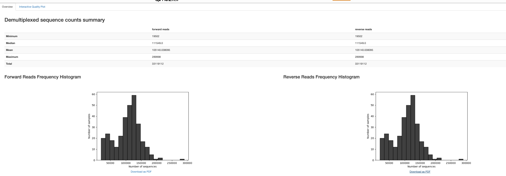
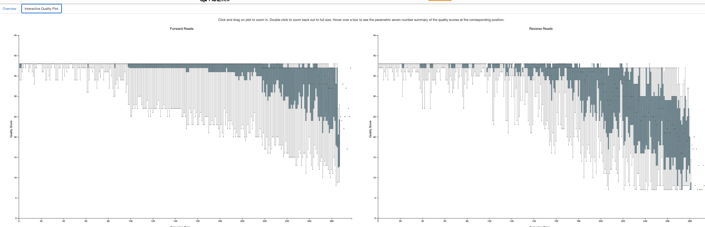
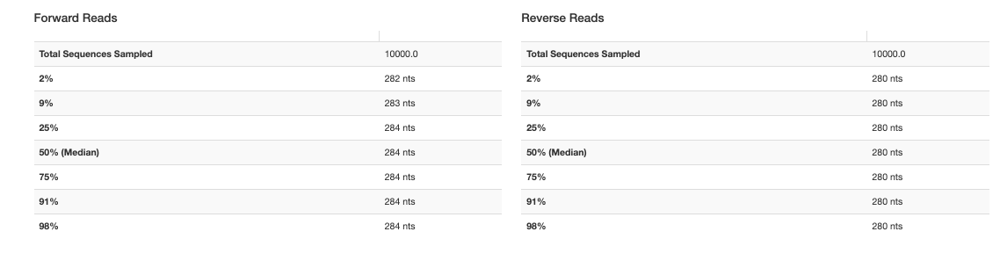
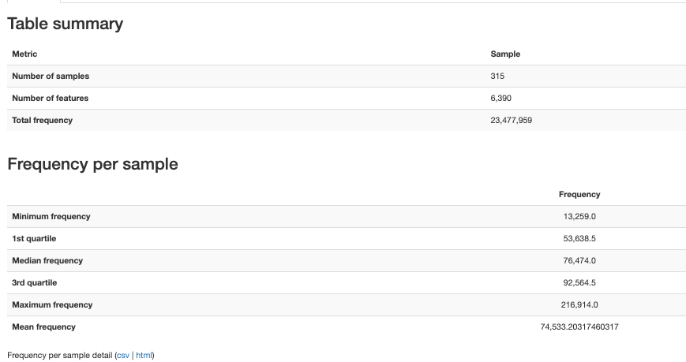
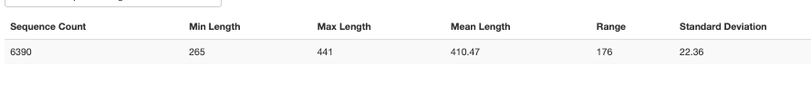
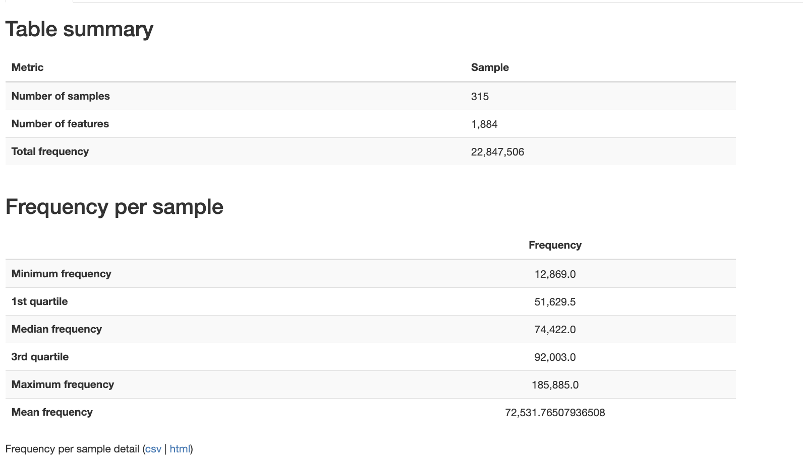

# Fujimoto (New)

-   V3-V4 region
-   46 patients
-   315 samples

# Reference

-   Full citation: Fujimoto, K., Hayashi, T., Yamamoto, M., Sato, N., Shimohigoshi, M., Miyaoka, D., Yokota, C., Watanabe, M., Hisaki, Y., Kamei, Y., Yokoyama, Y., Yabuno, T., Hirose, A., Nakamae, M., Nakamae, H., Uematsu, M., Sato, S., Yamaguchi, K., Furukawa, Y., Akeda, Y., Hino, M., Imoto, S., Uematsu, S., 2024. An enterococcal phage-derived enzyme suppresses graft-versus-host disease. Nature 632, 174–181. https://doi.org/10.1038/s41586-024-07667-8

-   Bioproject: [PRJNA1109929](https://www.ncbi.nlm.nih.gov/bioproject/PRJNA1109929)

# Relevant Methods

-   The 16S rRNA V3–V4 region was PCR-amplified using specific primers (forward primer: 5′-ACACGACGCTCTTCCGATCTCCTACGGGNG GCWGCAG-3′, reverse primer: 5′-GACGTGTGCTCTTCCGATCTGACTA CHVGGGTATCTAATCC-3′, underline: overhang sequence for secondround PCR) over 20 cycles, and the PCR products were purified with Agencourt AMpure beads (Beckman Coulter) as described previously15. Then, the overhang and index sequences required for sequencing were added by a second round of PCR using NEBNext multiplex Oligos for Illumina (Dual Index Primers Set1, New England Biolabs) over eight cycles, and the products were purified with Agencourt AMpure beads. For each sample, equal amounts of each DNA amplicon library were mixed and sequenced on an MiSeq instrument (Illumina) using the MiSeq v3 Reagent kit and a 15% PhiX spike (Illumina). 16S rRNA gene analysis was performed using QIIME2 (v.2018.11; https://qiime2.org). In brief, raw sequence data were subjected to primer sequence trimming, quality filtering and paired-end read merging using the dada2 denoise-paired method (–p-trim-left-f 17 –p-trim-left-r 21–p-trunc-len-f 275 –p-trunc-len-r 215 –p-n-threads 16). Before taxonomic analysis, sequences of the 16S rRNA V3–V4 region were extracted from Greengenes 13_8 99% operational taxonomic units and our primer sequences using the q2-feature-classifier. Then, the Naive Bayes classifier was trained using the extracted Greengenes 13_8 reference sequences and Greengenes 13_8 99% operational taxonomic unit taxonomy. The taxonomic composition was visualized using a qiime taxa bar plot.
-   
-   

# Data Access

-   meta_samples.csv downloaded from bioproject

    -   (March 9, 2026)

-   fuji_meta_qiime.tsv generated in R Fujimoto2024/Metadata/Parsing_metadata.qmd

    -   (March 9, 2026)

-   meta_clinical.xlsx copied (by hand) from Supplementary Table 2

    -   (March 9, 2026)

# Fetch and Import

Took a few hours. Nothing of note.

# Trimming







# Denoising



Percent non-chimera 46-93%. Lowest % nonchimeric still has at least 42000 reads.



# BLAST

```{r}
library(RCurl)
library(rBLAST)
library(Biostrings)
library(tidyverse)
```

```{r}
# 1. DATABASE PATHS -----------------------------------------------------------
conda_blast_path <- "/Users/sophiehuebler/miniconda3-x86_64/envs/qiime2-env/bin"
Sys.setenv(PATH = paste(conda_blast_path, Sys.getenv("PATH"), sep = ":"))

db_dir <- "~/blast_databases"
human_db_path <- file.path(db_dir, "GCF_000001405.39_top_level")
s16_db_path   <- file.path(db_dir, "16S_ribosomal_RNA")

# 2. LOAD SEQUENCES --------------------------------------------------------
fasta_input <- "~/Documents/ODSi/ODSiData/Fujimoto2024/QiimeData/dna-sequences.fasta"
seqs <- readDNAStringSet(fasta_input)
cat("Starting with", length(seqs), "total sequences.\n")

# 3. STEP 1: HUMAN DECONTAMINATION -----------------------------------------
cat("\n--- Step 1: Human Decontamination ---\n")
bl_human <- blast(db = human_db_path)

# High confidence human matches
human_args <- paste('-perc_identity 95', '-qcov_hsp_perc 90', '-num_threads 4')

blast_human <- predict(bl_human, seqs, type = 'megablast', BLAST_args = human_args)

human_ids <- unique(blast_human$qseqid)
non_human_seqs <- seqs[!(names(seqs) %in% human_ids)]

cat("Detected", length(human_ids), "human sequences.\n")
cat("Proceeding with", length(non_human_seqs), "microbial candidate sequences.\n")

# 4. STEP 2: 16S RRNA CLASSIFICATION ---------------------------------------
cat("\n--- Step 2: 16S rRNA Classification ---\n")
bl_16s <- blast(db = s16_db_path)

# Microbiome standard: identity > 75% (Source)
s16_args <- paste('-perc_identity 75', 
                  '-word_size 15', 
                  '-qcov_hsp_perc 90', 
                  '-max_target_seqs 10', 
                  '-num_threads 4')

blast_16s <- predict(bl_16s, non_human_seqs, type = 'megablast', BLAST_args = s16_args)
bact_ids <- unique(blast_16s$qseqid)
bact_seqs <- seqs[names(seqs) %in% bact_ids]

# 5. FILTER TO BEST HIT ----------------------------------------------------
cat("Filtering results to best hit per sequence...\n")

top_hits <- blast_16s %>%
  group_by(qseqid) %>%
  arrange(desc(pident), evalue) %>%
  dplyr::slice(1) %>%
  ungroup()

# 7. CALCULATE SUMMARY STATISTICS -----------------------------------------
cat("\n--- Final Summary Statistics ---\n")

total_count      <- length(seqs)
non_human_count  <- length(non_human_seqs)
classified_count <- length(unique(top_hits$qseqid))

# Calculate percentages
pct_human      <- ((total_count - non_human_count) / total_count) * 100
pct_classified <- (classified_count / non_human_count) * 100
pct_total_loss <- ((total_count - classified_count) / total_count) * 100

# Create a clean summary table
summary_stats <- data.frame(
  Metric = c("Total Raw ASVs", 
             "Human Contaminants Removed", 
             "Microbial Candidates Remaining", 
             "Successfully Classified (16S)",
             "Unclassified"),
  Count = c(total_count, 
            total_count - non_human_count, 
            non_human_count, 
            classified_count, 
            non_human_count - classified_count),
  Percentage = c(100, pct_human, (100 - pct_human), pct_classified, (100 - pct_classified))
)

print(summary_stats)

cat("\nFinal classification rate among non-human reads:", round(pct_classified, 2), "%\n")

# 6. EXPORT RESULTS --------------------------------------------------------
write_tsv(top_hits, "~/Documents/ODSi/ODSiData/Fujimoto2024/FilteredData/16s_blast_results.tsv")
writeXStringSet(bact_seqs, "~/Documents/ODSi/ODSiData/Fujimoto2024/FilteredData/blast_seqs.fasta")

cat("\nAnalysis Complete. Results saved to '16s_blast_results.tsv'.\n")
```

# Metadata

```{r}
fuji_meta_qiime <- read_tsv("/Users/sophiehuebler/Documents/ODSi/ODSiData/Fujimoto2024/Metadata/fuji_meta_qiime.tsv")
```

# Qc and Mapped


