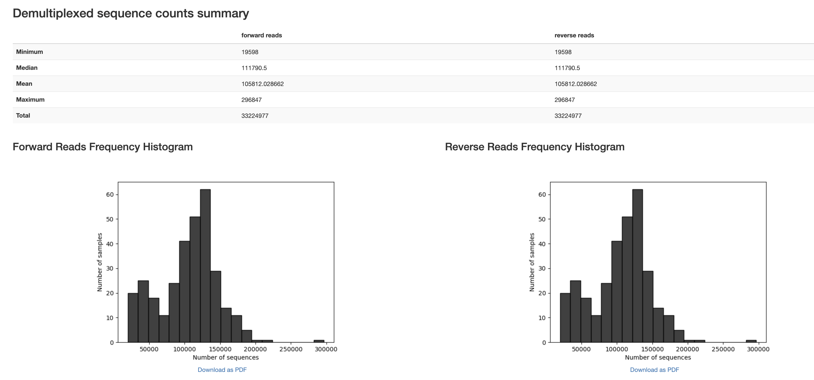
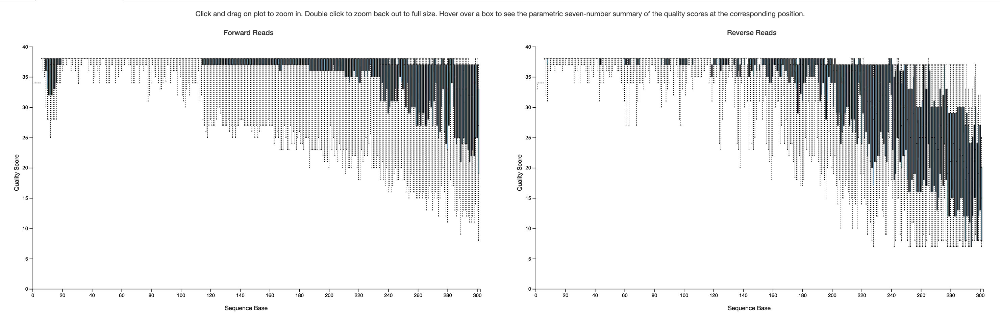
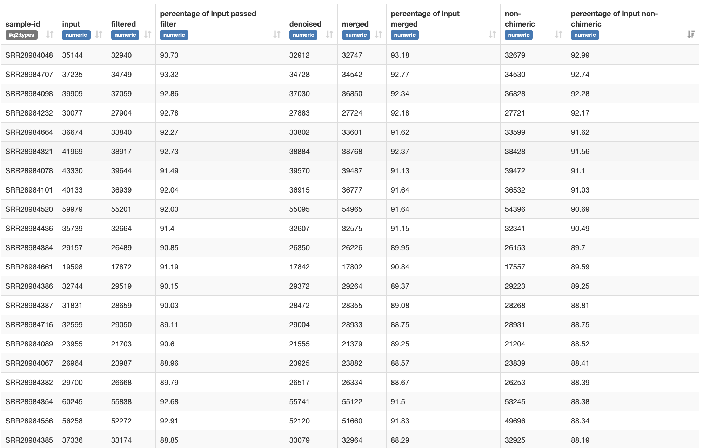
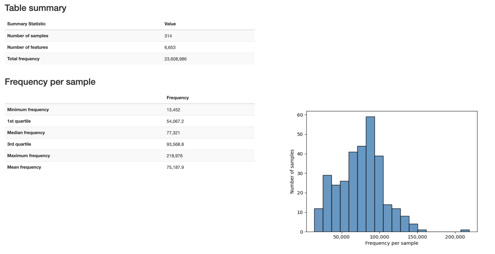
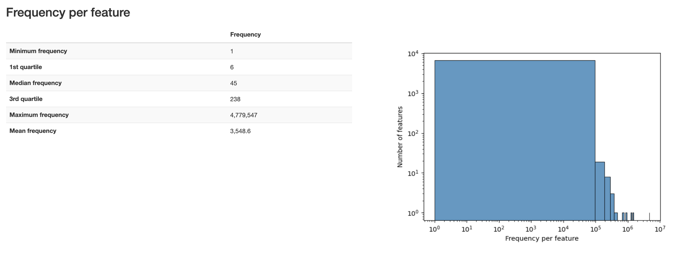
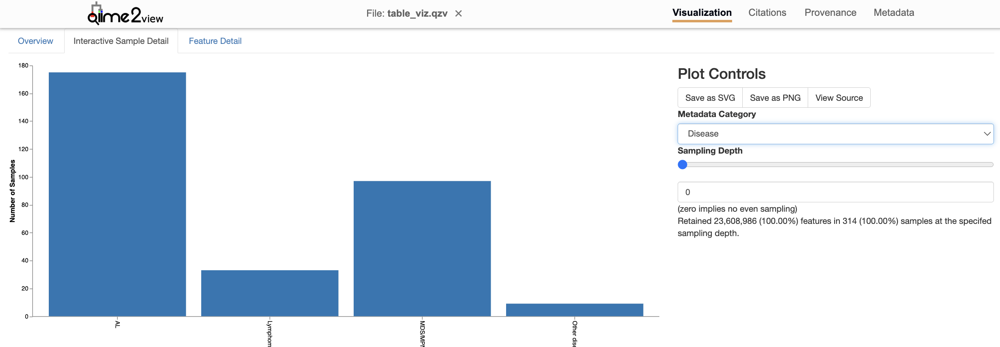
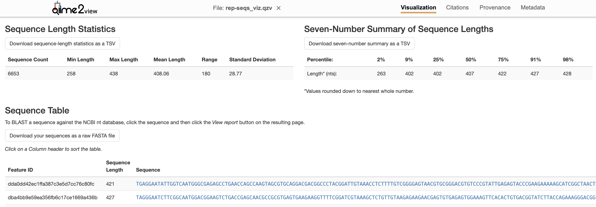
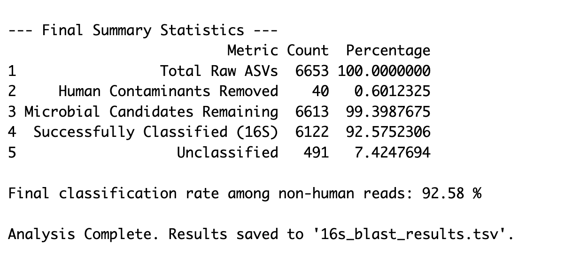
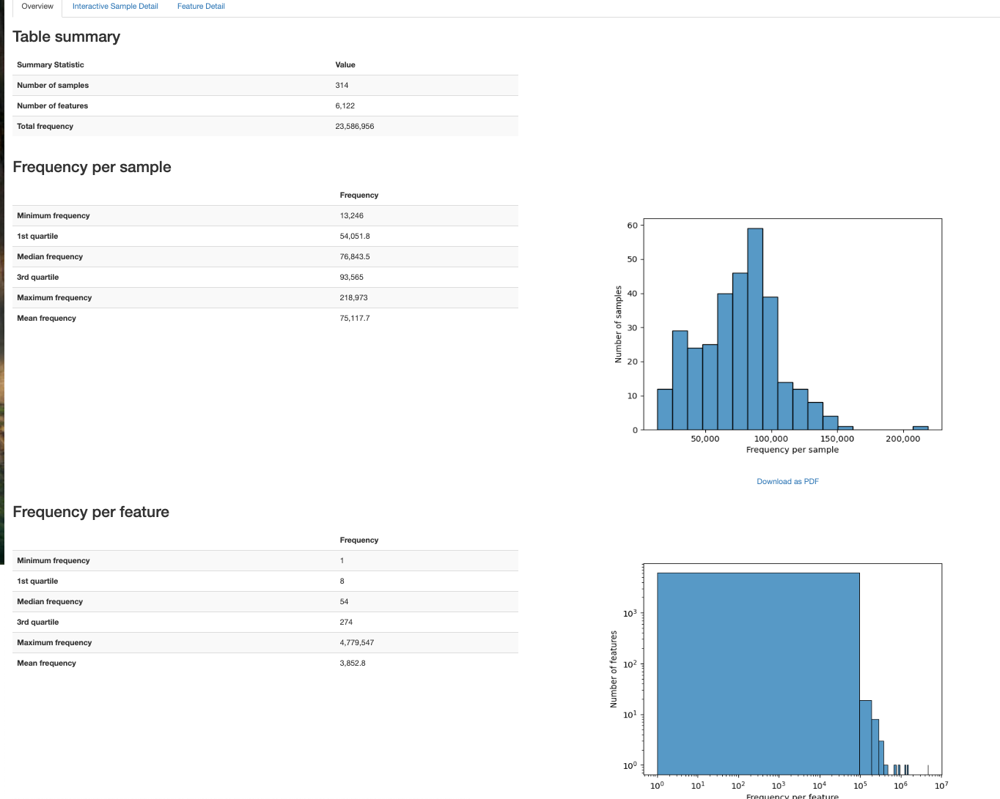
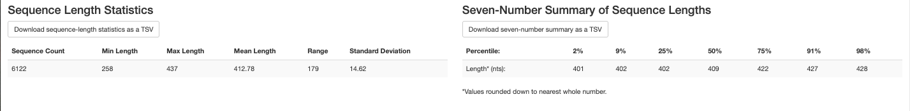

# Reference

-   Full citation: Fujimoto, K., Hayashi, T., Yamamoto, M., Sato, N., Shimohigoshi, M., Miyaoka, D., Yokota, C., Watanabe, M., Hisaki, Y., Kamei, Y., Yokoyama, Y., Yabuno, T., Hirose, A., Nakamae, M., Nakamae, H., Uematsu, M., Sato, S., Yamaguchi, K., Furukawa, Y., Akeda, Y., Hino, M., Imoto, S., Uematsu, S., 2024. An enterococcal phage-derived enzyme suppresses graft-versus-host disease. Nature 632, 174–181. https://doi.org/10.1038/s41586-024-07667-8

-   Bioproject: [PRJNA1109929](https://www.ncbi.nlm.nih.gov/bioproject/PRJNA1109929)

# Relevant Methods

-   The 16S rRNA V3–V4 region was PCR-amplified using specific primers (forward primer: 5′-ACACGACGCTCTTCCGATCTCCTACGGGNG GCWGCAG-3′, reverse primer: 5′-GACGTGTGCTCTTCCGATCTGACTA CHVGGGTATCTAATCC-3′, underline: overhang sequence for secondround PCR) over 20 cycles, and the PCR products were purified with Agencourt AMpure beads (Beckman Coulter) as described previously15. Then, the overhang and index sequences required for sequencing were added by a second round of PCR using NEBNext multiplex Oligos for Illumina (Dual Index Primers Set1, New England Biolabs) over eight cycles, and the products were purified with Agencourt AMpure beads. For each sample, equal amounts of each DNA amplicon library were mixed and sequenced on an MiSeq instrument (Illumina) using the MiSeq v3 Reagent kit and a 15% PhiX spike (Illumina). 16S rRNA gene analysis was performed using QIIME2 (v.2018.11; https://qiime2.org). In brief, raw sequence data were subjected to primer sequence trimming, quality filtering and paired-end read merging using the dada2 denoise-paired method (–p-trim-left-f 17 –p-trim-left-r 21–p-trunc-len-f 275 –p-trunc-len-r 215 –p-n-threads 16). Before taxonomic analysis, sequences of the 16S rRNA V3–V4 region were extracted from Greengenes 13_8 99% operational taxonomic units and our primer sequences using the q2-feature-classifier. Then, the Naive Bayes classifier was trained using the extracted Greengenes 13_8 reference sequences and Greengenes 13_8 99% operational taxonomic unit taxonomy. The taxonomic composition was visualized using a qiime taxa bar plot.

# Software versions

Sra toolkit

```         
(sra-env) sophiehuebler@Sophies-MBP RawData % prefetch --version

prefetch : 3.2.1

(sra-env) sophiehuebler@Sophies-MBP RawData % fastq-dump --version

fastq-dump : 3.2.1
```

Qiime2

```         
System versions
Python version: 3.10.14
QIIME 2 release: 2025.4
QIIME 2 version: 2025.4.0
q2cli version: 2025.4.0

Installed plugins
alignment: 2025.4.0
composition: 2025.4.0
cutadapt: 2025.4.0
dada2: 2025.4.0
deblur: 2025.4.0
demux: 2025.4.0
diversity: 2025.4.0
diversity-lib: 2025.4.0
emperor: 2025.4.0
feature-classifier: 2025.4.0
feature-table: 2025.4.0
fragment-insertion: 2025.4.0
longitudinal: 2025.4.0
metadata: 2025.4.0
phylogeny: 2025.4.0
quality-control: 2025.4.0
quality-filter: 2025.4.0
rescript: 2025.4.0
sample-classifier: 2025.4.0
stats: 2025.4.0
taxa: 2025.4.0
types: 2025.4.0
vizard: 0.0.1.dev0
vsearch: 2025.4.0
```

Blast (/Users/sophiehuebler/miniconda3-x86_64/envs/qiime2-env/bin/blastn)

```         
blastn: 2.16.0+
 Package: blast 2.16.0, build Nov 27 2024 10:36:47
```

Greengenes2

```         
2024.09.phylogeny.asv.nwk.qza
2024.09.seqs.fna.qza
2024.09.backbone.v4.nb.sklearn-1.4.2.qza
```

# Data Access

-   meta_samples.csv downloaded from bioproject

    -   (March 9, 2026)

-   fuji_meta_qiime.tsv generated in R Fujimoto2024/Metadata/Parsing_metadata.qmd

    -   (March 9, 2026)

-   meta_clinical.xlsx copied (by hand) from Supplementary Table 2

    -   (March 9, 2026)

# Reading Data

```         
arch -x86_64 zsh
source ~/miniconda3-x86_64/etc/profile.d/conda.sh
cd ~/Documents/ODSi/ODSiData/Fujimoto2024/RawData
```

```         
caffeinate -i  ../../Bash/fetch_accessions.sh
```

## Creating manifest

```         
../../Bash/create_manifest_script.sh
```

## Importing to qiime2

Couple of hours

```         
conda activate qiime2-env

qiime tools import \
  --type 'SampleData[PairedEndSequencesWithQuality]' \
  --input-path RawData/manifest.tsv \
  --output-path QiimeData/demux.qza \
  --input-format PairedEndFastqManifestPhred33V2
  
qiime demux summarize \
  --i-data QiimeData/demux.qza \
  --o-visualization QiimeData/demux_viz.qzv
```





# Cleaning Data

## DADA2

```         
caffeinate -i -m qiime dada2 denoise-paired \
  --i-demultiplexed-seqs demux.qza \
  --p-trim-left-f 17 \
  --p-trim-left-r 21 \
  --p-trunc-len-f 275 \
  --p-trunc-len-r 215 \
  --p-n-threads 8 \
  --o-table table.qza \
  --o-representative-sequences rep-seqs.qza \
  --o-denoising-stats stats.qza
```

## Stats

```         
qiime metadata tabulate \
  --m-input-file stats.qza \
  --o-visualization stats_viz.qzv
```



## Table

```         
qiime feature-table summarize \
  --i-table table.qza \
  --m-sample-metadata-file ../Metadata/fuji_meta_qiime.tsv \
  --o-visualization table_viz.qzv
```

{width="680"}





## Rep seqs

```         
qiime feature-table tabulate-seqs \
  --i-data rep-seqs.qza \
  --o-visualization rep-seqs_viz.qzv
```



# BLAST Analysis

```{r}
library(RCurl)
library(rBLAST)
library(Biostrings)
library(tidyverse)
```

```{r}
# 1. DATABASE PATHS -----------------------------------------------------------
conda_blast_path <- "/Users/sophiehuebler/miniconda3-x86_64/envs/qiime2-env/bin"
Sys.setenv(PATH = paste(conda_blast_path, Sys.getenv("PATH"), sep = ":"))

db_dir <- "~/blast_databases"
human_db_path <- file.path(db_dir, "GCF_000001405.39_top_level")
s16_db_path   <- file.path(db_dir, "16S_ribosomal_RNA")

# 2. LOAD SEQUENCES --------------------------------------------------------
fasta_input <- "~/Documents/ODSi/ODSiData/Fujimoto2024/QiimeData/exported-seqs/dna-sequences.fasta"
seqs <- readDNAStringSet(fasta_input)
cat("Starting with", length(seqs), "total sequences.\n")

# 3. STEP 1: HUMAN DECONTAMINATION -----------------------------------------
cat("\n--- Step 1: Human Decontamination ---\n")
bl_human <- blast(db = human_db_path)

# High confidence human matches
human_args <- paste('-perc_identity 95', '-qcov_hsp_perc 90', '-num_threads 4')

blast_human <- predict(bl_human, seqs, type = 'megablast', BLAST_args = human_args)

human_ids <- unique(blast_human$qseqid)
non_human_seqs <- seqs[!(names(seqs) %in% human_ids)]

cat("Detected", length(human_ids), "human sequences.\n")
cat("Proceeding with", length(non_human_seqs), "microbial candidate sequences.\n")

# 4. STEP 2: 16S RRNA CLASSIFICATION ---------------------------------------
cat("\n--- Step 2: 16S rRNA Classification ---\n")
bl_16s <- blast(db = s16_db_path)

# Microbiome standard: identity > 75% (Source)
s16_args <- paste('-perc_identity 75', 
                  '-word_size 15', 
                  '-qcov_hsp_perc 90', 
                  '-max_target_seqs 10', 
                  '-num_threads 4')

blast_16s <- predict(bl_16s, non_human_seqs, type = 'megablast', BLAST_args = s16_args)
bact_ids <- unique(blast_16s$qseqid)
bact_seqs <- seqs[names(seqs) %in% bact_ids]

# 5. FILTER TO BEST HIT ----------------------------------------------------
cat("Filtering results to best hit per sequence...\n")

top_hits <- blast_16s %>%
  group_by(qseqid) %>%
  arrange(desc(pident), evalue) %>%
  dplyr::slice(1) %>%
  ungroup()

# 7. CALCULATE SUMMARY STATISTICS -----------------------------------------
cat("\n--- Final Summary Statistics ---\n")

total_count      <- length(seqs)
non_human_count  <- length(non_human_seqs)
classified_count <- length(unique(top_hits$qseqid))

# Calculate percentages
pct_human      <- ((total_count - non_human_count) / total_count) * 100
pct_classified <- (classified_count / non_human_count) * 100
pct_total_loss <- ((total_count - classified_count) / total_count) * 100

# Create a clean summary table
summary_stats <- data.frame(
  Metric = c("Total Raw ASVs", 
             "Human Contaminants Removed", 
             "Microbial Candidates Remaining", 
             "Successfully Classified (16S)",
             "Unclassified"),
  Count = c(total_count, 
            total_count - non_human_count, 
            non_human_count, 
            classified_count, 
            non_human_count - classified_count),
  Percentage = c(100, pct_human, (100 - pct_human), pct_classified, (100 - pct_classified))
)

print(summary_stats)

cat("\nFinal classification rate among non-human reads:", round(pct_classified, 2), "%\n")

# 6. EXPORT RESULTS --------------------------------------------------------
write_tsv(top_hits, "~/Documents/ODSi/ODSiData/Fujimoto2024/FilteredData/16s_blast_results.tsv")
writeXStringSet(bact_seqs, "~/Documents/ODSi/ODSiData/Fujimoto2024/FilteredData/blast_seqs.fasta")

cat("\nAnalysis Complete. Results saved to '16s_blast_results.tsv'.\n")
```

{width="349"}

# Filtering

Keeping only sequences classified by blast.

```         
qiime tools import \
  --input-path blast_seqs.fasta \
  --output-path blast_seqs.qza \
  --type 'FeatureData[Sequence]'
```

```         
qiime feature-table filter-features \
  --i-table ../QiimeData/table.qza \
  --m-metadata-file blast_seqs.qza \
  --o-filtered-table clean-table.qza
```

```         
qiime feature-table filter-seqs \
  --i-data ../QiimeData/rep-seqs.qza \
  --i-table clean-table.qza \
  --o-filtered-data clean-seqs.qza
```

## Table

```         
qiime feature-table summarize \
  --i-table clean-table.qza \
  --o-visualization clean-table_viz.qzv \
  --m-sample-metadata-file ../Metadata/fuji_meta_qiime.tsv
```



## Sequences

```         
qiime feature-table tabulate-seqs \
  --i-data clean-seqs.qza \
  --o-visualization clean-seqs_viz.qzv
```



# Greengenes2 Reference

There was no overlap between the filtered ASVs (from clean-table) and the greengenes2 reference database. Decided to do clustering to 97% to greengenes2 sequences.

## Clustering

\~20 minutes

```         
qiime vsearch cluster-features-closed-reference \
  --i-table ../FilteredData/clean-table.qza \
  --i-sequences ../FilteredData/clean-seqs.qza \
  --i-reference-sequences ../../Greengenes2/2024.09.seqs.fna.qza \
  --p-perc-identity 0.97 \
  --o-clustered-table clustered-table.qza \
  --o-clustered-sequences clustered-seqs.qza \
  --o-unmatched-sequences unmatched-seqs.qza
```

```         
qiime feature-table tabulate-seqs \
  --i-data clustered-seqs.qza \
  --o-visualization clustered-seqs_viz.qzv
```

```         
qiime feature-table summarize \
  --i-table clustered-table.qza \
  --o-visualization clustered-table_viz.qzv \
  --m-sample-metadata-file ../Metadata/fuji_meta_qiime.tsv
```

## Phylogenetic Tree

Filtered asv table for those that appear within the greengenes phylogeny.

```         
qiime phylogeny filter-table \
  --i-table ../ClusteredData/clustered-table.qza \
  --i-tree ../../Greengenes2/2024.09.phylogeny.asv.nwk.qza \
  --o-filtered-table tree-table.qza
  
#qiime feature-table summarize \
#  --i-table tree-table.qza \
#  --o-visualization tree-table_viz.qzv \
#  --m-sample-metadata-file ../Metadata/fuji_meta_qiime.tsv  
  
```

```         
#qiime phylogeny filter-tree \
#  --i-tree ../../Greengenes2/2024.09.phylogeny.asv.nwk.qza \
#  --i-table tree-table.qza \
#  --o-filtered-tree greengenes2-subset-tree.qza
```

```         
qiime feature-table filter-seqs \
  --i-data ../ClusteredData/clustered-seqs.qza \
  --i-table tree-table.qza \
  --o-filtered-data final-tree-seqs.qza
```

## Taxonomy

!!Need to find a V3V4 classifier!!

Took under 2 minutes.

```         
#qiime feature-classifier classify-sklearn \
#  --i-classifier ../../Greengenes2/2024.09.backbone.v4.nb.sklearn-1.4.2.qza\
#  --i-reads ../PhylogeneticTree/final-tree-seqs.qza \
#  --p-confidence 0.9 \
#  --o-classification greengenes2_taxonomy.qza
```

```         
#qiime taxa barplot \
#  --i-table ../PhylogeneticTree/tree-table.qza \
#  --i-taxonomy greengenes2_taxonomy.qza \
#  --m-metadata-file ../Metadata/fuji_meta_qiime.tsv\
#  --o-visualization taxa-bar-plots.qzv
```

# De Novo Tree

```         
qiime phylogeny align-to-tree-mafft-fasttree \
  --i-sequences ../FilteredData/clean-seqs.qza \
  --o-alignment QuickTree/aligned-seqs.qza \
  --o-masked-alignment QuickTree/masked-aligned-seqs.qza \
  --o-tree QuickTree/unrooted-tree.qza \
  --o-rooted-tree QuickTree/rooted-tree.qza
```
