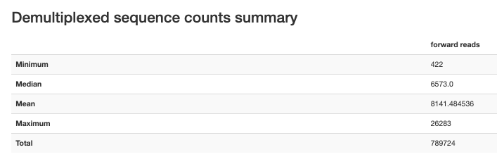
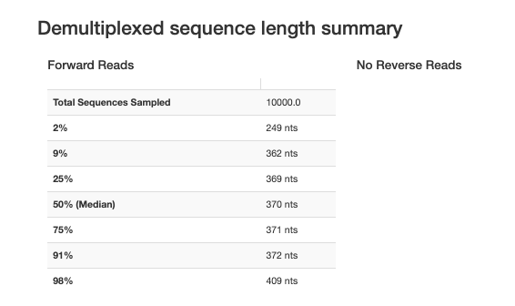
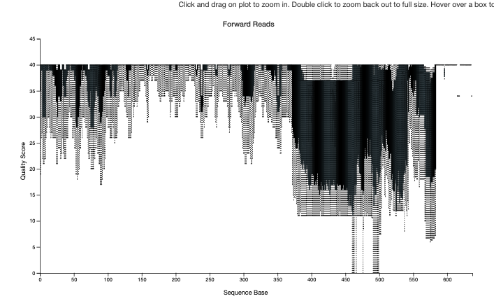
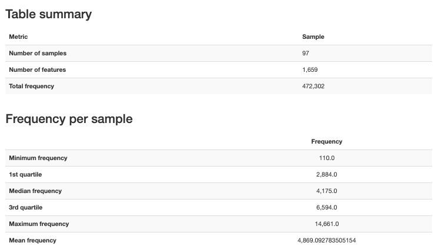
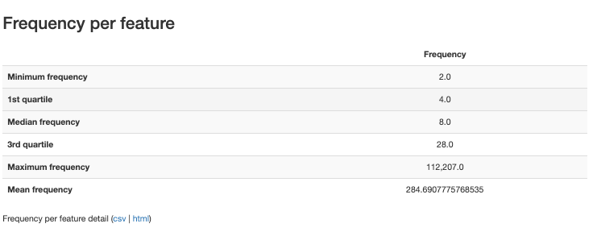
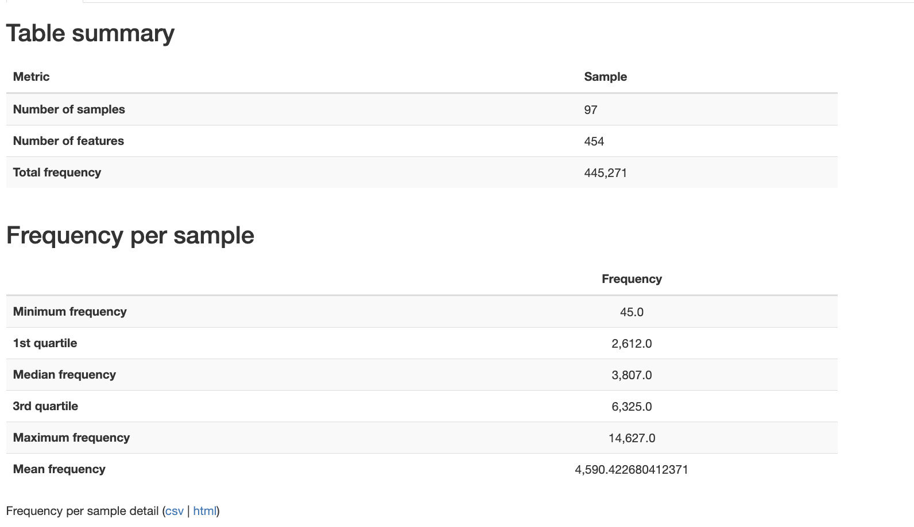

# Ingham

-   37 pediatric patients

-   97 samples

-   454 Pyro sequencing

-   V4-V5 region

# Reference

-   Ingham, A.C., Kielsen, K., Cilieborg, M.S., Lund, O., Holmes, S., Aarestrup, F.M., M√^o^ller, K.G., Pamp, S.J., 2019. Specific gut microbiome members are associated with distinct immune markers in pediatric allogeneic hematopoietic stem cell transplantation. Microbiome 7, 131. https://doi.org/10.1186/s40168-019-0745-z

-   PRJEB25221

-   <https://figshare.com/projects/Specific_gut_microbiome_members_are_associated_with_distinct_immune_markers_in_allogeneic_hematopoietic_stem_cell_transplantation/35201>

-   <https://figshare.com/articles/dataset/SFF_and_Mapping_files_for_demultiplexing/6508250?file=11972558>

# Relevant methods

-   We recruited 37 children (age range 1.1–18.0 years) under-going their first myeloablative allogeneic hematopoietic stemcell transplantation at Copenhagen University Hospital Rig-shospitalet, Denmark, from June 2010 to September 2012.Patients’ clinical characteristics are listed in Additional file 1:Table S1. Further information can also be found in previousstudies where the cohort has been examined in relation toother questions \[17, 46–48\]. All patients received pretreat-ment with a myeloablative conditioning regimen, starting onday − 7 (Additional file 1: Table S1). Four patients were re-transplanted at day + 157, + 518, + 712, and + 1360 after thefirst transplantation, respectively.Sampling time points were defined according to the fol-lowing intervals: pre-HSCT (collected between day − 33and day − 3), at the time of HSCT, preferably before graftinfusion (collected between day − 2 and day + 2) andweekly during the first 6 weeks after transplantation (week+ 1: day + 3 to day + 10, week + 2: day + 11 to day + 17,week + 3: day + 18 to day + 24, week + 4: day + 25 to day+ 31, week + 5: day + 32 to day + 38, week + 6: day + 39 today + 45) (Fig. 1a). Broader intervals applied to follow-uptime points: month + 1 (between days + 21 and + 44),month + 2 (between days + 45 and + 70), month + 3 (be-tween days + 77 and + 105), month + 6 (between days +161 and + 197), and 1-year post-transplantation (betweendays + 346 and + 375).

-   Fecal samples for analysis of the intestinal microbiomewere collected from a subset of 30 patients at seven timepoints: pre-HSCT (five patients were sampled after thestart of conditioning (between day − 6 and day − 4)), atthe time of HSCT and once weekly during the first fiveweeks after transplantation. The intestinal microbiomewas characterized at 1–2 time points in eight patients(27%), at 3–4 time points in 15 patients (50%), and at 5–6 time points in eight patients (27%) (Additional file 1:Table S1). In patients who underwent re-transplantation,no feces samples collected after the second transplant-ation were included in this study. In total, 97 fecal sam-ples were obtained.DNA from fecal samples and a blank control were iso-lated with the use of the Maxwell 16 Instrument (PromegaCorporation) following the manufacturer’s instructions forthe low elution volume blood DNA system. Alterations tothe protocol included additional lysozyme treatment andbead beating with stainless steel beads for 2 min/20 Hz in atissue lyser (Qiagen). In each sample including the blankcontrol, the V4–V5 region of the 16S ribosomal RNA genewere amplified in PCR using the following barcodedprimers: 519F (5#-CAGCAGCCGCGGTAATAC-3#) and926R (5#-CCGTCAATTCCTTTGAGTTT-3#). Ampliconswere then analyzed for quantity and quality in an Agilent2100 Bioanalyzer (Agilent Technologies) with the use of an Agilent RNA 1000 Nano Kit. For library preparation, 50 ngof DNA from each sample was pooled with multiplex iden-tifiers for 2-region 454 sequencing on GS FLX TitaniumPicoTiterPlates (70675) with the use of a GS FLX TitaniumSequencing Kit XLR70 (Roche Diagnostics). Library con-struction and 454 pyrosequencing were performed at theNational High-Throughput DNA Sequencing Center, Uni-versity of Copenhagen.

-   Raw 454 sequence reads stored in standard flowgramformat (SFF) were extracted, converted to and stored inFASTA format with associated quality files (containingsequence quality scores) using the sffinfo command ofthe bioinformatics software tool mothur \[49\]. Trimmingaccording to the clipQualLeft and clipQualRight valuesprovided by the sequence provider was disabled becausecut-off values are opaque and not customizable.Analysis was continued in the Quantitative Insights IntoMicrobial Ecology (QIIME; version 1.9.0) bioinformaticspipeline \[50\]. FASTA files were demultiplexed and qualityfiltered using the script split_libraries.py (Mapping files areavailable from figshare (https://doi.org/10.6084/m9.figshare.6508250)). As the samples were sequenced bidirectional,each FASTA file was demultiplexed in two steps. Firstly,based on a mapping file containing the 519F primer as the“LinkerPrimerSequence” and the 926R primer as the“ReversePrimer,” both in 5′ to 3′ orientation. Secondly,based on a mapping file containing the 926R primer as the“LinkerPrimerSequence” and the 519F primer as the“ReversePrimer,” again both in 5′ to 3′ orientation.

-   Reads between 200 and 1000 bp length and a minimumquality score of 25 were retained (default). Sequences withhomopolymers longer than 200 bp were removed fromthe data set. Removal of reverse primer sequences (-ztruncate_only option) was disabled during demultiplexing.Subsequently, the demultiplexed FASTA files that werenot yet primer-truncated were then used to denoise flow-grams (.sff.txt files also generated by mothur’s sffinfo) withQIIME’s denoise_wrapper.py script. Reverse primer-trun-cation had not been done yet to ensure compatibility be-tween FASTA and .sff.txt files. The denoised FASTAoutput files were then inflated, i.e., flowgram similarity be-tween cluster centroids was translated to sequence simi-larity, to be used for OTU picking. Reverse primers and subsequent sequences in the demultiplexed and denoised FASTA files were then truncated using the truncate_re-verse_primer.py script. In the following step, the orienta-tion of the primer-truncated reads that started with the926R primer as the “LinkerPrimerSequence” was adjustedby reverse complementation (with the script adjust_seq_orientation.py). All trimmed reads were then concatenatedto a single file for further analysis.

-   Chimeras were identified using the script identify_chimeric_seqs.py and method usearch61, which performsboth de novo (abundance-based) and reference-based detec-tion (by comparing the dataset to the chimera-free referencedatabase Ribosomal Database Project (RDP; training data-base version 15)). Only those sequences that were flagged asnon-chimeras from both detection methods were retained(option –non_chimeras_retention = intersection). Oper-ational taxonomic unit (OTU) clustering was performed,using the script pick_otus.py (based on the SILVA database,Silva_119_rep_set97). OTU tables in BIOM format werecreated with make_otu_table.py (and subsequently con-verted to JSON BIOM format to be compatible with analysisin R \[51\] with the package phyloseq \[52\]). The OTU tableand the taxonomy table are available from figshare (https://doi.org/10.6084/m9.figshare.6508187).

# Data Access

# Fetch and import

Importing resulted in 3 fastq files (ERRxx, ERRxx_1, and ERRxx_2). The \_1 and \_2 were identical with all reverse reads. The noprefix had a mix or forward and reverse reads that were not paired. Read lengths were variable.

## Fixing

Ran prep_ingham_454.sh to repair the mixture of the issues arising from the ERR storage and pyro sequences.

-   Remove \_2

-   Separate the files into r1 (all from noprefix) and r2 (from \_1 and noprefix).

-   Trim each read in it's native orientation

    -   revcomp(926R)=AAACTCAAAGGAATTGACGG

    -   revcomp(519F)=GTATTACCGCGGCTGCTG

-   Drop reads too short after trimming. Keep reads where no primer was detected.

-   Reorient everything in the forward direction

-   Deduplicate by readID

After this they were imported as single reads.







# Denoise

Ran DADA2 pyro denoising





# Metadata

```{r}
ingham_meta_qiime <- read_tsv("/Users/sophiehuebler/Documents/ODSi/ODSiData/Ingham2019/Metadata/ingham_meta_qiime.tsv")
```

# Qc and Mapped


