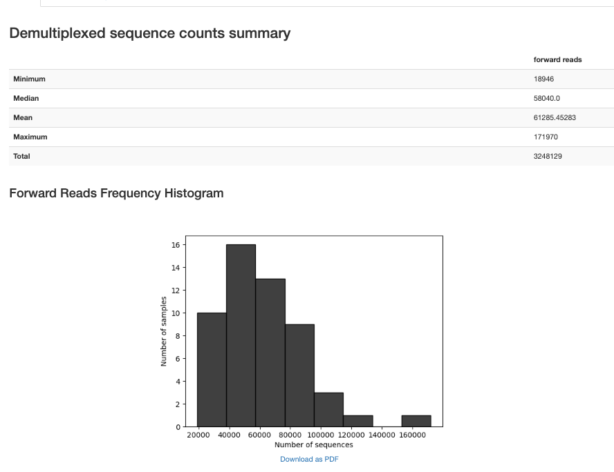
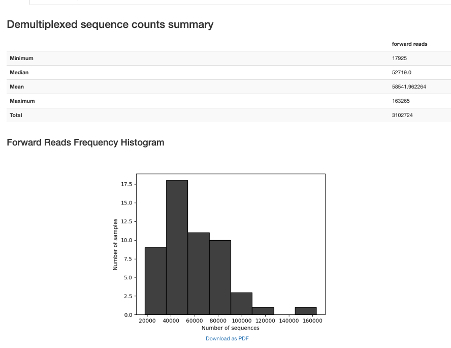
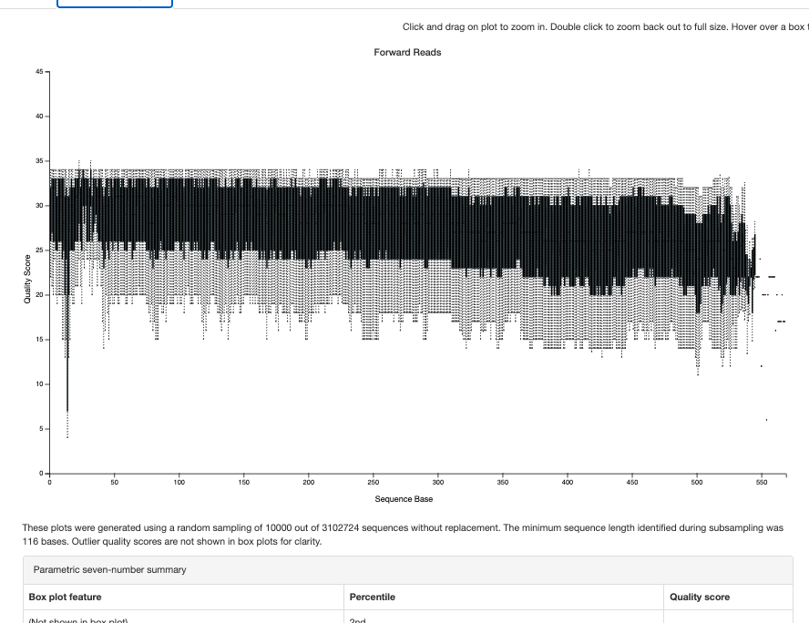
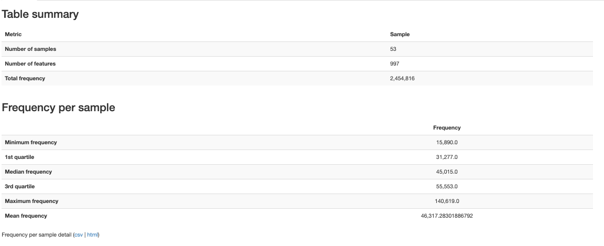
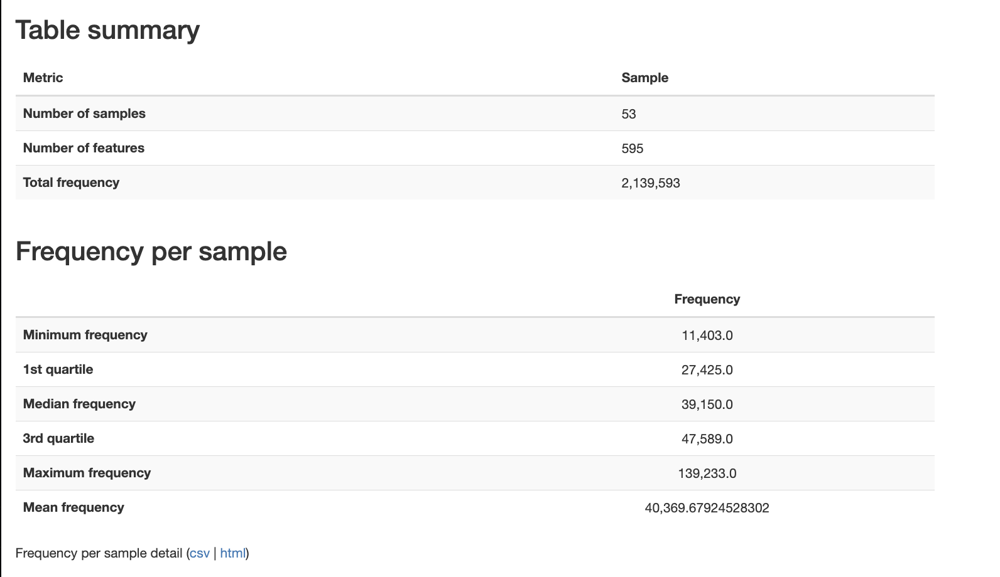

# Jarosch

-   V1-V3
-   53 samples

# References

-   Jarosch, S., Köhlen, J., Ghimire, S., Orberg, E.T., Hammel, M., Gaag, D., Evert, M., Janssen, K.-P., Hiergeist, A., Gessner, A., Weber, D., Meedt, E., Poeck, H., D’Ippolito, E., Holler, E., Busch, D.H., 2023. Multimodal immune cell phenotyping in GI biopsies reveals microbiome-related T cell modulations in human GvHD. Cell Rep. Med. 4, 101125. https://doi.org/10.1016/j.xcrm.2023.101125

-   PRJEB60178

# Relevant Methods

-   Nucleic acids were extracted from 50 mg patient stool collected and stabilized in maGix microbiome preservation buffer (microBIOMix). Lysis of microbial cells was enhanced by repeated beat-beating of stool suspensions on a Tissue Lyser II instrument (Qiagen) using Lysing Matrix Y beads (MP Biomedicals) followed by freezing and thawing. Total nucleic acids were purified from crude lysates with the MagNA Pure 96 system (Roche). Bacterial 16S rRNA gene copies were quantified by qPCR.82 V1-3 hypervariable regions of bacterial 16S rRNA genes were amplified from 1x107 16S copies with the Platinum II Taq Hot-Start DNA-Polymerase and primers S-D-Bact-0008-c-S-20 and S-D-Bact-0517-a-A-18.83 Amplicon libraries were purified with MagSi-NGSPREP Plus beads (Magtivio), quantified with the KAPA Library Quantification Kit (Roche) before normalization and pooling. Final library pools were sequenced on a GeneStudio S5 Plus instrument (Thermo Fisher Scientific) with the 600 bp protocol after isothermal amplification on an IonChef instrument.

-   Raw sequencing reads were retrieved from TorrentSuite (5.16.1) followed by quality trimming with Trimmomatic (0.9). Sequencing adapters and 16S primer sequences were removed and demultiplexed using cutadapt (3.5). Amplicon sequence variants (ASV) were retrieved from processed reads in R (4.1.1) using the dada2 (1.16) package. Here, 15 bp were trimmed from 5’-ends of each read, and the dada2 command was executed while a minEE value of 5, a HOMOPOLYMER_GAP_PENALTY of -1 and a BAND_SIZE of 32 were applied. Taxonomy was assigned to resulting ASVs with the IDTAXA classifier of the DECIPHER package (2.19) and the All-Species Living Tree (LTP) database (12.2021) applying a 50% confidence threshold. Correlation analysis was performed based on the abundance of assigned taxonomic features.

    -   Ion Torrent (use single pyro denoiser)

    -   Changed the max error from 2 to 5 to match original authors

-   S-D-Bact-0008-c-S-20 = AGRGTTYGATYMTGGCTCAG (27F)

-   revcomp of S-D-Bact-0517-a-A-18 = GCCAGCMGCCGCGGTAAT (18 nt)

# Fetch and import

-   Import went very quickly

-   {width="691"}{width="314"}

# Trim

{width="513"}

{width="636"}

# Denoise

-   Trim left at 15 (big spike downward at 14 even after trimming) plus that's what authors indicate.

-   No right truncation, let pyro max ee handle errors



54-92% non-chimeric

# BLAST

```{r}
library(RCurl)
library(rBLAST)
library(Biostrings)
library(tidyverse)
```

```{r}
# 1. DATABASE PATHS -----------------------------------------------------------
conda_blast_path <- "/Users/sophiehuebler/miniconda3-x86_64/envs/qiime2-env/bin"
Sys.setenv(PATH = paste(conda_blast_path, Sys.getenv("PATH"), sep = ":"))

db_dir <- "~/blast_databases"
human_db_path <- file.path(db_dir, "GCF_000001405.39_top_level")
s16_db_path   <- file.path(db_dir, "16S_ribosomal_RNA")

# 2. LOAD SEQUENCES --------------------------------------------------------
fasta_input <- "~/Documents/ODSi/ODSiData/Jarosch2023/QiimeData/dna-sequences.fasta"
seqs <- readDNAStringSet(fasta_input)
cat("Starting with", length(seqs), "total sequences.\n")

# 3. STEP 1: HUMAN DECONTAMINATION -----------------------------------------
cat("\n--- Step 1: Human Decontamination ---\n")
bl_human <- blast(db = human_db_path)

# High confidence human matches
human_args <- paste('-perc_identity 95', '-qcov_hsp_perc 90', '-num_threads 4')

blast_human <- predict(bl_human, seqs, type = 'megablast', BLAST_args = human_args)

human_ids <- unique(blast_human$qseqid)
non_human_seqs <- seqs[!(names(seqs) %in% human_ids)]

cat("Detected", length(human_ids), "human sequences.\n")
cat("Proceeding with", length(non_human_seqs), "microbial candidate sequences.\n")

# 4. STEP 2: 16S RRNA CLASSIFICATION ---------------------------------------
cat("\n--- Step 2: 16S rRNA Classification ---\n")
bl_16s <- blast(db = s16_db_path)

# Microbiome standard: identity > 75% (Source)
s16_args <- paste('-perc_identity 75', 
                  '-word_size 15', 
                  '-qcov_hsp_perc 90', 
                  '-max_target_seqs 10', 
                  '-num_threads 4')

blast_16s <- predict(bl_16s, non_human_seqs, type = 'megablast', BLAST_args = s16_args)
bact_ids <- unique(blast_16s$qseqid)
bact_seqs <- seqs[names(seqs) %in% bact_ids]

# 5. FILTER TO BEST HIT ----------------------------------------------------
cat("Filtering results to best hit per sequence...\n")

top_hits <- blast_16s %>%
  group_by(qseqid) %>%
  arrange(desc(pident), evalue) %>%
  dplyr::slice(1) %>%
  ungroup()

# 7. CALCULATE SUMMARY STATISTICS -----------------------------------------
cat("\n--- Final Summary Statistics ---\n")

total_count      <- length(seqs)
non_human_count  <- length(non_human_seqs)
classified_count <- length(unique(top_hits$qseqid))

# Calculate percentages
pct_human      <- ((total_count - non_human_count) / total_count) * 100
pct_classified <- (classified_count / non_human_count) * 100
pct_total_loss <- ((total_count - classified_count) / total_count) * 100

# Create a clean summary table
summary_stats <- data.frame(
  Metric = c("Total Raw ASVs", 
             "Human Contaminants Removed", 
             "Microbial Candidates Remaining", 
             "Successfully Classified (16S)",
             "Unclassified"),
  Count = c(total_count, 
            total_count - non_human_count, 
            non_human_count, 
            classified_count, 
            non_human_count - classified_count),
  Percentage = c(100, pct_human, (100 - pct_human), pct_classified, (100 - pct_classified))
)

print(summary_stats)

cat("\nFinal classification rate among non-human reads:", round(pct_classified, 2), "%\n")

# 6. EXPORT RESULTS --------------------------------------------------------
write_tsv(top_hits, "~/Documents/ODSi/ODSiData/Jarosch2023/FilteredData/16s_blast_results.tsv")
writeXStringSet(bact_seqs, "~/Documents/ODSi/ODSiData/Jarosch2023/FilteredData/blast_seqs.fasta")

cat("\nAnalysis Complete. Results saved to '16s_blast_results.tsv'.\n")
```

# METADATA INTERLUDE

Only able to match clinical data to samples on the reported alpha diversity metrics included in clinical samples.

# Qc and Mapped


