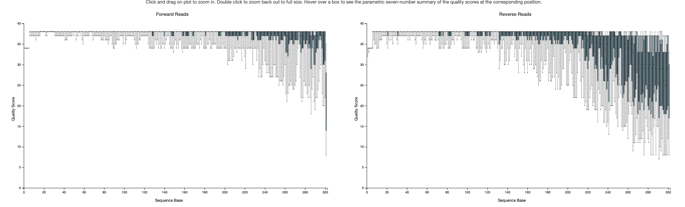
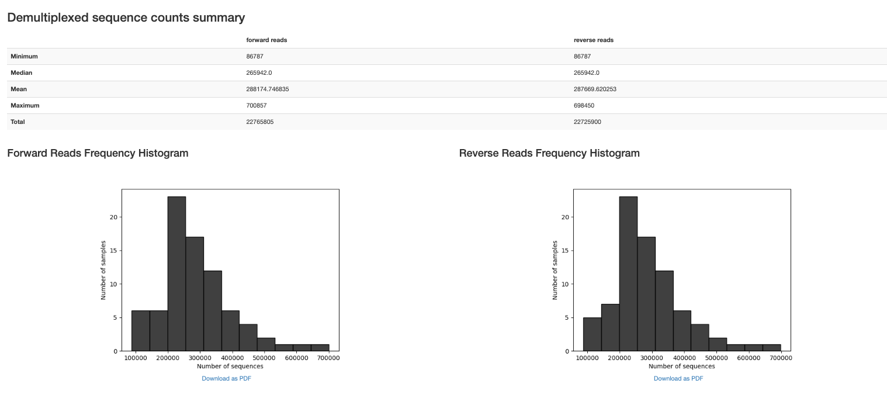
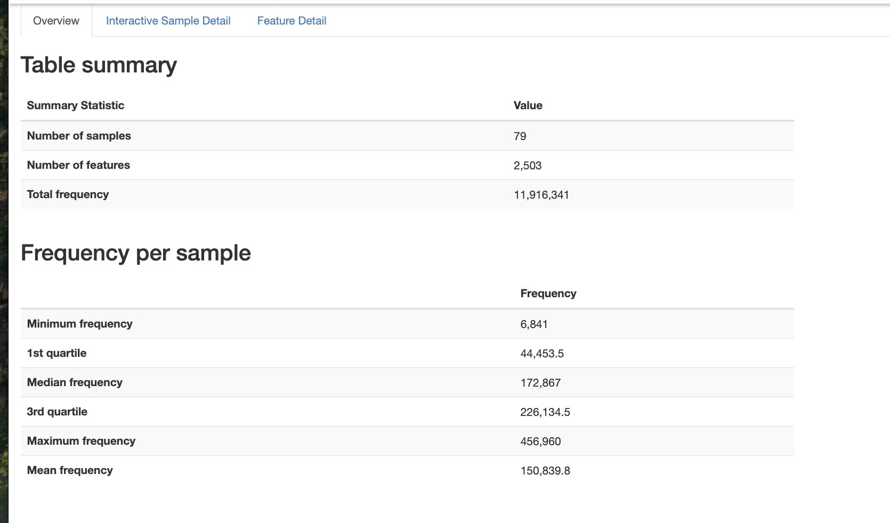
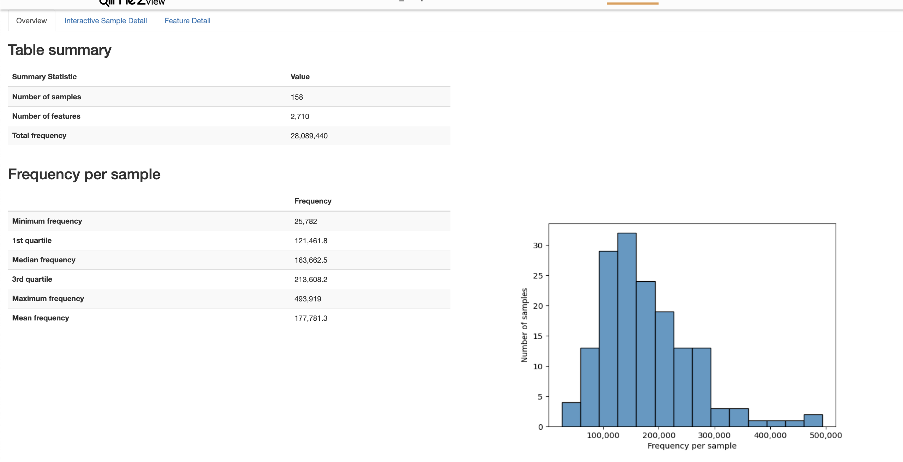
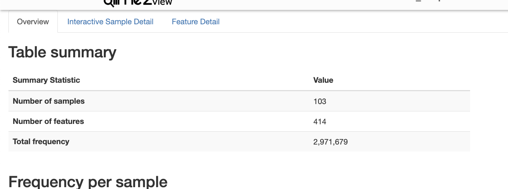
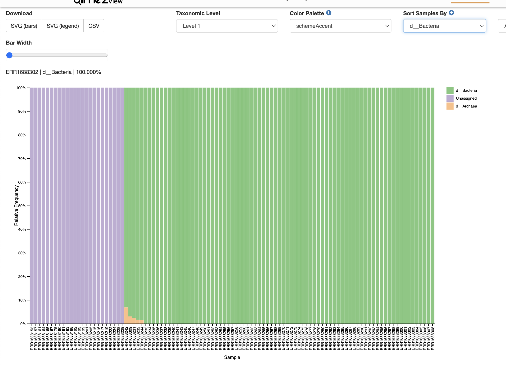
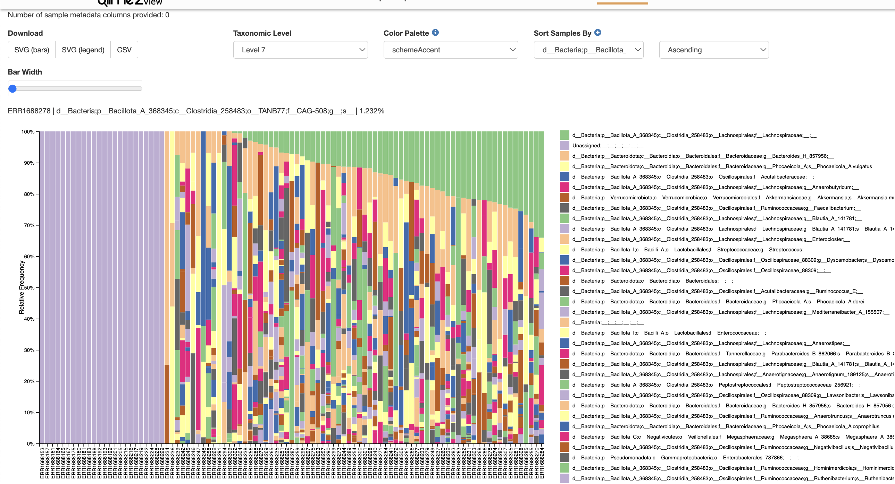

# Liu

-   V4

# Reference

-   Full citation: Liu C, Frank DN, Horch M, Chau S, Ir D, Horch EA, Tretina K, van Besien K, Lozupone CA, Nguyen VH. Associations between acute gastrointestinal GvHD and the baseline gut microbiota of allogeneic hematopoietic stem cell transplant recipients and donors. Bone Marrow Transplant. 2017 Dec;52(12):1643-1650. doi: 10.1038/bmt.2017.200. Epub 2017 Oct 2. PMID: 28967895

-   Bioproject: PRJEB16057

-   qiita pipeline: **Baseline Fecal Samples of Hemapoetic Stem Cell Transplant Recipients and Donors - ID 10564**

# Software Versions

Sra toolkit

```         
(sra-env) sophiehuebler@Sophies-MBP RawData % prefetch --version

prefetch : 3.2.1

(sra-env) sophiehuebler@Sophies-MBP RawData % fastq-dump --version

fastq-dump : 3.2.1
```

Qiime2

```         
System versions
Python version: 3.10.14
QIIME 2 release: 2025.4
QIIME 2 version: 2025.4.0
q2cli version: 2025.4.0

Installed plugins
alignment: 2025.4.0
composition: 2025.4.0
cutadapt: 2025.4.0
dada2: 2025.4.0
deblur: 2025.4.0
demux: 2025.4.0
diversity: 2025.4.0
diversity-lib: 2025.4.0
emperor: 2025.4.0
feature-classifier: 2025.4.0
feature-table: 2025.4.0
fragment-insertion: 2025.4.0
longitudinal: 2025.4.0
metadata: 2025.4.0
phylogeny: 2025.4.0
quality-control: 2025.4.0
quality-filter: 2025.4.0
rescript: 2025.4.0
sample-classifier: 2025.4.0
stats: 2025.4.0
taxa: 2025.4.0
types: 2025.4.0
vizard: 0.0.1.dev0
vsearch: 2025.4.0
```

BLAST

```         
blastn: 2.16.0+
 Package: blast 2.16.0, build Nov 27 2024 10:36:47
```

Greengenes2

```         
2024.09.phylogeny.asv.nwk.qza
2024.09.seqs.fna.qza
2024.09.backbone.v4.nb.sklearn-1.4.2.qza
```

# Data Access

-   meta_samples.csv downloaded from bioproject

    -   (November 25, 2025)

-   meta_clinical.xlsx downloaded from qiita

    -   (December 16, 2025)

    -   Downloaded as a .tsv from prep 2125 and converted to xlsx

-   ENA_samples.tsv downloaded from <https://www.ebi.ac.uk/ena/browser/view/ERP017899> 

    -   (March 31, 2025)

-   sequences downloaded from ENA website

# Reading Data

## Getting accessions

```         
../../Bash/fetch_ena_and_pair.sh
```

Checked using fastqc that the higher run_accessions which were labelled \_2 were actually higher quality. Now switching the names of the files.

```         
# 1. Rename all current _1 (reverse) files to a temporary name
for f in *_1.fastq; do mv "$f" "${f/_1.fastq/_temp.fastq}"; done

# 2. Rename all current _2 (forward) files to _1
for f in *_2.fastq; do mv "$f" "${f/_2.fastq/_1.fastq}"; done

# 3. Rename all temporary files (the real reverse reads) to _2
for f in *_temp.fastq; do mv "$f" "${f/_temp.fastq/_2.fastq}"; done

echo "All files successfully swapped!"
```

## Getting metadata

See Metadata/Parsing_metadata.qmd

## Pairing reads

```         
../../Bash/bb_repair.sh
```

## Creating manifest

```         
cd synced_reads
../../../Bash/create_manifest_script.sh
```

## Importing to qiime

Took about 1.25 hours

```         


cd ../..
  
qiime tools import \
  --type 'SampleData[PairedEndSequencesWithQuality]' \
  --input-path RawData/synced_reads/manifest.tsv \
  --output-path QiimeData/demux.qza \
  --input-format PairedEndFastqManifestPhred33V2
  
cd QiimeData
  
qiime demux summarize \
  --i-data demux.qza \
  --o-visualization demux_viz.qzv
  
```





# Cleaning Data

## Removing primers

```         
qiime cutadapt trim-paired \
  --i-demultiplexed-sequences demux.qza \
  --p-front-f GTGCCAGCMGCCGCGGTAA \
  --p-front-r GGACTACHVGGGTWTCTAAT \
  --o-trimmed-sequences demux-trimmed.qza
  
  qiime demux summarize \
  --i-data demux-trimmed.qza \
  --o-visualization demux-trimmed-viz.qzv
```

## DADA2

\~30 minutes

```         
caffeinate -i -m qiime dada2 denoise-paired \
  --i-demultiplexed-seqs demux-trimmed.qza \
  --p-trim-left-f 0 \
  --p-trim-left-r 0 \
  --p-trunc-len-f 250 \
  --p-trunc-len-r 180 \
  --p-n-threads 5 \
  --o-table table.qza \
  --o-representative-sequences rep-seqs.qza \
  --o-denoising-stats stats.qza
```

## Stats

```         
qiime metadata tabulate \
  --m-input-file stats.qza \
  --o-visualization stats_viz.qzv
```

## Table

```         
qiime feature-table summarize \
  --i-table table.qza \
  --o-visualization table_viz.qzv
```

## Rep Seqs

```         
qiime feature-table tabulate-seqs \
  --i-data rep-seqs.qza \
  --o-visualization rep-seqs_viz.qzv
```

## Export

```         
qiime tools export \
  --input-path rep-seqs.qza \
  --output-path exported-seqs
```

# BLAST Analysis

```{r}
library(RCurl)
library(rBLAST)
library(Biostrings)
library(tidyverse)
```

```{r}

# 1. DATABASE PATHS -----------------------------------------------------------
conda_blast_path <- "/Users/sophiehuebler/miniconda3-x86_64/envs/qiime2-env/bin"
Sys.setenv(PATH = paste(conda_blast_path, Sys.getenv("PATH"), sep = ":"))

db_dir <- "~/blast_databases"
human_db_path <- file.path(db_dir, "GCF_000001405.39_top_level")
s16_db_path   <- file.path(db_dir, "16S_ribosomal_RNA")

# 2. LOAD SEQUENCES --------------------------------------------------------
fasta_input <- "~/Documents/ODSi/ODSiData/Liu2017/QiimeData/exported-seqs/dna-sequences.fasta"
seqs <- readDNAStringSet(fasta_input)
cat("Starting with", length(seqs), "total sequences.\n")

# 3. STEP 1: HUMAN DECONTAMINATION -----------------------------------------
cat("\n--- Step 1: Human Decontamination ---\n")
bl_human <- blast(db = human_db_path)

# High confidence human matches
human_args <- paste('-perc_identity 95', '-qcov_hsp_perc 90', '-num_threads 4')

blast_human <- predict(bl_human, seqs, type = 'megablast', BLAST_args = human_args)

human_ids <- unique(blast_human$qseqid)
non_human_seqs <- seqs[!(names(seqs) %in% human_ids)]

cat("Detected", length(human_ids), "human sequences.\n")
cat("Proceeding with", length(non_human_seqs), "microbial candidate sequences.\n")

# 4. STEP 2: 16S RRNA CLASSIFICATION ---------------------------------------
cat("\n--- Step 2: 16S rRNA Classification ---\n")
bl_16s <- blast(db = s16_db_path)

# Microbiome standard: identity > 75%
s16_args <- paste('-perc_identity 75', 
                  '-word_size 15', 
                  '-qcov_hsp_perc 90', 
                  '-max_target_seqs 10', 
                  '-num_threads 4')

blast_16s <- predict(bl_16s, non_human_seqs, type = 'megablast', BLAST_args = s16_args)
bact_ids <- unique(blast_16s$qseqid)
bact_seqs <- seqs[names(seqs) %in% bact_ids]

# 5. FILTER TO BEST HIT ----------------------------------------------------
cat("Filtering results to best hit per sequence...\n")

top_hits <- blast_16s %>%
  group_by(qseqid) %>%
  arrange(desc(pident), evalue) %>%
  dplyr::slice(1) %>%
  ungroup()

# 7. CALCULATE SUMMARY STATISTICS -----------------------------------------
cat("\n--- Final Summary Statistics ---\n")

total_count      <- length(seqs)
non_human_count  <- length(non_human_seqs)
classified_count <- length(unique(top_hits$qseqid))

# Calculate percentages
pct_human      <- ((total_count - non_human_count) / total_count) * 100
pct_classified <- (classified_count / non_human_count) * 100
pct_total_loss <- ((total_count - classified_count) / total_count) * 100

# Create a clean summary table
summary_stats <- data.frame(
  Metric = c("Total Raw ASVs", 
             "Human Contaminants Removed", 
             "Microbial Candidates Remaining", 
             "Successfully Classified (16S)",
             "Unclassified"),
  Count = c(total_count, 
            total_count - non_human_count, 
            non_human_count, 
            classified_count, 
            non_human_count - classified_count),
  Percentage = c(100, pct_human, (100 - pct_human), pct_classified, (100 - pct_classified))
)

print(summary_stats)

# Optional: Plotting the "Sankey" or Flow of sequences
# This is great for supplemental figures in your dissertation
cat("\nFinal classification rate among non-human reads:", round(pct_classified, 2), "%\n")

# 6. EXPORT RESULTS --------------------------------------------------------
write_tsv(top_hits, "~/Documents/ODSi/ODSiData/Liu2017/FilteredData/16s_blast_results.tsv")
writeXStringSet(bact_seqs, "~/Documents/ODSi/ODSiData/Liu2017/FilteredData/blast_seqs.fasta")

cat("\nAnalysis Complete. Results saved to '16s_blast_results.tsv'.\n")
```

# Filtering

```         
qiime tools import \
  --input-path blast_seqs.fasta \
  --output-path blast_seqs.qza \
  --type 'FeatureData[Sequence]'
```

```         
qiime feature-table filter-features \
  --i-table ../QiimeData/table.qza \
  --p-min-samples 1 \
  --o-filtered-table clean-table.qza
```

```         
qiime feature-table filter-seqs \
  --i-data ../QiimeData/rep-seqs.qza \
  --i-table clean-table.qza \
  --o-filtered-data clean-seqs.qza
```

## Table

```         
qiime feature-table summarize \
  --i-table clean-table.qza \
  --o-visualization clean-table_viz.qzv \
  --m-sample-metadata-file ../Metadata/liu_meta_qiime.tsv
```

{width="533"}

## Sequences

```         
qiime feature-table tabulate-seqs \
  --i-data clean-seqs.qza \
  --o-visualization clean-seqs_viz.qzv
```

# Greengenes

## Clustering

\~30

```         
qiime vsearch cluster-features-closed-reference \
  --i-table ../FilteredData/clean-table.qza \
  --i-sequences ../FilteredData/clean-seqs.qza \
  --i-reference-sequences ../../Greengenes2/2024.09.seqs.fna.qza \
  --p-perc-identity 0.97 \
  --o-clustered-table clustered-table.qza \
  --o-clustered-sequences clustered-seqs.qza \
  --o-unmatched-sequences unmatched-seqs.qza
```

```         
qiime feature-table tabulate-seqs \
  --i-data clustered-seqs.qza \
  --o-visualization clustered-seqs_viz.qzv
```

```         
qiime feature-table summarize \
  --i-table clustered-table.qza \
  --o-visualization clustered-table_viz.qzv
```



## Phylogenetic Tree

```         
qiime phylogeny filter-table \
  --i-table ../ClusteredData/clustered-table.qza \
  --i-tree ../../Greengenes2/2024.09.phylogeny.asv.nwk.qza \
  --o-filtered-table tree-table.qza
  
qiime feature-table summarize \
  --i-table tree-table.qza \
  --o-visualization tree-table_viz.qzv  
  
```

{width="438"}

```         
qiime phylogeny filter-tree \
  --i-tree ../../Greengenes2/2024.09.phylogeny.asv.nwk.qza \
  --i-table tree-table.qza \
  --o-filtered-tree greengenes2-subset-tree.qza
```

```         
#qiime feature-table filter-features \
#  --i-table tree-table.qza \
# --p-min-samples 2 \
#  --o-filtered-table final-tree-table.qza
```

```         
qiime feature-table filter-seqs \
  --i-data ../ClusteredData/clustered-seqs.qza \
  --i-table tree-table.qza \
  --o-filtered-data tree-seqs.qza
```

```         
qiime feature-table summarize \
  --i-table tree-table.qza \
  --o-visualization tree-table_viz.qzv
```

{width="429"}

## Taxonomy

```         
qiime feature-classifier classify-sklearn \
  --i-classifier ../../Greengenes2/2024.09.backbone.full-length.nb.sklearn-1.4.2.qza\
  --i-reads ../PhylogeneticTree/final-tree-seqs.qza \
  --p-confidence 0.9 \
  --o-classification greengenes2_taxonomy.qza
```

```         
qiime taxa barplot \
  --i-table ../PhylogeneticTree/final-tree-table.qza \
  --i-taxonomy greengenes2_taxonomy.qza \
  --o-visualization taxa-bar-plots.qzv
```

{width="447"}


