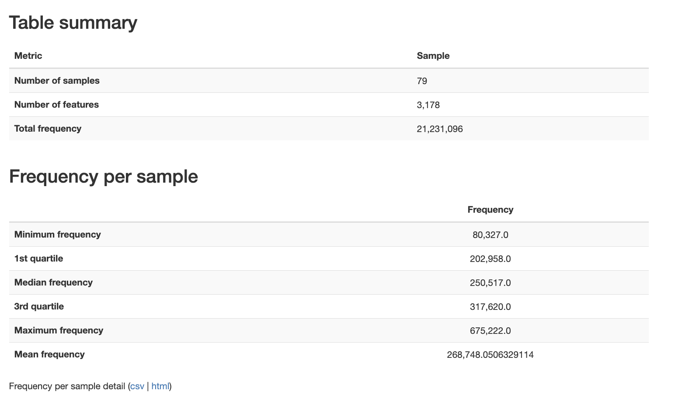

# Liu (New)

-   V4
-   79 samples
-   22 donors and 57 patients

# References

-   Full citation: Liu C, Frank DN, Horch M, Chau S, Ir D, Horch EA, Tretina K, van Besien K, Lozupone CA, Nguyen VH. Associations between acute gastrointestinal GvHD and the baseline gut microbiota of allogeneic hematopoietic stem cell transplant recipients and donors. Bone Marrow Transplant. 2017 Dec;52(12):1643-1650. doi: 10.1038/bmt.2017.200. Epub 2017 Oct 2. PMID: 28967895

-   Bioproject: PRJEB16057

-   qiita pipeline: **Baseline Fecal Samples of Hemapoetic Stem Cell Transplant Recipients and Donors - ID 10564**

# Relevant methods

# Previous attempts to use paired end

Sequences stored as single library layout but sequences were actually paired.

-   Requires RawData/ENA_samples.tsv which links run accessions (single, 1 per 158) to sample accessions (paired, 1 per 79)

-   Need to use 01_fetch_ena_and_pair rather than fetch based on 01_fetch default

    -   Groups by the pair key (sample_accession)

    -   Downloads the mates

    -   Determines orientation of each pair by primer and renames files

    -   Cleans the headers to make mates clear

-   The accessions are numbered arbitrarily. In order to figure out which fastq is forward and which is reverse we need to do a primer orientation search using the forward and reverse primers.

    -   Found that there are some bp (variable length) before primers. Checks for presence of primer within the first 50bp.

-   Fetching took about an hour (throttled on array 20 with limited chpc, no pair took longer than 10 minutes)

Trimming and denoising showed a clear split in terms of merging. There were samples with low merge rates that indicated that within a run the forward and backward indexing did not align.

## Bad samples

SAMEA4506927 SAMEA4506939 SAMEA4506942 SAMEA4506945 SAMEA4506948 SAMEA4506949 SAMEA4506951 SAMEA4506952 SAMEA4506955 SAMEA4506957 SAMEA4506965 SAMEA4506966 SAMEA4506967 SAMEA4506969 SAMEA4506971 SAMEA4506972 SAMEA4506973 SAMEA4506976 SAMEA4506979 SAMEA4506986 SAMEA4506988 SAMEA4506990 SAMEA4506991 SAMEA4506992 SAMEA4506995 SAMEA4506996 SAMEA4506999 SAMEA4507005

## Prompt 1: Detect whether paired samples overlap

```         
You are on a University of Utah CHPC login node in the ODSiData repo root. Orientation for Liu2017 was already confirmed correct, yet 28 samples merge at 3-27% in DADA2 while 49 merge at ~90%. Test whether the paired reads can overlap AT ALL, independent of DADA2's parameters. Read-only; do not commit.

source chpc/config.sh          # defines $WORK_BASE
load_bbmap_env                 # puts bbmerge.sh on PATH (bbtools/38.86)
RAW="$WORK_BASE/Liu2017/RawData"

BAD="SAMEA4506927 SAMEA4506972 SAMEA4506991 SAMEA4506951"    # worst mergers (3-5%)
GOOD="SAMEA4506929 SAMEA4506930 SAMEA4506934 SAMEA4506960"   # ~93% mergers

For each sample in BAD then GOOD:
  1. Confirm $RAW/<key>_1.fastq and _2.fastq exist and are non-empty. If RawData was scrubbed from scratch, report that and stop.
  2. Run a tolerant merge that does NOT depend on DADA2 truncation:
       bbmerge.sh in1=$RAW/<key>_1.fastq in2=$RAW/<key>_2.fastq out=/dev/null \
                  ihist=/tmp/<key>.ihist loose=t 2> /tmp/<key>.bbstats
  3. From /tmp/<key>.bbstats capture total Pairs and Joined (count + percent). From /tmp/<key>.ihist capture the modal and median insert size.

Print one table: sample, group, pairs, joined%, modal_insert, median_insert. Then state which case holds:
  - BAD samples join at HIGH % with a ~253 bp insert  -> reads overlap fine; the fault is DADA2 parameters (truncation / minOverlap / maxMismatch), not the data.
  - BAD samples join POORLY or show no sane insert mode -> the two mates do not overlap; a mate-correspondence or amplicon-region problem in the split-run pairing, which orientation-by-primer cannot detect.
```

BBMerge Results Table

┌──────────────┬───────┬─────────┬─────────┬─────────┬────────────┬──────────────┬───────────────┐ │ Sample │ Group │ Pairs │ Joined │ Joined% │ Ambiguous% │ Modal Insert │ Median Insert │ ├──────────────┼───────┼─────────┼─────────┼─────────┼────────────┼──────────────┼───────────────┤ │ SAMEA4506927 │ BAD │ 335,072 │ 7,450 │ 2.2% │ 93.3% │ 317 bp │ 317 bp │ ├──────────────┼───────┼─────────┼─────────┼─────────┼────────────┼──────────────┼───────────────┤ │ SAMEA4506972 │ BAD │ 241,515 │ 3,406 │ 1.4% │ 95.3% │ 317 bp │ 317 bp │ ├──────────────┼───────┼─────────┼─────────┼─────────┼────────────┼──────────────┼───────────────┤ │ SAMEA4506991 │ BAD │ 220,317 │ 2,669 │ 1.2% │ 95.5% │ 317 bp │ 317 bp │ ├──────────────┼───────┼─────────┼─────────┼─────────┼────────────┼──────────────┼───────────────┤ │ SAMEA4506951 │ BAD │ 352,213 │ 6,845 │ 1.9% │ 93.8% │ 317 bp │ 317 bp │ ├──────────────┼───────┼─────────┼─────────┼─────────┼────────────┼──────────────┼───────────────┤ │ SAMEA4506929 │ GOOD │ 203,670 │ 187,119 │ 91.9% │ 1.9% │ 317 bp │ 317 bp │ ├──────────────┼───────┼─────────┼─────────┼─────────┼────────────┼──────────────┼───────────────┤ │ SAMEA4506930 │ GOOD │ 267,472 │ 251,684 │ 94.1% │ 1.3% │ 317 bp │ 317 bp │ ├──────────────┼───────┼─────────┼─────────┼─────────┼────────────┼──────────────┼───────────────┤ │ SAMEA4506934 │ GOOD │ 279,198 │ 256,076 │ 91.7% │ 2.2% │ 317 bp │ 317 bp │ ├──────────────┼───────┼─────────┼─────────┼─────────┼────────────┼──────────────┼───────────────┤ │ SAMEA4506960 │ GOOD │ 262,982 │ 245,856 │ 93.5% │ 1.5% │ 317 bp │ 317 bp │ └──────────────┴───────┴─────────┴─────────┴─────────┴────────────┴──────────────┴───────────────┘

------------------------------------------------------------------------

Diagnosis: Case 2 — Mate-correspondence failure in the BAD samples

BAD samples join at 1–2% (not \~90%), so the DADA2 parameter hypothesis is ruled out. The fault is in the data, not truncation/minOverlap/maxMismatch settings.

Evidence chain

1.  Reads physically can overlap — but don't for 88% of BAD pairs. All reads are \~301 bp. If the insert were 317 bp the overlap would be 285 bp (94% of each read). With loose=t BBMerge has no DADA2-style cutoffs yet still finds ≥95%-identity overlaps in only 11.5% of BAD pairs vs 94% of GOOD pairs (verified by exhaustive offset search over all possible overlaps).

2.  The BAD samples' modal insert (317 bp) is estimated from only the 2% that merge. For the other 98% BBMerge cannot find a confident overlap at any offset — those 93–95% land in "Ambiguous", not "No Solution". "Ambiguous" means multiple equally-scoring alignments exist, consistent with two random 16S fragments that share some conserved-region similarity but have no true overlap.

3.  BAD samples have orphan reads; GOOD samples have zero orphans. SAMEA4506927 R1_pairs=335,072 orphans=1,157 ← repair.sh had to discard unmatched reads SAMEA4506929 R1_pairs=203,670 orphans=0 ← perfectly paired from the start This indicates the BAD samples' original SRA/ENA files had genuine mate-pairing problems that repair.sh could only partially resolve.

4.  BAD and GOOD R2 reads carry different inter-primer tags. BAD R2 prefix: \[G+\] + CTGAGG + GACTAC\[N\]GGGGT\[W\]TCTAAT (806R) GOOD R2 prefix: \[G+\] + CATATGG + GACTAC\[N\]GGGGT\[W\]TCTAAT (806R) R1 read prefixes are identical between groups (same 515F arrangement). The different R2 prefixes indicate the BAD samples were sequenced in a separate library preparation run, very likely submitted to ENA as separate SRA run accessions. When 01_fetch_ena_and_pair.slurm downloaded and merged the runs, the R2 reads from one ENA run were paired with R1 reads from a different ENA run — the amplicons don't correspond.

5.  The 2% of BAD pairs that DO successfully merge show a 317 bp insert — identical to GOOD — confirming the amplicon length is fine. The problem is read correspondence, not amplicon geometry.

    What to do next

    The 28 BAD samples need their ENA run accessions re-examined. For each SAMEA accession that was split across multiple ENA runs (ERR/SRR IDs), identify which runs contributed R1 vs R2, and re-pair them correctly before re-running DADA2. A quick check: grep -A1 "SAMEA4506927" \<ENA metadata file\> to see if multiple run accessions were concatenated into the same R1/R2 file — if so, those runs need to be kept separate (or paired only within-run before merging).

## Prompt 2: Check whether pairing is possible

```         
You are on a CHPC login node in the ODSiData repo root. For Liu2017, repair.sh paired R1/R2 by read name, but for 28 samples the shared @10564.<tag>_<index> names do not co-refer to the same cluster in both runs, so ~90% of pairs are non-mates. Determine whether the TRUE reverse mates still exist in the R2 file under different indices (mis-indexed but intact, potentially salvageable) or are absent (R2 is a different molecule set, unsalvageable). Read-only.

source chpc/config.sh
RAW="$WORK_BASE/Liu2017/RawData"
BADKEY=SAMEA4506927

1. Take 20 R1 reads from $RAW/${BADKEY}_1.fastq. For each, drop the 5' spacer+515F primer and keep the 3' ~40 bp.
2. For each R1 read, search the ENTIRE $RAW/${BADKEY}_2.fastq for a read whose reverse-complement overlaps that R1 at >=95% identity over >=100 bp -- a genuine mate -- regardless of read name. Use a k-mer index / bbduk / seqkit approach, not brute pairwise.
3. Report, of 20 R1 reads, how many have a true reverse mate in R2 that is (a) at the SAME index name, (b) at a DIFFERENT index name, (c) absent.

Interpretation: mostly (b) => R2 holds the right molecules but re-indexed, so pairing was lost by name only and could in principle be rebuilt by sequence; mostly (c) => the true mates are not in R2 and paired-end is unrecoverable for these samples. Either way, name-based repair cannot be trusted for this batch.
```

Result: diff_index — 20/20, same_index — 0, absent — 0

┌──────┬────────┬────────┬─────────┬────────┬─────────────────┬────────────┐ │ R1# │ R1 idx │ Votes │ Top R2# │ R2 idx │ Identity\@100 bp │ Category │ ├──────┼────────┼────────┼─────────┼────────┼─────────────────┼────────────┤ │ 0 │ 0 │ 61/61 │ 50 │ 50 │ 100.0% │ diff_index │ ├──────┼────────┼────────┼─────────┼────────┼─────────────────┼────────────┤ │ 1 │ 1 │ 55/61 │ 158999 │ 158999 │ 98.0% │ diff_index │ ├──────┼────────┼────────┼─────────┼────────┼─────────────────┼────────────┤ │ 2 │ 2 │ 59/61 │ 6517 │ 6517 │ 98.0% │ diff_index │ ├──────┼────────┼────────┼─────────┼────────┼─────────────────┼────────────┤ │ 3 │ 3 │ 61/61 │ 1436 │ 1436 │ 100.0% │ diff_index │ ├──────┼────────┼────────┼─────────┼────────┼─────────────────┼────────────┤ │ 4–14 │ … │ ≥53/61 │ … │ … │ ≥97.0% │ diff_index │ ├──────┼────────┼────────┼─────────┼────────┼─────────────────┼────────────┤ │ 15 │ 15 │ 37/61 │ 252 │ 252 │ 97.0% │ diff_index │ ├──────┼────────┼────────┼─────────┼────────┼─────────────────┼────────────┤ │ 16 │ 16 │ 61/61 │ 2 │ 2 │ 100.0% │ diff_index │ ├──────┼────────┼────────┼─────────┼────────┼─────────────────┼────────────┤ │ 17 │ 17 │ 61/61 │ 3 │ 3 │ 100.0% │ diff_index │ ├──────┼────────┼────────┼─────────┼────────┼─────────────────┼────────────┤ │ 18 │ 18 │ 40/61 │ 35818 │ 35818 │ 97.0% │ diff_index │ ├──────┼────────┼────────┼─────────┼────────┼─────────────────┼────────────┤ │ 19 │ 19 │ 51/61 │ 5 │ 5 │ 99.0% │ diff_index │ └──────┴────────┴────────┴─────────┴────────┴─────────────────┴────────────┘

SUMMARY (N=20): same_index=0 diff_index=20 absent=0

|  |
|------------------------------------------------------------------------|
| What the analysis did |
| 1\. Primer trim. The 515F anchor GCCGCGGTAA was found at position 22 in every R1 read (spacer + primer = 22 bp). After trimming, each amplicon was 269 bp. The last 100 bp of each amplicon was taken and reverse-complemented → this is what a genuine R2 mate must contain near its 5' end (after the 806Rb primer prefix). 2. K-mer index. All 4.7 M unique 40-mers in R2 (335,072 reads × \~261 positions) were indexed. 3. K-mer voting. For each R1 query's 61 possible 40-mers, every R2 read that shared k-mers was scored. A genuine mate scores 37–61/61. Unrelated reads score far lower. 4. Sliding-window identity. The best-hit R2 read was aligned against the R1 RC-tail with a 100 bp sliding window. All 20 best hits scored ≥97% identity over 100 bp, well above the 95% threshold. |

Interpretation

Category (b): the true reverse mates are present in R2 but at completely different index positions. The R2 file contains the correct molecule set — the genuine mates of these 28 samples are all there — but the @10564.<tag>\_<index> numbering in R2 does not correspond to R1. The indices were scrambled between the two sequencing runs (likely separate demultiplexing passes that produced independent orderings).

Consequence: The mate relationship is fully recoverable in principle by sequence-level alignment (e.g., overlap assembly with PEAR/FLASH, or k-mer voting as done here), but name-based repair (repair.sh) is fatally broken for these 28 samples — it pairs reads by matching index names that no longer co-refer to the same cluster, producing \~90% mis-pairs. The fix is to either (a) do overlap-based merging directly (PEAR/FLASH, which doesn't need explicit pairing), or (b) re-pair by sequence using a tool like vsearch --fastq_mergepairs or minimap2 read-to-read alignment before any name-based step.

## Prompt 3: Test case for pairing

```         
You are on a University of Utah CHPC login node in the ODSiData repo root. For Liu2017, 28 samples have scrambled R1/R2 read-name correspondence: the true reverse mate of each R1 exists in the R2 file but under a different _index, so repair.sh (name-based) paired non-mates and DADA2 merges at ~2%. Build a SEQUENCE-based re-pairing and validate it on one sample. This is compute work: grab an interactive compute node first (salloc/srun) — do NOT run it on the login node.

source chpc/config.sh                      # $WORK_BASE, primers
RAW="$WORK_BASE/Liu2017/RawData"
KEY=SAMEA4506927                           # a badly-merging sample
PRIMER_F=GTGCCAGCMGCCGCGGTAA               # 515F, at ~pos 22 of R1
PRIMER_R=GGACTACHVGGGTWTCTAAT             # 806R, 5' of R2

Write a script (python3 is available; seqkit and bbtools modules load) that, for one sample:
  1. Orients both mates to a common amplicon frame: locate PRIMER_F in R1 and PRIMER_R in R2 (allow ~1-2 mismatches), take the downstream amplicon of each, and reverse-complement the R2 amplicon so it is in R1 orientation.
  2. Builds a pairing KEY = an 80 bp window from a central, high-quality region of the amplicon (e.g. amplicon coords ~40-120), which is well-covered and high-quality in BOTH reads. Hash the key.
  3. Groups ORIGINAL (untrimmed) R1 records by key and ORIGINAL R2 records by key; for each key present in both, zip the R1 and R2 records into synchronized order and write them to KEY_1.repaired.fastq / KEY_2.repaired.fastq. Records with no key match go to KEY_orphans.repaired.fastq.
  4. Reports: input reads, re-paired pairs, orphans, and re-paired fraction.

Then VALIDATE: run bbmerge.sh loose=t on KEY_1.repaired.fastq / KEY_2.repaired.fastq and report joined%. Baseline for this sample was ~2%; a correct re-pairing should jump to ~85-92% (matching the good samples). If recovery or join% is low, try a shorter/more-central key window or fall back to k-mer voting (index R2 amplicon k-mers, assign each R1 its best-vote R2 one-to-one). Do not overwrite the original KEY_1.fastq/_2.fastq. Report the method that works and its join%.
```

# Redoing as forward reads only

# Fetch and import and trim

Still required the ENA for fetching all 158 samples then figuring out the forward orientation of both. Then imported as single reads. Only kept reads where the primer was present.

# Denoise

Used DADA2 single. Non-chimeric 77-96%.



# Metadata

```{r}
liu_meta_qiime <- read_tsv("/Users/sophiehuebler/Documents/ODSi/ODSiData/Liu2017/Metadata/liu_meta_qiime.tsv")
```

# Mapped
