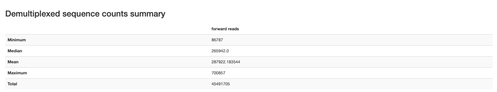
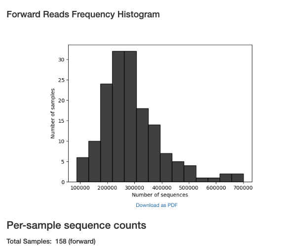
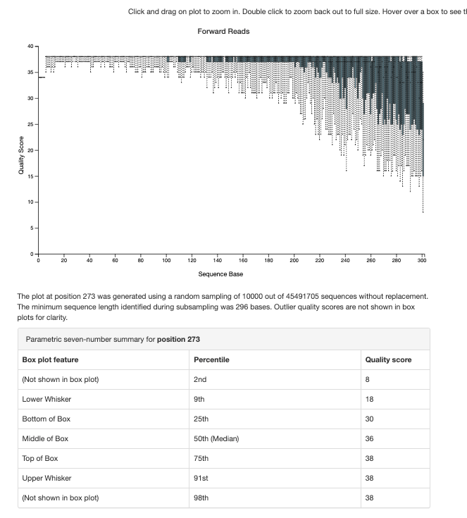

# Reference

-   Full citation: Liu C, Frank DN, Horch M, Chau S, Ir D, Horch EA, Tretina K, van Besien K, Lozupone CA, Nguyen VH. Associations between acute gastrointestinal GvHD and the baseline gut microbiota of allogeneic hematopoietic stem cell transplant recipients and donors. Bone Marrow Transplant. 2017 Dec;52(12):1643-1650. doi: 10.1038/bmt.2017.200. Epub 2017 Oct 2. PMID: 28967895

-   Bioproject: PRJEB16057

-   qiita pipeline: **Baseline Fecal Samples of Hemapoetic Stem Cell Transplant Recipients and Donors - ID 10564**

# Software Versions

Sra toolkit

```         
(sra-env) sophiehuebler@Sophies-MBP RawData % prefetch --version

prefetch : 3.2.1

(sra-env) sophiehuebler@Sophies-MBP RawData % fastq-dump --version

fastq-dump : 3.2.1
```

Qiime2

```         
System versions
Python version: 3.10.14
QIIME 2 release: 2025.4
QIIME 2 version: 2025.4.0
q2cli version: 2025.4.0

Installed plugins
alignment: 2025.4.0
composition: 2025.4.0
cutadapt: 2025.4.0
dada2: 2025.4.0
deblur: 2025.4.0
demux: 2025.4.0
diversity: 2025.4.0
diversity-lib: 2025.4.0
emperor: 2025.4.0
feature-classifier: 2025.4.0
feature-table: 2025.4.0
fragment-insertion: 2025.4.0
longitudinal: 2025.4.0
metadata: 2025.4.0
phylogeny: 2025.4.0
quality-control: 2025.4.0
quality-filter: 2025.4.0
rescript: 2025.4.0
sample-classifier: 2025.4.0
stats: 2025.4.0
taxa: 2025.4.0
types: 2025.4.0
vizard: 0.0.1.dev0
vsearch: 2025.4.0
```

BLAST

```         
blastn: 2.16.0+
 Package: blast 2.16.0, build Nov 27 2024 10:36:47
```

Greengenes2

```         
2024.09.phylogeny.asv.nwk.qza
2024.09.seqs.fna.qza
2024.09.backbone.v4.nb.sklearn-1.4.2.qza
```

# Data Access

-   meta_samples.csv downloaded from bioproject

    -   (November 25, 2025)

-   meta_clinical.xlsx downloaded from qiita

    -   (December 16, 2025)

    -   Downloaded as a .tsv from prep 2125 and converted to xlsx

-   sequences downloaded from bioproject

# Reading Data

## Getting accessions

```         
arch -x86_64 zsh
source ~/miniconda3-x86_64/etc/profile.d/conda.sh
cd ~/Documents/ODSi/ODSiData/Liu2017/RawData
conda activate sra-env
prefetch --option-file run_accessions.txt
cat run_accessions.txt | while read srr; do fasterq-dump --split-files --progress "$srr"; done
conda deactivate
```

## Getting metadata

Need to write a cleaning script that will identify the correct sample.

## Creating manifest

```         
../../Bash/create_manifest_single_script.sh
```

## Importing to qiime

```         


conda activate qiime2-env

qiime tools import \
  --type 'SampleData[SequencesWithQuality]' \
  --input-path RawData/manifest_single.tsv \
  --output-path QiimeData/demux.qza \
  --input-format SingleEndFastqManifestPhred33V2

cd QiimeData

qiime demux summarize \
  --i-data demux.qza \
  --o-visualization demux_viz.qzv
```

{width="639"}

{width="263"}

{width="343"}

# Cleaning Data

## Checking for primers

## DADA2 

```         
qiime dada2 denoise-single \
  --i-demultiplexed-seqs demux.qza \
  --p-trim-left 0 \
  --p-trunc-len 230 \
  --p-trunc-q 2 \
  --p-n-threads 4 \
  --o-representative-sequences rep-seqs.qza \
  --o-table table.qza \
  --o-denoising-stats stats.qza
```
