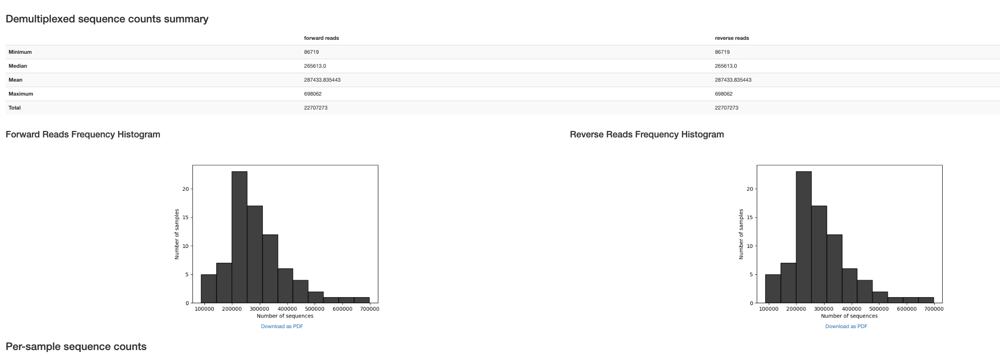
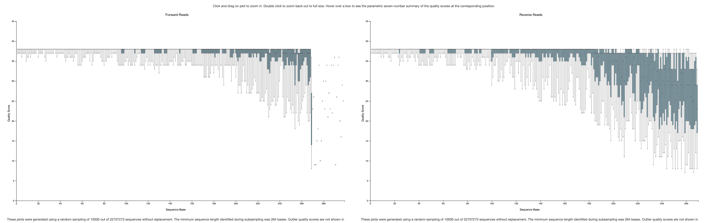
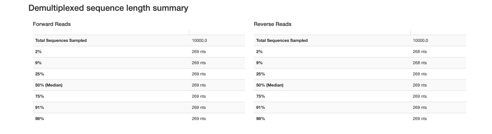
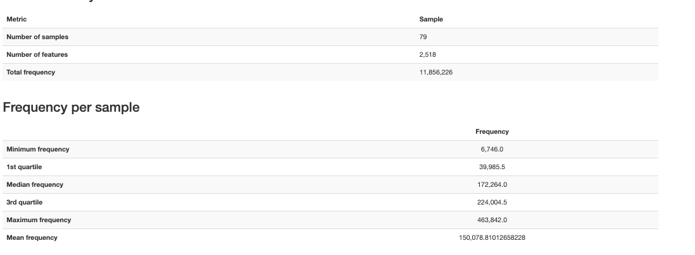

# Liu (New)

-   V4

# References

-   Full citation: Liu C, Frank DN, Horch M, Chau S, Ir D, Horch EA, Tretina K, van Besien K, Lozupone CA, Nguyen VH. Associations between acute gastrointestinal GvHD and the baseline gut microbiota of allogeneic hematopoietic stem cell transplant recipients and donors. Bone Marrow Transplant. 2017 Dec;52(12):1643-1650. doi: 10.1038/bmt.2017.200. Epub 2017 Oct 2. PMID: 28967895

-   Bioproject: PRJEB16057

-   qiita pipeline: **Baseline Fecal Samples of Hemapoetic Stem Cell Transplant Recipients and Donors - ID 10564**

# Relevant methods

# Fetching and Importing

Sequences stored as single library layout but sequences were actually paired.

-   Requires RawData/ENA_samples.tsv which links run accessions (single, 1 per 158) to sample accessions (paired, 1 per 79)

-   Need to use 01_fetch_ena_and_pair rather than fetch based on 01_fetch default

    -   Groups by the pair key (sample_accession)

    -   Downloads the mates

    -   Determines orientation of each pair by primer and renames files

    -   Cleans the headers to make mates clear

-   The accessions are numbered arbitrarily. In order to figure out which fastq is forward and which is reverse we need to do a primer orientation search using the forward and reverse primers.

    -   Found that there are some bp (variable length) before primers. Checks for presence of primer within the first 50bp.

-   Fetching took about an hour (throttled on array 20 with limited chpc, no pair took longer than 10 minutes)

# Trimming

# Denoising

