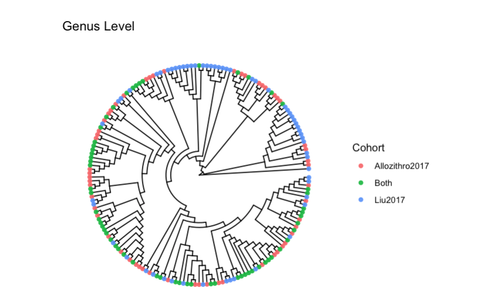

```         
qiime feature-table merge \
  --i-tables ../Allozithro2017/PhylogeneticTree/tree-table.qza ../Liu2017/PhylogeneticTree/final-tree-table.qza \
  --o-merged-table merged-table.qza

qiime feature-table merge-seqs \
  --i-data ../Allozithro2017/PhylogeneticTree/final-tree-seqs.qza ../Liu2017/PhylogeneticTree/final-tree-seqs.qza \
  --o-merged-data merged-seqs.qza
```

```         
qiime phylogeny filter-tree \
  --i-tree ../Greengenes2/2024.09.phylogeny.asv.nwk.qza \
  --i-table merged-table.qza \
  --o-filtered-tree greengenes2-merged-tree.qza
```

```         
qiime feature-classifier classify-sklearn \
  --i-classifier ../Greengenes2/2024.09.backbone.full-length.nb.sklearn-1.4.2.qza\
  --i-reads merged-seqs.qza \
  --p-confidence 0.9 \
  --o-classification greengenes2_merged_taxonomy.qza
```

```         
qiime taxa barplot \
  --i-table merged-table.qza \
  --i-taxonomy greengenes2_merged_taxonomy.qza \
  --o-visualization merged-taxa-bar-plots.qzv
```

{width="513"}

{width="427"}

# Phyloseq

## Libraries

```{r}
library(phyloseq)
library(qiime2R)
library(biomformat)
library(readr)
library(tidyverse)
library(ape)
library(Biostrings)
library(ggtree)
```

## Reading

```{r}
table_qza <- "~/Documents/ODSi/ODSiData/MergedTree/merged-table.qza"
taxonomy_qza  <- "~/Documents/ODSi/ODSiData/MergedTree/greengenes2_merged_taxonomy.qza"
repseqs_qza   <- "~/Documents/ODSi/ODSiData/MergedTree/merged-seqs.qza"      
tree_qza      <- "~/Documents/ODSi/ODSiData/MergedTree/greengenes2-merged-tree.qza"
```

## OTU

```{r}
# Read in files
qt_orig <- read_qza(table_qza)$data

tax_q  <- read_qza(taxonomy_qza)$data
tree    <- read_qza(tree_qza)$data
rep_seqs <- tryCatch(read_qza(repseqs_qza)$data, error = function(e) NULL)
```

```{r}
otu_mat <- otu_table(qt_orig, taxa_are_rows = TRUE)
```

## Taxonomy

```{r}
# Taxonomy matrix
parse_taxonomy <- function(tax_df) {
  # tax_df expected to have columns: Feature.ID (or similar) and Taxon (string "k__; p__; ...")
  cnames <- colnames(tax_df)
  idcol <- cnames[1]    # usually "Feature.ID"
  taxcol <- cnames[2]   # usually "Taxon"
  tax_df2 <- as.data.frame(tax_df, stringsAsFactors = FALSE)
  colnames(tax_df2)[1:2] <- c("FeatureID","Taxon")
  tax_df2$Taxon <- as.character(tax_df2$Taxon)
  ranks <- c("Kingdom","Phylum","Class","Order","Family","Genus","Species")
  tax_sep <- tidyr::separate(tax_df2, Taxon, into = ranks, sep = ";\\s*", fill = "right", remove = FALSE)
  clean_rank <- function(x) {
    x <- ifelse(is.na(x) | x == "" , NA, x)
    x <- gsub("^[dkpcofgs]__|^__", "", x)   # remove prefixes like 'k__'
    trimws(x)
  }
  tax_mat <- tax_sep %>%
    dplyr::select(all_of(ranks)) %>%
    mutate_all(clean_rank) %>%
    as.matrix()
  rownames(tax_mat) <- tax_sep$FeatureID
  tax_mat
}

tax_mat <- parse_taxonomy(tax_q)
tax_mat <- tax_table(tax_mat)
```

## Sequences

```{r}
seqs <- Biostrings::DNAStringSet(rep_seqs)
names(seqs) <- names(rep_seqs)
```

## Meta

```{r}
L_meta_raw <- read.csv("~/Documents/ODSi/ODSiData/Liu2017/Metadata/meta_samples.csv",
                     stringsAsFactors = FALSE, check.names = FALSE)

L_meta_raw$Project <- rep("Liu2017", nrow(L_meta_raw))


L_meta <- L_meta_raw %>%
  mutate(ID = `Run`)%>%
  mutate(age = AGE)%>% #all units are years
  select(
    # Identifications
    ID,
    Project,
    BioSample,
    `Library Name`,
    Run,
    host_subject_id,
    #Experiment,
    external_id,
    
    #Covariates
    ## Donor or Patient
    donor_or_patient,
    
    ## Demographics
    age,
    race,
    sex,
    aborh,
    BMI,
    
    ## Medical History
    disease,
    disease_status_at_transplant,
    infection_prior_to_transplant,
    other_viruses,
    gi_history_details,
    
    ## Donor Information
    donor_source,
    donor_type,
  
    ## Treatments
    chemotherapy_regimen,
    conditioning_intensity,
    cyclosporine,
    cytogenetics,
    methotrexate,
    mmf,
    sirolimus,
    tacrolimus,
    
    # Outcomes
    right_censor_time,
    
    ## Death
    deceased,
    etiology_of_death,
    time_to_death,
    
    ## Relapse
    relapsed,
    days_at_relapse,
    
    ## Platelet Engraftment
    platelet_engrafment,
    days_to_platelet_engrafment,
    
    ## ANC Engraftment
    anc_engrafment,
    days_to_anc_engrafment,
    
    ## AGVHD
    agvhd_organ,
    agvhd_severity,
    agvhd_gut,
    time_to_agvhd,
    
    ## CGVHD
    cgvhd_severity,
    time_to_cgvhd,
    
  
    ## Infection
    infection_duringafter_transplant,
    infection_details,
    
    # PB
    pb_cd3_day_30,
    pb_cd3_day_100,
    pb_cd3_day_180,
    pb_cd3_1_year,
    
    pb_unfx_day_30,
    pb_unfx_day_100,
    pb_unfx_day_180,
    pb_unfx_1_year
    )%>%
  # standardize missing values
  mutate(across(everything(), ~na_if(., "Missing: Not applicable"))) %>%
  mutate(across(everything(), ~na_if(., "Missing: Not collected"))) %>%
  mutate(across(everything(), ~na_if(., "Missing: Restricted access"))) %>%
  distinct()%>%
  mutate(age = as.numeric(age))%>%
  select(ID, Project, Run, age, sex)
```

```{r}
A_meta_raw <- read.csv("~/Documents/ODSi/ODSiData/Allozithro2017/Metadata/meta_samples.csv",
                     stringsAsFactors = FALSE, check.names = FALSE)

A_meta_raw$Project <- rep("Allozithro2017", nrow(A_meta_raw))

A_meta <- A_meta_raw %>%
  mutate(ID = Run)%>%
  mutate(age = as.numeric(AGE))%>%
  select(ID, Project, Run, age, sex)
```

```{r}
A_meta_raw2 <- readxl::read_xlsx("~/Documents/ODSi/ODSiData/Allozithro2017/Metadata/meta_clinical.xlsx")
```

```{r}
meta <- bind_rows(L_meta, A_meta)
rownames(meta)<- meta$Run

kept_samples <- colnames(otu_mat)
meta <- meta %>%
  filter(Run %in% kept_samples)

meta_df <- sample_data(meta)
```

## Checks

```{r}
print("Matching otu rownames and tree tip labels:")
all(rownames(otu_mat) %in% tree$tip.label)

print(sprintf("OTU features: %d ; tree tips: %d", ntaxa(otu_mat), length(tree$tip.label)))
print(sprintf("Intersection: %d", sum(rownames(otu_mat) %in% tree$tip.label)))


print(sprintf("OTU sample: %d ; meta samples: %d", ncol(otu_mat), nrow(meta_df)))
print(sprintf("Intersection: %d", sum(colnames(otu_mat) %in% rownames(meta_df))))
```

## Object

```{r}
ps <- phyloseq(otu_mat, tax_mat, meta_df, phy_tree(tree), refseq(seqs))
```

# Tree

```{r}
circular_tree <- ggtree(ps@phy_tree, layout = "circular", branch.length = "none") +
  geom_tippoint( size = 1.6, alpha = 0.9)

circular_tree
```

# PCoA

```{r}
ps_1 <- subset_taxa(ps, taxa_sums(ps) > 0)

ps_2 <- prune_samples(sample_sums(ps_1) > 0, ps_1)

ps_rel <- transform_sample_counts(ps_2, function(x) x / sum(x))
```

```{r}
ord_bray <- ordinate(ps_rel, method = "PCoA", distance = "bray", na.rm = T)
```

```{r}
ord_unifrac <- ordinate(ps_rel, method = "PCoA", distance = "unifrac", weighted = TRUE)
```

```{r}
plot_ordination(ps_rel, ord_bray, color = "Project") + 
  geom_point(size = 3) +
  ggtitle("PCoA of Global Patterns (Bray-Curtis)")
```

```{r}
plot_scree(ord_bray, "Scree Plot")
```

```{r}
plot_ordination(ps_rel, ord_unifrac, color = "Project") + 
  geom_point(size = 3) +
  ggtitle("PCoA of Global Patterns (Weighted Unifrac)")
```

```{r}
plot_scree(ord_unifrac, "Scree Plot")
```

# Collapsing

## Functions for annotating

```{r}
asv_mapping_func <- function(phylo_obj,
                             save = TRUE,
           save_file_name = "Allo_Liu_ASVs.txt",
           id_col_name = "SampleID",
           cohort_col_name = "Project",
           save_path = "/Users/sophiehuebler/Documents/ODSi/ODSiData/MergedTree/TreeColors"){
  
  if(taxa_are_rows(phylo_obj@otu_table)){
    otus <- as.data.frame(t(phylo_obj@otu_table))
    otus[,id_col_name] <- colnames(phylo_obj@otu_table)
  }else{
    otus <- as.data.frame(phylo_obj@otu_table) 
    otus[,id_col_name] <- rownames(phylo_obj@otu_table)
  }

  

  metas <- as.data.frame(unclass(phylo_obj@sam_data))
  metas[,id_col_name]<- rownames(phylo_obj@sam_data)
  
  metas <- metas[, c(id_col_name, cohort_col_name)]
  

  
  df <- otus %>%
    left_join(metas, by = id_col_name)%>%
    pivot_longer(
      cols = -all_of(c(id_col_name, cohort_col_name)),
      names_to = "ASV_ID",
      values_to = "Count"
    ) %>%
    filter(Count > 0)%>%
    distinct(ASV_ID, !!sym(cohort_col_name))%>%
    arrange(!!sym(cohort_col_name)) %>%
  mutate(exists = 1) %>%
  pivot_wider(
    names_from = all_of(cohort_col_name), 
    values_from = exists, 
    values_fill = 0 # Fill missing combinations with 0
  ) 
  
  
  cohort_cols <- setdiff(colnames(df), "ASV_ID")
  num_cohorts <- length(cohort_cols)
  color_map <- data.frame(Cohort = c(cohort_cols, "Both", "Other"),
                          Color = RColorBrewer::brewer.pal(num_cohorts + 2,"Set1"))

  df_final <- df%>%
    rowwise() %>%
    mutate(
      present_count = sum(c_across(all_of(cohort_cols))),
      
      Cohort = if (present_count == num_cohorts) {
        "Both"
      } else if (present_count == 1) {
        cohort_cols[c_across(all_of(cohort_cols)) == 1]
      } else {
        "Other" 
      }
    ) %>%
    ungroup() %>%
    select(ASV_ID, Cohort)%>%
  left_join(color_map, by = "Cohort")

  if(save){
# Map cohorts to specific hex colors
color_mapping <- df_final %>%
  mutate(
    Type = "label",
    Style = "bold"
  )

# Construct the comma-separated data strings
itol_data <- paste(color_mapping$ASV_ID, color_mapping$Type, color_mapping$Color, color_mapping$Style, sep = ",")

# Define the headers and write to a text file
writeLines(
  c("TREE_COLORS", "SEPARATOR COMMA", "DATA", itol_data), 
  paste0(save_path, "/", save_file_name)
)
}

return(df_final)

}


```

```{r}
ps
all_asv_merge <- asv_mapping_func(ps, save = F)
table(all_asv_merge$Cohort)
 
```

```{r}
ggtree(phy_tree(ps_genus), layout = "circular",
       branch.length = "none") %<+%all_asv_merge +
  geom_tippoint( size = 1.6, alpha = 0.9, aes(color = Cohort))+
  ggtitle("Genus Level")
```

## Genus

```{r}
ps_genus <- suppressMessages(tax_glom(ps, taxrank = "Genus"))
ps_genus
```

```{r}
all_genus_merge <- asv_mapping_func(ps_genus, save = T, save_file_name = "Allo_Liu_Genus.txt")
table(all_genus_merge$Cohort)
```

```{r}

genus_tax <- tax_table(ps_genus)%>%
  as.data.frame()%>%
  rownames_to_column("ASV_ID")

genus_tax2 <- all_genus_merge %>%
  left_join(genus_tax %>%
              select(ASV_ID, Genus),
            by = "ASV_ID")


ggtree(ps_genus@phy_tree, layout = "circular",
       branch.length = "none") %<+% genus_tax2 +
  geom_tippoint( size = 1.6, alpha = 0.9, aes(color = Cohort))+
  geom_tiplab(aes(label = Genus),
              offset = 1, size = 2)+
  ggtitle("Genus Level")

```

## Family

```{r}
ps_family <- suppressMessages(tax_glom(ps, taxrank = "Family"))
ps_family
```

```{r}

all_family_merge <- asv_mapping_func(ps_family, save = T, save_file_name = "Allo_Liu_Family.txt")
table(all_family_merge$Cohort)
```

```{r}

family_tax <- tax_table(ps_family)%>%
  as.data.frame()%>%
  rownames_to_column("ASV_ID")

family_tax2 <- all_family_merge %>%
  left_join(genus_tax %>%
              select(ASV_ID, Family),
            by = "ASV_ID")


ggtree(ps_family@phy_tree, layout = "circular",
       branch.length = "none") %<+% family_tax2 +
  geom_tippoint( size = 3, alpha = 0.9, aes(color = Cohort))+
  geom_tiplab(aes(label = Family),
              offset = 1, size = 3)+
  ggtitle("Family Level")

```

## Order

```{r}
ps_order <- suppressMessages(tax_glom(ps, taxrank = "Order"))
ps_order

all_order_merge <- asv_mapping_func(ps_order, save = T, save_file_name = "Allo_Liu_Order.txt")
table(all_order_merge$Cohort)

order_tax <- tax_table(ps_order)%>%
  as.data.frame()%>%
  rownames_to_column("ASV_ID")

order_tax2 <- all_order_merge %>%
  left_join(genus_tax %>%
              select(ASV_ID, Order),
            by = "ASV_ID")


ggtree(ps_order@phy_tree, layout = "circular",
       branch.length = "none") %<+% order_tax2 +
  geom_tippoint( size = 4, alpha = 0.9, aes(color = Cohort))+
  geom_tiplab(aes(label = Order),
              offset = 1, size = 4)+
  ggtitle("Order Level")
```

## Class

```{r}
ps_class <- suppressMessages(tax_glom(ps, taxrank = "Class"))
ps_class

all_class_merge <- asv_mapping_func(ps_class, save = T, save_file_name = "Allo_Liu_Class.txt")
table(all_class_merge$Cohort)

class_tax <- tax_table(ps_class)%>%
  as.data.frame()%>%
  rownames_to_column("ASV_ID")

class_tax2 <- all_class_merge %>%
  left_join(genus_tax %>%
              select(ASV_ID, Class),
            by = "ASV_ID")


ggtree(ps_class@phy_tree, layout = "circular",
       branch.length = "none") %<+% class_tax2 +
  geom_tippoint( size = 3, alpha = 0.9, aes(color = Cohort))+
  geom_tiplab(aes(label = Class),
              offset = 1, size = 4)+
  ggtitle("Class"
```

## Together

```{r}
library(phyloseq)
library(ggtree)
library(ape)
library(dplyr)
library(purrr)
library(tidytree)

# 1. Extract tree and taxonomy from the genus-level phyloseq object
tree <- phy_tree(ps_genus)
tax_df <-  tax_table(ps_genus)%>%
  as.data.frame()%>%
  rownames_to_column("ASV_ID")

tax2 <- all_genus_merge %>%
  left_join(tax_df %>%
              select(ASV_ID, Genus, Family, Order, Class),
            by = "ASV_ID")%>%
  mutate(tip_label = ASV_ID)


# 2. Define a helper function to aggregate Cohort status for a group of genera
aggregate_cohort <- function(cohorts) {
  unique_cohorts <- unique(na.omit(cohorts))
  # If the class contains genera from different cohorts, or already contains "Both"
  if (length(unique_cohorts) > 1 || "Both" %in% unique_cohorts) {
    return("Both")
  } else if (length(unique_cohorts) == 1) {
    return(unique_cohorts) # Returns "Allozithro2017" or "Liu2017"
  } else {
    return(NA)
  }
}


```

```{r}
# 3. Iterate over all unique Classes to map MRCA nodes and aggregate Cohort
classes <- unique(na.omit(tax2$Class))

class_node_data <- map_df(classes, function(cls) {
  # Subset tips belonging to the current Class
  class_tips <- tax2%>% filter(Class == cls)
  tip_names <- class_tips$tip_label
  
  # Find the Node ID representing the MRCA
  if (length(tip_names) == 1) {
    node_id <- which(tree$tip.label == tip_names) # Tip is its own MRCA
  } else {
    node_id <- getMRCA(tree, tip_names)           # Internal node
  }
  
  # Determine the aggregated cohort status for this node
  agg_cohort <- aggregate_cohort(class_tips$Cohort)
  
  # Return a single-row tibble to be compiled by map_df
  tibble(
    node = node_id,
    Class_Name = cls,
    Class_Cohort = agg_cohort
  )
})

orders <- unique(na.omit(tax2$Order))

order_node_data <- map_df(orders, function(cls) {
  # Subset tips belonging to the current Class
  order_tips <- tax2%>% filter(Order == cls)
  tip_names <- order_tips$tip_label
  
  # Find the Node ID representing the MRCA
  if (length(tip_names) == 1) {
    node_id <- which(tree$tip.label == tip_names) # Tip is its own MRCA
  } else {
    node_id <- getMRCA(tree, tip_names)           # Internal node
  }
  
  # Determine the aggregated cohort status for this node
  agg_cohort <- aggregate_cohort(order_tips$Cohort)
  
  # Return a single-row tibble to be compiled by map_df
  tibble(
    node = node_id,
    Order_Name = cls,
    Order_Cohort = agg_cohort
  )
})

families <- unique(na.omit(tax2$Family))

family_node_data <- map_df(families, function(cls) {
  # Subset tips belonging to the current Class
  family_tips <- tax2%>% filter(Family == cls)
  tip_names <- family_tips$tip_label
  
  # Find the Node ID representing the MRCA
  if (length(tip_names) == 1) {
    node_id <- which(tree$tip.label == tip_names) # Tip is its own MRCA
  } else {
    node_id <- getMRCA(tree, tip_names)           # Internal node
  }
  
  # Determine the aggregated cohort status for this node
  agg_cohort <- aggregate_cohort(family_tips$Cohort)
  
  # Return a single-row tibble to be compiled by map_df
  tibble(
    node = node_id,
    Family_Name = cls,
    Family_Cohort = agg_cohort
  )
})
```

```{r}
p <- ggtree(ps_genus@phy_tree, layout = "circular",
       branch.length = "none") %<+% genus_tax2 +
  geom_tippoint( size = 1.6, alpha = 0.9, aes(color = Cohort))+
  geom_tiplab(aes(label = Genus),
              offset = 1, size = 2)
```

```{r}

p <- p %<+% family_node_data
p <- p %<+% order_node_data
p <- p %<+% class_node_data
```

```{r}
p
```

```{r}
p +   geom_tippoint(aes(shape = "Genus", color = Cohort),
                    size = 2)+ 
  # 1. Plot Family nodes (Smallest points)
  geom_point2(
    aes(subset = !is.na(Family_Cohort), color = Family_Cohort, shape = "Family"), 
    size = 2
  ) +
  # 2. Plot Order nodes (Medium points)
  geom_point2(
    aes(subset = !is.na(Order_Cohort), color = Order_Cohort, shape = "Order"), 
    size = 3.5
  ) +
  # 3. Plot Class nodes (Largest points)
  geom_point2(
    aes(subset = !is.na(Class_Cohort), color = Class_Cohort, shape = "Class"), 
    size = 5
  ) +
  # 4. Standardize the colors to match your tip points
  scale_color_manual(
    name = "Cohort",
    values = c("Allozithro2017" = "#F8766D", "Liu2017" = "#619CFF", "Both" = "#00BA38"),
    na.translate = FALSE 
  ) +
  # 5. Add the manual shape scale to generate the new legend
  scale_shape_manual(
    name = "Taxonomic Level",
    values = c("Genus" = 16,"Family" = 15, "Order" = 17, "Class" = 8),
    drop = F,
    breaks = c("Genus", "Family", "Order", "Class")
  )+
  ggtitle("Multi-levels")
```
