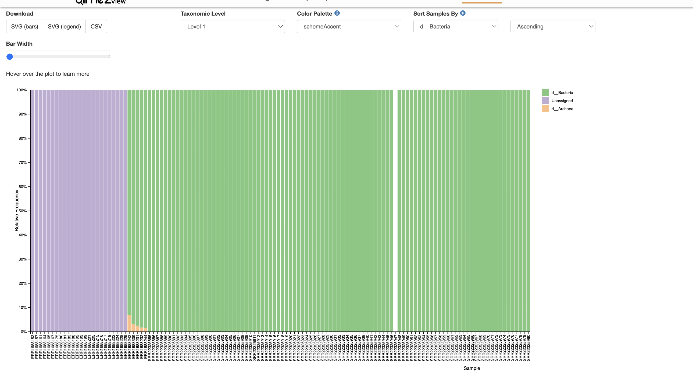
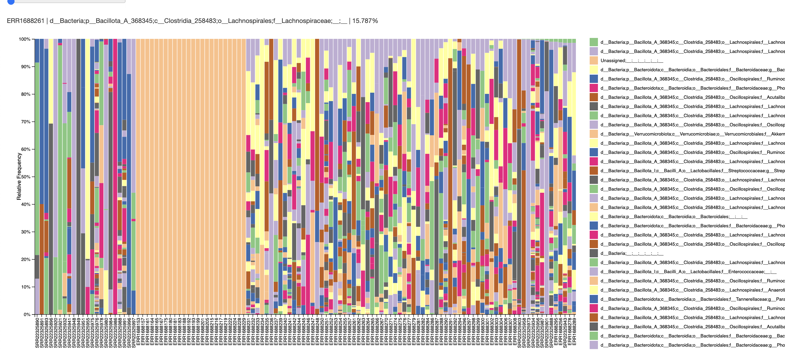

```         
qiime feature-table merge \
  --i-tables ../Allozithro2017/PhylogeneticTree/tree-table.qza ../Liu2017/PhylogeneticTree/final-tree-table.qza \
  --o-merged-table merged-table.qza

qiime feature-table merge-seqs \
  --i-data ../Allozithro2017/PhylogeneticTree/final-tree-seqs.qza ../Liu2017/PhylogeneticTree/final-tree-seqs.qza \
  --o-merged-data merged-seqs.qza
```

```         
qiime phylogeny filter-tree \
  --i-tree ../Greengenes2/2024.09.phylogeny.asv.nwk.qza \
  --i-table merged-table.qza \
  --o-filtered-tree greengenes2-merged-tree.qza
```

```         
qiime feature-classifier classify-sklearn \
  --i-classifier ../Greengenes2/2024.09.backbone.full-length.nb.sklearn-1.4.2.qza\
  --i-reads merged-seqs.qza \
  --p-confidence 0.9 \
  --o-classification greengenes2_merged_taxonomy.qza
```

```         
qiime taxa barplot \
  --i-table merged-table.qza \
  --i-taxonomy greengenes2_merged_taxonomy.qza \
  --o-visualization merged-taxa-bar-plots.qzv
```

{width="513"}

{width="427"}

# Phyloseq

## Libraries

```{r}
library(phyloseq)
library(qiime2R)
library(biomformat)
library(readr)
library(tidyverse)
library(ape)
library(Biostrings)
library(ggtree)
```

## Reading

```{r}
table_qza <- "~/Documents/ODSi/ODSiData/MergedTree/merged-table.qza"
taxonomy_qza  <- "~/Documents/ODSi/ODSiData/MergedTree/greengenes2_merged_taxonomy.qza"
repseqs_qza   <- "~/Documents/ODSi/ODSiData/MergedTree/merged-seqs.qza"      
tree_qza      <- "~/Documents/ODSi/ODSiData/MergedTree/greengenes2-merged-tree.qza"
```

## OTU

```{r}
# Read in files
qt_orig <- read_qza(table_qza)$data

tax_q  <- read_qza(taxonomy_qza)$data
tree    <- read_qza(tree_qza)$data
rep_seqs <- tryCatch(read_qza(repseqs_qza)$data, error = function(e) NULL)
```

```{r}
otu_mat <- otu_table(qt_orig, taxa_are_rows = TRUE)
```

## Taxonomy

```{r}
# Taxonomy matrix
parse_taxonomy <- function(tax_df) {
  # tax_df expected to have columns: Feature.ID (or similar) and Taxon (string "k__; p__; ...")
  cnames <- colnames(tax_df)
  idcol <- cnames[1]    # usually "Feature.ID"
  taxcol <- cnames[2]   # usually "Taxon"
  tax_df2 <- as.data.frame(tax_df, stringsAsFactors = FALSE)
  colnames(tax_df2)[1:2] <- c("FeatureID","Taxon")
  tax_df2$Taxon <- as.character(tax_df2$Taxon)
  ranks <- c("Kingdom","Phylum","Class","Order","Family","Genus","Species")
  tax_sep <- tidyr::separate(tax_df2, Taxon, into = ranks, sep = ";\\s*", fill = "right", remove = FALSE)
  clean_rank <- function(x) {
    x <- ifelse(is.na(x) | x == "" , NA, x)
    x <- gsub("^[dkpcofgs]__|^__", "", x)   # remove prefixes like 'k__'
    trimws(x)
  }
  tax_mat <- tax_sep %>%
    dplyr::select(all_of(ranks)) %>%
    mutate_all(clean_rank) %>%
    as.matrix()
  rownames(tax_mat) <- tax_sep$FeatureID
  tax_mat
}

tax_mat <- parse_taxonomy(tax_q)
tax_mat <- tax_table(tax_mat)
```

## Sequences

```{r}
seqs <- Biostrings::DNAStringSet(rep_seqs)
names(seqs) <- names(rep_seqs)
```

## Meta

```{r}
L_meta_raw <- read.csv("~/Documents/ODSi/ODSiData/Liu2017/Metadata/meta_samples.csv",
                     stringsAsFactors = FALSE, check.names = FALSE)

L_meta_raw$Project <- rep("Liu2017", nrow(L_meta_raw))


L_meta <- L_meta_raw %>%
  mutate(ID = `Run`)%>%
  mutate(age = AGE)%>% #all units are years
  select(
    # Identifications
    ID,
    Project,
    BioSample,
    `Library Name`,
    Run,
    host_subject_id,
    #Experiment,
    external_id,
    
    #Covariates
    ## Donor or Patient
    donor_or_patient,
    
    ## Demographics
    age,
    race,
    sex,
    aborh,
    BMI,
    
    ## Medical History
    disease,
    disease_status_at_transplant,
    infection_prior_to_transplant,
    other_viruses,
    gi_history_details,
    
    ## Donor Information
    donor_source,
    donor_type,
  
    ## Treatments
    chemotherapy_regimen,
    conditioning_intensity,
    cyclosporine,
    cytogenetics,
    methotrexate,
    mmf,
    sirolimus,
    tacrolimus,
    
    # Outcomes
    right_censor_time,
    
    ## Death
    deceased,
    etiology_of_death,
    time_to_death,
    
    ## Relapse
    relapsed,
    days_at_relapse,
    
    ## Platelet Engraftment
    platelet_engrafment,
    days_to_platelet_engrafment,
    
    ## ANC Engraftment
    anc_engrafment,
    days_to_anc_engrafment,
    
    ## AGVHD
    agvhd_organ,
    agvhd_severity,
    agvhd_gut,
    time_to_agvhd,
    
    ## CGVHD
    cgvhd_severity,
    time_to_cgvhd,
    
  
    ## Infection
    infection_duringafter_transplant,
    infection_details,
    
    # PB
    pb_cd3_day_30,
    pb_cd3_day_100,
    pb_cd3_day_180,
    pb_cd3_1_year,
    
    pb_unfx_day_30,
    pb_unfx_day_100,
    pb_unfx_day_180,
    pb_unfx_1_year
    )%>%
  # standardize missing values
  mutate(across(everything(), ~na_if(., "Missing: Not applicable"))) %>%
  mutate(across(everything(), ~na_if(., "Missing: Not collected"))) %>%
  mutate(across(everything(), ~na_if(., "Missing: Restricted access"))) %>%
  distinct()%>%
  mutate(age = as.numeric(age))%>%
  select(ID, Project, Run, age, sex)
```

```{r}
A_meta_raw <- read.csv("~/Documents/ODSi/ODSiData/Allozithro2017/Metadata/meta_samples.csv",
                     stringsAsFactors = FALSE, check.names = FALSE)

A_meta_raw$Project <- rep("Allozithro2017", nrow(A_meta_raw))

A_meta <- A_meta_raw %>%
  mutate(ID = Run)%>%
  mutate(age = as.numeric(AGE))%>%
  select(ID, Project, Run, age, sex)
```

```{r}
meta <- bind_rows(L_meta, A_meta)
rownames(meta)<- meta$Run

kept_samples <- colnames(otu_mat)
meta <- meta %>%
  filter(Run %in% kept_samples)

meta_df <- sample_data(meta)
```

## Checks

```{r}
print("Matching otu rownames and tree tip labels:")
all(rownames(otu_mat) %in% tree$tip.label)

print(sprintf("OTU features: %d ; tree tips: %d", ntaxa(otu_mat), length(tree$tip.label)))
print(sprintf("Intersection: %d", sum(rownames(otu_mat) %in% tree$tip.label)))


print(sprintf("OTU sample: %d ; meta samples: %d", ncol(otu_mat), nrow(meta_df)))
print(sprintf("Intersection: %d", sum(colnames(otu_mat) %in% rownames(meta_df))))
```

## Object

```{r}
ps <- phyloseq(otu_mat, tax_mat, meta_df, phy_tree(tree), refseq(seqs))
```

# Tree

```{r}
circular_tree <- ggtree(ps@phy_tree, layout = "circular") +
  geom_tippoint( size = 1.6, alpha = 0.9)

circular_tree
```

# PCoA

```{r}
ps_1 <- subset_taxa(ps, taxa_sums(ps) > 0)

ps_2 <- prune_samples(sample_sums(ps_1) > 0, ps_1)

ps_rel <- transform_sample_counts(ps_2, function(x) x / sum(x))
```

```{r}
ord_bray <- ordinate(ps_rel, method = "PCoA", distance = "bray", na.rm = T)
```

```{r}
ord_unifrac <- ordinate(ps_rel, method = "PCoA", distance = "unifrac", weighted = TRUE)
```

```{r}
plot_ordination(ps_rel, ord_bray, color = "Project") + 
  geom_point(size = 3) +
  ggtitle("PCoA of Global Patterns (Bray-Curtis)")
```

```{r}
plot_scree(ord_bray, "Scree Plot")
```

```{r}
plot_ordination(ps_rel, ord_unifrac, color = "Project") + 
  geom_point(size = 3) +
  ggtitle("PCoA of Global Patterns (Weighted Unifrac)")
```

```{r}
plot_scree(ord_unifrac, "Scree Plot")
```

# Collapsing

```{r}
ps_taxa <- tax_glom(ps, taxrank = "Genus")
taxa_meeting_threshold <- ps_taxa@otu_table %>%
  as.data.frame() %>%
  # Count how many samples have a non-zero value for each taxon
  summarise(across(everything(), ~ sum(. > 0))) %>%
  pivot_longer(everything(), names_to = "Taxon", values_to = "Prevalence") %>%
  filter(Prevalence >= 9)

# To see how many:
nrow(taxa_meeting_threshold)
```

```{r}
circular_tree <- ggtree(ps_taxa@phy_tree, layout = "circular") +
  geom_tippoint( size = 1.6, alpha = 0.9)

circular_tree
```
