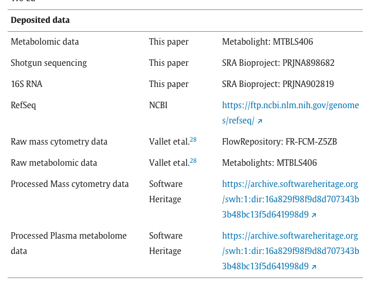
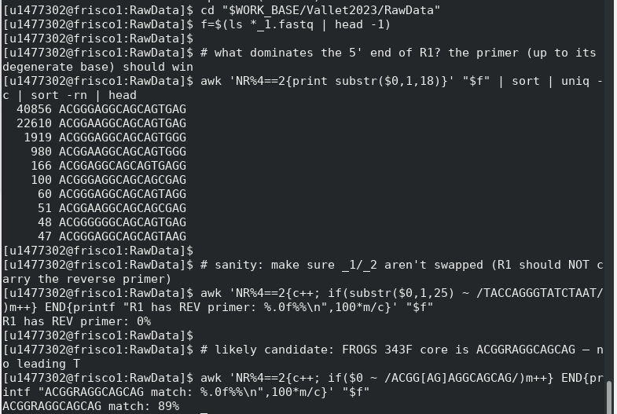
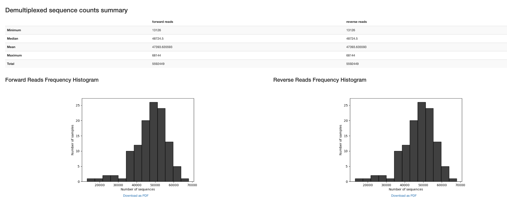
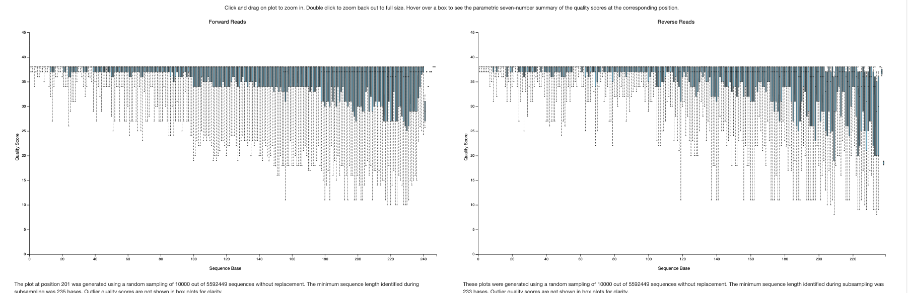
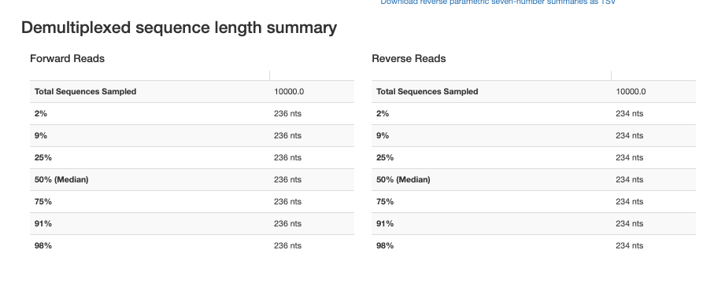
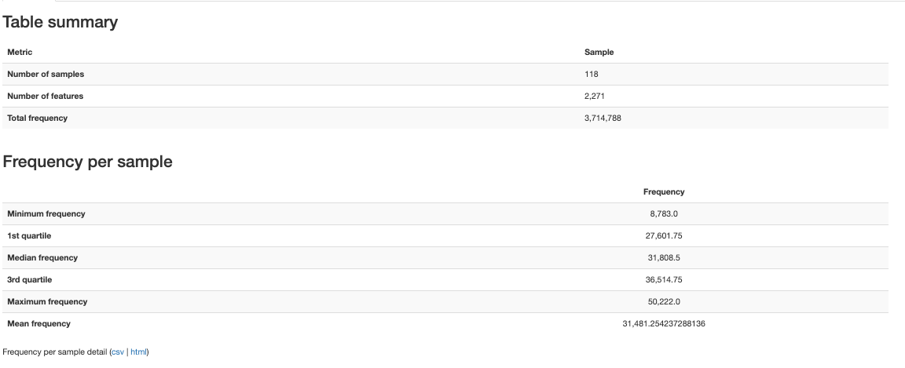
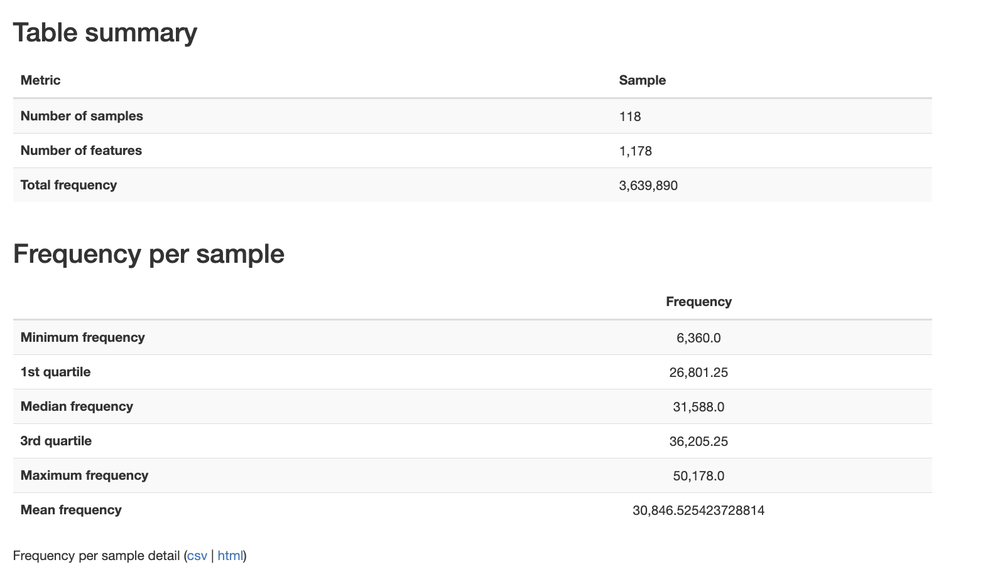

# Vallet

-   Previously processed as allozithro. This is the published microbiome followup of the subcohort.

-   V3-V4 Region

-   50 individuals

-   118 samples

# Reference

-   Vallet, N., Salmona, M., Malet-Villemagne, J., Bredel, M., Bondeelle, L., Tournier, S., Mercier-Delarue, S., Cassonnet, S., Ingram, B., Latour, R.P. de, Bergeron, A., Socié, G., Goff, J.L., Lepage, P., Michonneau, D., 2023. Circulating T cell profiles associate with enterotype signatures underlying hematological malignancy relapses. Cell Host Microbe 31, 1386-1403.e6. https://doi.org/10.1016/j.chom.2023.06.009

-   Bioproject: PRJNA902819

-   Associated github: <https://gitlab.com/nivall/azimutfeces>

-   Raw data are available on a public repository: (i) metabolomic, Metabolights: MTBLS406; (ii) bacteriome, Bioproject: PRJNA902819; (iii) virome, Bioproject: PRJNA898682. Source codes, data and CSV files of interim analyses are available on the following Git repositories: <https://gitlab.com/nivall/azimutfeces>. Git repositories version at submission time are archived on Software Heritage: <https://archive.softwareheritage.org/swh:1:dir:9a24ab367cbe9519007f0dd407423fe47def5cfa>. Unless otherwise specified, data analyses were computed using R environment. Raw figures were made with the “ggplot2” R package. Computational environment may be reproduced using GNU Guix with the files “manifest.scm” and “channels.scm” in “guixconfig” directory of the git repository.^[86](https://www.sciencedirect.com/science/article/pii/S1931312823002603?via%3Dihub#bib86)^ Manuscript figures were created from R outputs and combined with Inkscape (version 1.2.1) on macOS (version 12.5).

# Relevant Methods

{width="410"}

-   This study was conducted with samples from patients included in the multicenter, randomized, double-blind, placebo-controlled phase three superiority trial ALLOZITHRO (NCT01959100).^[11](https://www.sciencedirect.com/science/article/pii/S1931312823002603?via%3Dihub#bib11)^ This study was approved by the local ethics committee and Institutional Review Board (CPP Île de France IV, IRB number 00003835, reference number 2013-000499-14). Fecal samples were gathered from the cohort MICROBIOTE-T3 (IRB 00003835, CNIL 104706). Blood samples were retrieved from the CRYOSTEM Consortium (project number CS-1801, IRB Sud-Méditerranée 1, reference AC-2011-1420) and the Commission National Informatique et Liberté for data protection (reference nz70243374i no. 912120). All patients gave written consent for [clinical research](https://www.sciencedirect.com/topics/pharmacology-toxicology-and-pharmaceutical-science/clinical-research). No additional clinical procedure was carried out in this non-interventional research study in accordance with the Declaration of Helsinki. Data analyses were performed using a database without patients’ identifiers. Patients’ characteristics are described in [Tables 1](https://www.sciencedirect.com/science/article/pii/S1931312823002603?via%3Dihub#tbl1) and [S1](https://www.sciencedirect.com/science/article/pii/S1931312823002603?via%3Dihub#mmc1). Feces and blood samples collection times are shown in [Figure S8](https://www.sciencedirect.com/science/article/pii/S1931312823002603?via%3Dihub#mmc1)A.

-   Patients’ fecal samples were frozen-aliquoted (150 mg), homogenized and lysed using both mechanical (bead beating for 10 minutes) and chemical techniques as previously described,^[87](https://www.sciencedirect.com/science/article/pii/S1931312823002603?via%3Dihub#bib87)^ and total DNA was extracted using the MoBio Power Fecal [DNA isolation](https://www.sciencedirect.com/topics/immunology-and-microbiology/dna-isolation) kit following the manufacturer’s recommendations. DNA quality and quantity were evaluated using a spectrophotometer (Nanodrop 1000, Thermoscientific). Sequencing was then performed at GeT-PlaGe platform of the Génopole (Toulouse Midi-Pyrénées, France) using [Illumina MiSeq](https://www.sciencedirect.com/topics/biochemistry-genetics-and-molecular-biology/illumina-miseq) technology targeting the V3-V4 region of the 16SrRNA gene with the following primers: V3fwd-TACGGRAGGCAGCAG and V4rev- TACCAGGGTATCTAAT.

    -   !!!This forward primer as reported actually has a typo!!!!! Should be ACGGRAGGCAGCAG

# Fetch and Import

-   Fetch normal from accessions (took \~5 min)

-   Import normal from 01_fetch.slurm (took \~40 min)

# Trimming

Checked whether the primers are still in the sequences before trimming

```         
source chpc/config.sh                 # defines $WORK_BASE
cd "$WORK_BASE/Vallet2023/RawData"
f=$(ls *_1.fastq | head -1); r=${f/_1.fastq/_2.fastq}
echo "sampling $f / $r"

# eyeball the first 20 bp of a few R1 reads
awk 'NR%4==2{print substr($0,1,20)}' "$f" | head

# fwd primer TACGGRAGGCAGCAG (R=A/G); rev primer TACCAGGGTATCTAAT
awk 'NR%4==2{c++; s=substr($0,1,25);
     if(s ~ /^TACGG[AG]AGGCAGCAG/)a++; if(s ~ /TACGG[AG]AGGCAGCAG/)b++}
     END{printf "FWD: at-start %.0f%%  within-25bp %.0f%%  (n=%d)\n",100*a/c,100*b/c,c}' "$f"
awk 'NR%4==2{c++; s=substr($0,1,25);
     if(s ~ /^TACCAGGGTATCTAAT/)a++; if(s ~ /TACCAGGGTATCTAAT/)b++}
     END{printf "REV: at-start %.0f%%  within-25bp %.0f%%  (n=%d)\n",100*a/c,100*b/c,c}' "$r"
```

Found 0% forward primer but 81% reverse primer.

Turns out there is a typo in the reported forward primer. The leading T should not have been included.

```         
cd "$WORK_BASE/Vallet2023/RawData"
f=$(ls *_1.fastq | head -1)

# what dominates the 5' end of R1? the primer (up to its degenerate base) should win
awk 'NR%4==2{print substr($0,1,18)}' "$f" | sort | uniq -c | sort -rn | head

# sanity: make sure _1/_2 aren't swapped (R1 should NOT carry the reverse primer)
awk 'NR%4==2{c++; if(substr($0,1,25) ~ /TACCAGGGTATCTAAT/)m++} END{printf "R1 has REV primer: %.0f%%\n",100*m/c}' "$f"

# likely candidate: FROGS 343F core is ACGGRAGGCAGCAG — no leading T
awk 'NR%4==2{c++; if($0 ~ /ACGG[AG]AGGCAGCAG/)m++} END{printf "ACGGRAGGCAGCAG match: %.0f%%\n",100*m/c}' "$f"
```

{width="545"}

Trimming took about 7 minutes





{width="742"}

# Denoise

DADA2 paired denoiser. Percent non-chimeric 54-77%



# BLAST

```{r}
library(RCurl)
library(rBLAST)
library(Biostrings)
library(tidyverse)
```

```{r}
# 1. DATABASE PATHS -----------------------------------------------------------
conda_blast_path <- "/Users/sophiehuebler/miniconda3-x86_64/envs/qiime2-env/bin"
Sys.setenv(PATH = paste(conda_blast_path, Sys.getenv("PATH"), sep = ":"))

db_dir <- "~/blast_databases"
human_db_path <- file.path(db_dir, "GCF_000001405.39_top_level")
s16_db_path   <- file.path(db_dir, "16S_ribosomal_RNA")

# 2. LOAD SEQUENCES --------------------------------------------------------
fasta_input <- "~/Documents/ODSi/ODSiData/Vallet2023/QiimeData/dna-sequences.fasta"
seqs <- readDNAStringSet(fasta_input)
cat("Starting with", length(seqs), "total sequences.\n")

# 3. STEP 1: HUMAN DECONTAMINATION -----------------------------------------
cat("\n--- Step 1: Human Decontamination ---\n")
bl_human <- blast(db = human_db_path)

# High confidence human matches
human_args <- paste('-perc_identity 95', '-qcov_hsp_perc 90', '-num_threads 4')

blast_human <- predict(bl_human, seqs, type = 'megablast', BLAST_args = human_args)

human_ids <- unique(blast_human$qseqid)
non_human_seqs <- seqs[!(names(seqs) %in% human_ids)]

cat("Detected", length(human_ids), "human sequences.\n")
cat("Proceeding with", length(non_human_seqs), "microbial candidate sequences.\n")

# 4. STEP 2: 16S RRNA CLASSIFICATION ---------------------------------------
cat("\n--- Step 2: 16S rRNA Classification ---\n")
bl_16s <- blast(db = s16_db_path)

# Microbiome standard: identity > 75% (Source)
s16_args <- paste('-perc_identity 75', 
                  '-word_size 15', 
                  '-qcov_hsp_perc 90', 
                  '-max_target_seqs 10', 
                  '-num_threads 4')

blast_16s <- predict(bl_16s, non_human_seqs, type = 'megablast', BLAST_args = s16_args)
bact_ids <- unique(blast_16s$qseqid)
bact_seqs <- seqs[names(seqs) %in% bact_ids]

# 5. FILTER TO BEST HIT ----------------------------------------------------
cat("Filtering results to best hit per sequence...\n")

top_hits <- blast_16s %>%
  group_by(qseqid) %>%
  arrange(desc(pident), evalue) %>%
  dplyr::slice(1) %>%
  ungroup()

# 7. CALCULATE SUMMARY STATISTICS -----------------------------------------
cat("\n--- Final Summary Statistics ---\n")

total_count      <- length(seqs)
non_human_count  <- length(non_human_seqs)
classified_count <- length(unique(top_hits$qseqid))

# Calculate percentages
pct_human      <- ((total_count - non_human_count) / total_count) * 100
pct_classified <- (classified_count / non_human_count) * 100
pct_total_loss <- ((total_count - classified_count) / total_count) * 100

# Create a clean summary table
summary_stats <- data.frame(
  Metric = c("Total Raw ASVs", 
             "Human Contaminants Removed", 
             "Microbial Candidates Remaining", 
             "Successfully Classified (16S)",
             "Unclassified"),
  Count = c(total_count, 
            total_count - non_human_count, 
            non_human_count, 
            classified_count, 
            non_human_count - classified_count),
  Percentage = c(100, pct_human, (100 - pct_human), pct_classified, (100 - pct_classified))
)

print(summary_stats)

cat("\nFinal classification rate among non-human reads:", round(pct_classified, 2), "%\n")

# 6. EXPORT RESULTS --------------------------------------------------------
write_tsv(top_hits, "~/Documents/ODSi/ODSiData/Vallet2023/FilteredData/16s_blast_results.tsv")
writeXStringSet(bact_seqs, "~/Documents/ODSi/ODSiData/Vallet2023/FilteredData/blast_seqs.fasta")

cat("\nAnalysis Complete. Results saved to '16s_blast_results.tsv'.\n")
```

# Metadata

```{r}
vallet_meta_qiime <- read_tsv("/Users/sophiehuebler/Documents/ODSi/ODSiData/Vallet2023/Metadata/vallet_meta_qiime.tsv")
```

# Qc and Mapped


